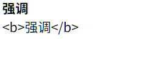
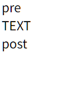
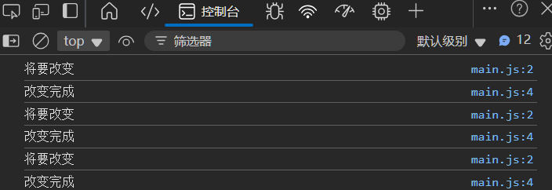
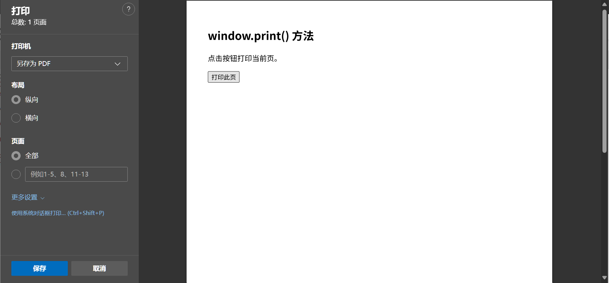

# 基础

## 引入html

### 事件

```html
<form>
    <input type="button" value="BUTTON" onclick="this.value=(this.value==='BUTTON'?'按钮':'BUTTON')" >
</form>
```

### `<script>`标签

```html
<form>
    <input type="button" value="BUTTON" onclick="changeButtonValue(this)" >
</form>
<script type="application/javascript">
    const changeButtonValue = function (buttonElement) {
        buttonElement.value = buttonElement.value === 'BUTTON' ? '按钮' : 'BUTTON';
    };
</script>
```

把脚本置于 `<body>` 元素的底部，可改善显示速度，因为脚本编译会拖慢显示

`type="application/javascript"`可省去, 默认就是`javascript`


### 外部文件

引入, 可以引入本地文件, 也可以引用网络上的 js 文件, 有关路径由HTML文件路径来决定

```html
<script src="src/main.js"></script>
```

main.js

```js
const changeButtonValue = function (buttonElement) {
    buttonElement.value = buttonElement.value === 'BUTTON' ? '按钮' : 'BUTTON';
};
```

调用脚本

```html
<form>
    <input type="button" value="BUTTON" onclick="changeButtonValue(this)">
</form>
```

## 输出

-   `window.alert()` 弹窗
-   `document.write()` 写入 HTML 输出
-   `innerHTML` 写入 HTML 元素
-   `console.log()` 写入浏览器控制台

### innerHTML

对标签内的内容进行填写

```html
<div id="content1"></div>
<div id="content2"></div>
<script>
    document.getElementById("content1").innerHTML = "<b>强调</b>"
    document.getElementById("content2").innerText = "<b>强调</b>"
</script>
```



### document.write

```html
<div>pre</div>
<div>
    <script>
        document.write("TEXT");
    </script>
</div>
<div>post</div>
```





在 HTML 文档完全加载后使用 document.write() 将**删除所有已有的 HTML** :

```html
<p>content</p>

<button type="button" onclick="document.write('text')">b</button>
```

### window.alert

由于window是全局对象, 所以window是可省略的

### console.log()

```js
const changeButtonValue = function (buttonElement) {
    console.log("将要改变")
    buttonElement.value = buttonElement.value === 'BUTTON' ? '按钮' : 'BUTTON';
    console.log("改变完成")
};
```



### window.print()

不同的是, 调用浏览器的**打印**模块, 进行打印

```html
<button onclick="window.print()">打印此页</button>
```



## 注释

```js
/*
多行注释
*/
// 单行注释
```

## HTML事件

| 事件        | 描述                                   | 用处                                                         |
| :---------- | :------------------------------------- | ------------------------------------------------------------ |
| onchange    | HTML 元素已被改变                      |                                                              |
| onmouseover | 用户把鼠标移动到 HTML 元素上           |                                                              |
| onmouseout  | 用户把鼠标移开 HTML 元素               |                                                              |
| onmousedown | 当鼠标按钮被点击时                     |                                                              |
| onmouseup   | 当鼠标按钮被释放时                     |                                                              |
| onclick     | 用户点击了 HTML 元素(当鼠标点击完成后) |                                                              |
| onkeydown   | 用户按下键盘按键                       |                                                              |
| onload      | 浏览器已经完成页面加载                 | 可用于检测访问者的浏览器类型和浏览器版本，然后基于该信息加载网页的恰当版本 |

