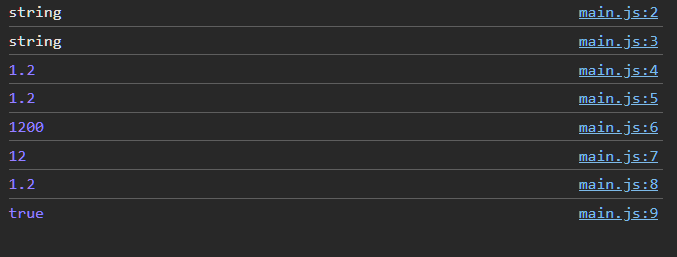
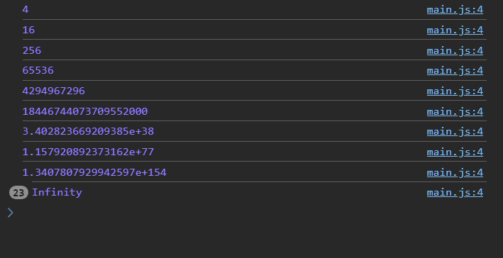
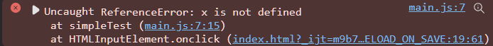
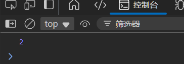
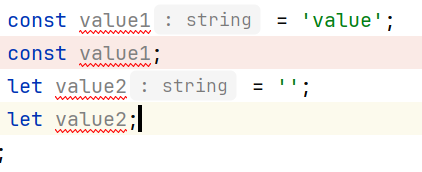

# 过程控制

## 顺序

每条语句以分号结尾, 由于js是脚本语言, 这条规则并不严格

### 字面量

```js
console.log("string")
console.log('string')
console.log(1.2);
console.log(1.20);
console.log(1.2e3);
console.log(12/*L*/);
console.log(1.2/*f*/);
console.log(1e30===(1e30+1e-30));
```




所有数字（Number 类型）都是以 64 位（8 字节）双精度浮点数格式存储

测试数字上限与溢出可能的情况

```js
let num = 2;
for (let i = 0; i < 32; i++) {
  console.log(num = num * num);
}
```




### 标识符

-   用于命名
-   首字母必须是字母, 下划线, 或美元(`$`)符号
-   由字母, 数字, 下划线, 美元符组成
-   大小写敏感
-   使用 **Unicode** 字符集

### 变量

#### let/var/const

-   变量前不标注-全局作用域
-   var 函数作用域
-   let 块作用域 
-   const 块作用域


-   let 作用域变量

    ```js
    if (true) {
      let x = 2;
    }
    console.log(x);
    ```

    在运行时异常

    

-   var 变量, 类似Python的变量

    ```js
    if (true) {
      var x = 2;
    }
    console.log(x);
    ```

    输出2

    

-   const 常量

    ```js
    class A{
      x;
    }
    const simpleTest = function () {
      const a = new A();
      a.x = 12;
      // a = new A(); 直接报错
    };
    ```

    const是指 "指针值是常量" 而不是 "指向常量的指针" 


#### 声明

声明

```js
[var|let|const] identifier;
```

声明并赋初值

```js
[var|let|const] identifier = expression;
```

多个声明和初值

```js
[var|let|const] identifier1 [= expression] [, identifier2 [= expression] ,...];
```

```js
let a = 2,
  b = 'x',
  c = (d = 3; /*警告: 隐式声明变量 d */
console.log(a);
console.log(b);
console.log(c);
console.log(d);
```

重复的声明

var允许重复声明而不改变值

```js
var value = 'value';
var value;
console.log(value); // value
```

但let和const不能, 会直接报错



## 分支

### 条件 if-else if-else

允许一行省略空格

```js
if (condition) 
    expression;
else if (condition) 
    expression;
else 
    expression;
```


### switch-case-default

```js
switch(expression) {
  case x:
    // 代码块
    break;
  case y:
    // 代码块
    break;
  default:
    // 代码块
}
```

-   允许default不再最后
-   上面的条件先符合的优先匹配上一条条件
-   总会先匹配default
-    case 使用严格比较（===）
-   


```js
switch (value) {
  default:
    text = 'Default';
    break;
  case 'X':
    text = 'XX';
    break;
  case undefined:
  case null:
  case NaN:
}
```

总是匹配default


```js
let value = '';
switch (value) {
  case String:
    console.log('S');
    break;
  case Number:
    console.log('N');
    break;
  default:
    console.log('D');
    break;
}
```

依旧匹配Default, 即使类型不会报错

## 循环

### while

### do-while

### for-i

### for-each

如果遍历一个**对象**, 就是遍历这个对象的键/属性/字段

```js
const simpleTest = function () {
  let object = { p1: 'John', p2: 'Doe', p3: 25 };
  let text = '{';
  for (let personKey in object) {
    text += personKey + ':' + object[personKey] + ',';
  }
  text += '}';
  console.log(text); // {p1:John,p2:Doe,p3:25,}
};

```

甚至

```js
class Obj {
  f1 = 'John';
  f2 = 'Doe';
  f3 = 25;
}

const simpleTest = function () {
  let object = new Obj();
  let text = '{';
  for (let personKey in object) {
    text += personKey + ':' + object[personKey] + ',';
  }
  text += '}';
  console.log(text); // {f1:John,f2:Doe,f3:25,}
};
```

### for-of

遍历 **iterable** 对象的值

-   数组
-   字符串
-   映射
-   节点列表等

```js
let values = ['A', 'B', 'C'];
for (let x of values) {
  console.log(x);
}
```

```js
let values = ['A', 'B', 'C'];
let x; // 拆到外面也是可以的
for (x of values) {
  console.log(x);
}
console.log(x); // C
// 但这样不对吧?
// 如果有获得最后的x的需求, 这种写法的可读性根本没有啊
```


## 作用域

此处不做全局变量的叙述, 因为可读性一坨

```js
simpleTest();
console.log(carName);

function  simpleTest() {
  carName = 'A'; // 不声明var|let|c
  console.log(carName);
}
```
