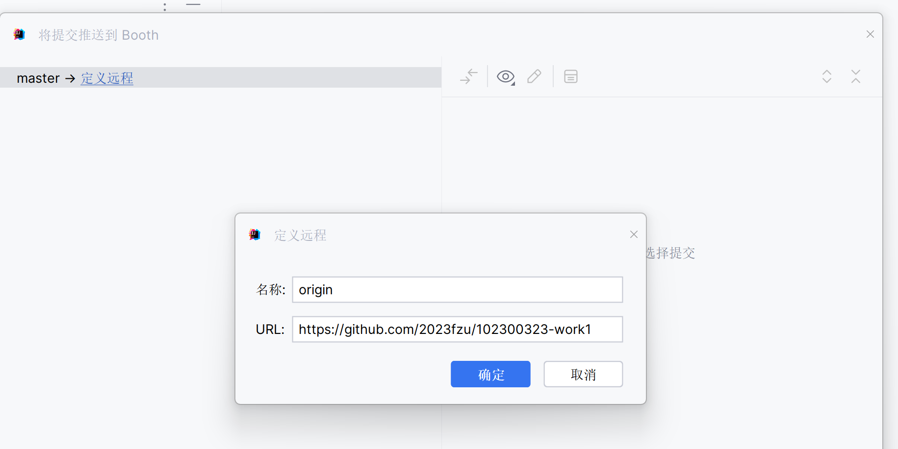
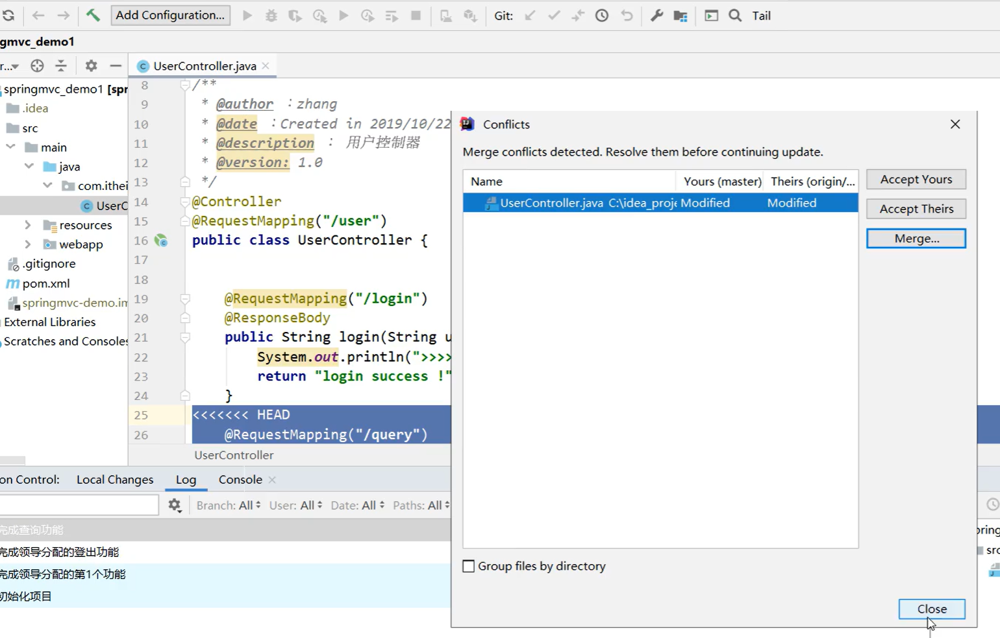

# 在IDEA中配置Git

## 提交

VCS->创建Git仓库->选择文件->确定

Alt+0->提交[add]

Alt+9->提交[这一步commit到本地仓库]->

Alt+0->推送[push]

## 远程仓库与本地仓库冲突

1. add->commit
2. **先pull(向左下的箭头)再push(向右上的箭头)**

pull之后不对劲了,可以这样:

点close,然后手动操作
