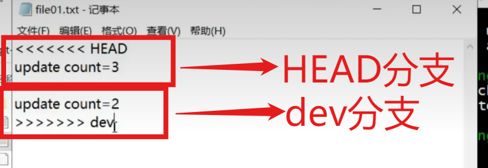

# Git分支

## 查看分支

```Git
git branch
```

## 创建分支

```Git
git branch 分支名
```


- 只能对一个分支进行修改
- 每个分支上都有独立的文件

## 切换分支

```Git
git checkout [-b] 分支名
```

- -b 创建并切换分支 

## 合并分支

```Git
git merge 分支名
```

把**分支名所指分支**合并到**当前分支**

### 合并分支冲突

- 冲突产生原因

  同一个文件,两条分支上文件内容不同

- git的反应

  把发生冲突的文件进行一定的更改,把俩分支上的内容共同写进文件内

  - 
  - **这里对HEAD和master分支的认识还不够清晰**

- 解决方法

  直接再次更改文件(可以留下其中一个,也可以随便改成第三者)

## 删除分支

```Git
git branch -d 分支名
git branch -D 分支名
```

- -d delet做各种检查
- -D 不做检查,强制删除

