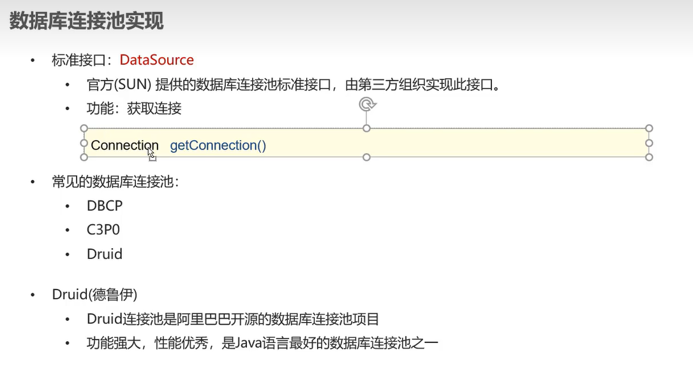

-   我不想写原理,就是用户太多,参考线程池吧

-   讲究一个资源复用
-   原理还是看[b站](https://www.bilibili.com/video/BV1s3411K7jH?p=9)吧



# 使用Druid

1.  导入jar包

2.  准配配置文件

    ```properties
    # 配置写在配置文件下
    String url = "jdbc:mysql:///company&useServerPrepStmt=true";

    String username = "root";
    String password = "123456";

    # 初始化连接数
    initialSize = 5
    # 最大连接数
    maxActive = 10
    # 等待3000毫秒
    maxWait = 3000
    ```

3.  写代码

    ```java
    System.out.println(System.getProperty("user.dir"));//输出当前路径
    //C:\Users\27970\Desktop\IT\JDK\learn_jdbc

    //加载属性文件.properties
    Properties prop = new Properties();
    prop.load(new FileInputStream("learn_jdbc\\src\\....."));

    //获取连接池对象
    DataSource dataSource = DruidDataSourceFactory.createDataSource(prop);

    //获取数据库连接
    Connection connection = dataSource.getConnection();
    System.out.println(connection);

    //然后一样

    ```

```java
//注册驱动,导入包
Class.forName("com.mysql.cj.jdbc.Driver");

//获取连接
String url = "jdbc:mysql://127.0.0.1:3306/company";
String username = "root";
String password = "123456";
//以上这些可以写道属性文件.properties里去

Connection conn = DriverManager.getConnection(url, username, password);

//--------------------------------------------------------------------    
//定义sql指令,结尾分号可写可不写
String sql = "update employee set age = 27 where age = 26;";

//获取执行Sql对象Statement
Statement stmt = conn.createStatement();

//执行sql
int count = stmt.executeUpdate(sql);
//返回影响的行数

System.out.println(count+" hava been updated.");

//释放资源
//后开stmt,先释放stmt
stmt.close();
//先开conn,后释放conn
conn.close();
```

