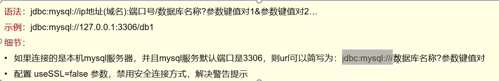

# API介绍

```java
//注册驱动,导入包,以后不写也没事
Class.forName("com.mysql.cj.jdbc.Driver");
//会使用静态代码块运行:
//DriverManager.registerDriver(new Driver());    
```

## SQL类型和JAVA类型对照

| **类型名称**  | **显示长度** | **数据库类型**            | **JAVA类型**             | **JDBC类型索引(int)** |
| ------------- | ------------ | ------------------------- | ------------------------ | --------------------- |
| **VARCHAR**   | **L+N**      | **VARCHAR**               | **java.lang.String**     | **12**                |
| **CHAR**      | **N**        | **CHAR**                  | **java.lang.String**     | **1**                 |
| **BLOB**      | **L+N**      | **BLOB**                  | **java.lang.byte[]**     | **-4**                |
| **TEXT**      | **65535**    | **VARCHAR**               | **java.lang.String**     | **-1**                |
| **INTEGER**   | **4**        | **INTEGER UNSIGNED**      | **java.lang.Long**       | **4**                 |
| **TINYINT**   | **3**        | **TINYINT UNSIGNED**      | **java.lang.Integer**    | **-6**                |
| **SMALLINT**  | **5**        | **SMALLINT UNSIGNED**     | **java.lang.Integer**    | **5**                 |
| **MEDIUMINT** | **8**        | **MEDIUMINT UNSIGNED**    | **java.lang.Integer**    | **4**                 |
| **BIT**       | **1**        | **BIT**                   | **java.lang.Boolean**    | **-7**                |
| **BIGINT**    | **20**       | **BIGINT UNSIGNED**       | **java.math.BigInteger** | **-5**                |
| **FLOAT**     | **4+8**      | **FLOAT**                 | **java.lang.Float**      | **7**                 |
| **DOUBLE**    | **22**       | **DOUBLE**                | **java.lang.Double**     | **8**                 |
| **DECIMAL**   | **11**       | **DECIMAL**               | **java.math.BigDecimal** | **3**                 |
| **BOOLEAN**   | **1**        | **同TINYINT**             |                          |                       |
| **ID**        | **11**       | **PK (INTEGER UNSIGNED)** | **java.lang.Long**       | **4**                 |
| **DATE**      | **10**       | **DATE**                  | **java.sql.Date**        | **91**                |
| **TIME**      | **8**        | **TIME**                  | **java.sql.Time**        | **92**                |
| **DATETIME**  | **19**       | **DATETIME**              | **java.sql.Timestamp**   | **93**                |
| **TIMESTAMP** | **19**       | **TIMESTAMP**             | **java.sql.Timestamp**   | **93**                |
| **YEAR**      | **4**        | **YEAR**                  | **java.sql.Date**        | **91**                |

## DriverManager工具类

-   **里头全是静态方法**

### 与数据库创建连接getConnection()

```java
Connect getConnection(String url,String username,String password)
```


#### 参数url




## Connect 接口

### 数据库连接对象

#### 普通执行SQL对象

```java
Statement createStatement() throws SQLException;
```


#### 预编译SQL的执行SQL对象:防止

```java
PreparedStatement prepareStatement(String sql)
    throws SQLException;
```


#### 执行存储过程的对象

```java
CallableStatement prepareCall(String sql, int resultSetType,                                  int resultSetConcurrency) throws SQLException;
```


### 事务管理

#### 开启事务

```java
void setAutoCommit(boolean autoCommit) 
    throws SQLException;
```

#### 提交事务

```java
void commit() throws SQLException;
```

#### 回滚事务

```java
void rollback() throws SQLException;
```

-   用try-catch{rollback}

#### 实践

```java
import java.sql.*;

/**
 * @author HarveyBlocks
 * @date 2023/10/09 19:22
 **/
public class JDBCDemo {
    public static void main(String[] args) throws Exception {
        //获取连接
        String url = "jdbc:mysql:///company";
        String username = "root";
        String password = "123456";
        Connection conn = DriverManager.getConnection(url, username, password);

        //定义sql指令,结尾分号可写可不写
        String sql1 = "update employee set age = 27 where age = 26;";

        Statement stmt = conn.createStatement();
        conn.setAutoCommit(false);
		int count1=0;int count2=0;
        try {
            count1 = stmt.executeUpdate(sql1);
            System.out.println(count1+" hava been updated.");
            出了异常...
            int count2 = stmt.executeUpdate(sql1);
            System.out.println(count2+" hava been updated.");
            conn.commit();
        } catch (Exception e) {
            //回滚事务
            conn.rollback();
        }

        stmt.close();
        conn.close();
    }
}
```

## Statement接口执行SQL语句

-   用不同方法执行DML,DDL,DQL

### executUpdate执行DML,DDL语句

```java
int executeUpdate(String sql);
```

-   DDL:数据库义语言
-   DML:数据更改语言
-   返回受影响的记录数
    -   对于DML返回为0,失败;返回正,成功
    -   对于DDL,无论如何返回0,只要不报错,就运行成功

### executeQuery(sql)执行DQL语句

```java
ResultSet executeQuery(sql);
```

-   ResultQuery结果集对象

#### ResultSet结果集对象
-   ResultQuery结果集对象
    -   封装了sql的查询的结果
    -   里面还有一个**游标**
    -   游标最开始默认在查询到的数据集的**第一行**
    -   所以我们需要通过**移动游标**获取数据

-   获取查询结果的方法:

    ```java
    boolean next()
    ```
    
    -   将光标从当前一行移到下一行
    -   返回当前行是否为有效值的判断:
    -   true:当前行有效
        -   false:当前行无效
    
    
    ```java
    *** get***(String 列名)
*** get***(int 从一开始的列编号)
    ```
    
    -   ***表示该列的数据类型;如:
        -   int getInt(....)
        -   String getString(....)
        -   byte getByte(...)
    
    ```java
    RS.close()
    ```
    
    -   释放资源

```java
while(rs.next){
    rs.get();
}
```

### 示例

-   最终目标:将记录作为一个对象,将对象存入集合
    -   **对象的属性和数据库中字段的数据类型应该相同**
    -   **尽量使用包装类**,包装类默认null,不然0也是具有意义的

```java
import java.sql.*;
import java.util.ArrayList;
import java.util.List;

/**
 * @author HarveyBlocks
 * @date 2023/10/09 19:22
 **/
public class JDBCDemo {
    public static void main(String[] args) throws Exception {
        //获取连接
        String url = "jdbc:mysql:///company";
        String username = "root";
        String password = "123456";
        Connection conn = DriverManager.getConnection(url, username, password);
        Statement stmt = conn.createStatement();

        //定义sql指令,结尾分号可写可不写
        String sql1 = "desc employee;";
        List<EmployeeField> employeeFields = new ArrayList<>();
        ResultSet employeeFieldRS = stmt.executeQuery(sql1);
        EmployeeField field;
        while (employeeFieldRS.next()){
            field = new EmployeeField(employeeFieldRS.getString("Field"), employeeFieldRS.getString(1));
            System.out.println(field);
            employeeFields.add(field);
        }

        System.out.println("----------------------------------------------------------");

        String sql2 = "select * from employee";
        List<Employee> employees = new ArrayList<>();
        ResultSet employeeRS = stmt.executeQuery(sql2);
        Employee employee;
        while (employeeRS.next()){
            employee = new Employee(employeeRS.getString("employee_ID"), employeeRS.getString(1));
            System.out.println(employee);
            employees.add(employee);
        }

    }
}


class Employee{
    private String employeeId;
    private String name;

    public Employee(String employeeId, String name) {
        this.employeeId = employeeId;
        this.name = name;
    }

    @Override
    public String toString() {
        return "Employee{" +
                "employeeId='" + employeeId + '\'' +
                ", name='" + name + '\'' +
                '}';
    }

    public String getEmployeeId() {
        return employeeId;
    }

    public void setEmployeeId(String employeeId) {
        this.employeeId = employeeId;
    }

    public String getName() {
        return name;
    }

    public void setName(String name) {
        this.name = name;
    }
}


class EmployeeField{
    private String fieldName;
    private String type;
    public EmployeeField(String fieldName, String type){
        this.fieldName = fieldName;
        this.type = type;
    }

    @Override
    public String toString() {
        return "EmployeeField{" +
                "fieldName='" + fieldName + '\'' +
                ", type='" + type + '\'' +
                '}';
    }

    public String getFieldName() {
        return fieldName;
    }

    public void setFieldName(String fieldName) {
        this.fieldName = fieldName;
    }

    public String getType() {
        return type;
    }

    public void setType(String type) {
        this.type = type;
    }
}
```

## PreparedStatement类执行SQL的对象

-   extends Statement
-   用于预编译Statement

### PreparedStatement防注入

#### SQL注入(inject)

-   攻击服务器

例如我用户名随便输,密码输入一段特殊的sql脚本,就会攻击

-   核心代码:

    ```java
    String userName = "gfahjb dfahjzcbn " ;//随便输
    String passWord = "' or '1'='1" ;//特定的代码,注入的其中一种
    
    String sql = "select * from tb_user " +
        "where username = '"+userName+"' and pwd = '"+passWord+"'";
            //被注入的原因:拼字符串
    ```

    

#### 解决注入

1.  获取**PreparedStatement**对象

    ```Java
    Connection conn = DriverManager.getConnection(url, username, password);
    
    String sql = "select * from tb_user where username = ? and pwd = ?";
     
    PreparedStatement pstmt = conn.prepareStatement(sql);
    ```

    -   用**"?"**作为占位符

2.  设置参数值

    

3.  执行sql

    ```java
    pstmt.executeUpdate();
    /*or*/
    pstmt.executeQuery();
    ```

    -   因为上面已经用sql执行过了

#### PreparedStatement防注入原理

将**敏感字符**单引号   **'**     转义为  **\\'**     转移字符

#### 完整代码

```java
String userName = "gfahjb dfahjzcbn " ;
String passWord = "" ;

String sql = "select * from tb_user where username = ? and pwd = ?";

PreparedStatement pstmt = conn.prepareStatement(sql);

pstmt.setString(1,userName);
pstmt.setString(2,passWord);

pstmt.executeUpdate();
```

### PerparedStatement预编译

-   不用预编译:

    对于类似的语句:

    ```java
    for(String name:names){
    	String sql = "select * from employee where name = '"+name+"'";
    	ResultSet employeeRS = stmt.executeQuery(sql);
    }
    ```

    反复执行,反复检查sql语法,反复编译,效率很低

-   用了预编译可以减少反复的无用功

#### 打开预编译(useServerPrepStmt=true)

```java
//String url = "jdbc:mysql:///company";这句需要改↓
String url = "jdbc:mysql:///company[这里可以从网页上拿参数,待等我去学网络编程]&useServerPrepStmt=true";


//下面还是一样
String username = "root";
String password = "123456";
Connection conn = DriverManager.getConnection(url, username, password);

//这里正式写代码
String userName = "gfahjb dfahjzcbn " ;
String passWord = "" ;

String sql = "select * from tb_user where username = ? and pwd = ?";

PreparedStatement pstmt = conn.prepareStatement(sql);

pstmt.setString(1,userName);
pstmt.setString(2,passWord);

pstmt.executeUpdate();
```

