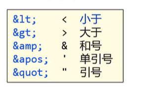
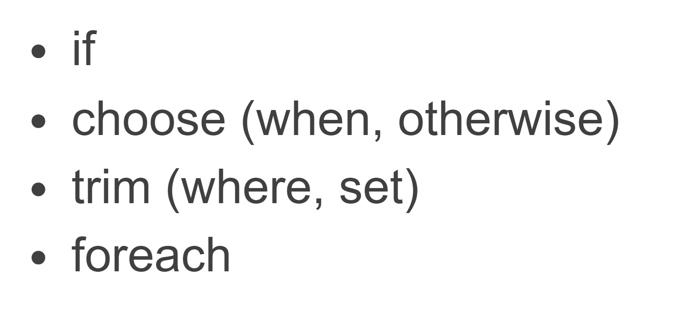
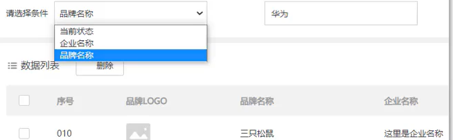
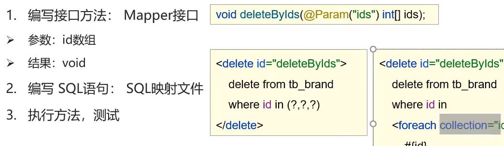

# 增删改查

-   插件MyBatisX
    -   效率
-   思路:
    1.  编写接口方法
    2.  参数
    3.  返回结果
    4.  SQL语句->SQL映射文件
    5.  编写Demo
    6.  执行测试

## 参数获取

```xml
<!--parameterType=int,integer都没有问题,大小写也没有问题-->
<!--parameterType一般不写,太麻烦了-->
<select id ="selectByID" parameterType="int" resultType="User">
    select * from user where id = #{id};
</select>
```

### 参数占位符

`#{id}` -->会替换成问号,然后再把值代入

`${id}`  -->会直接替换值,拼字符串

-   **这不就是注入吗?**

-   参数传递都要用***#{ID}*** !!!!!!!!!!!!!!!!!!!     ***防止注入***!!!!!!!!!!!

    ```sql
    select * from ${tableName} where name = #{id};
    ```

    表名或者列名不确定的时候,就用`${id}`

### <>特殊符号->转义字符

[xml文件](..\java特殊文件\Day30-xml文件.md/## 注意)

省流:打个CD



### 自动包装出现问题

-   SQL中的字段user_name和Java类里的属性userName不能自动包装
-   对应不上!!!!!!

#### 法一:起别名

```xml
<select id ="selectAll" resultType="User">
    <!--查询结果应该 不包含ID-->
    select user_name as userName, user_age age, status, gender
    from user where id = #{id};
</select>
```

-   不一样的列名起别名,让别名和实体类的属性名相等

-   **缺点:要写很多遍**

#### 法二:定义sql片段

```xml
<sql id="user_column">
    user_name as name, user_age age, status, gender
</sql>
<!-- 下面是大量的sql语句-->

<select id ="selectById" resultType="User">
    <!--查询结果应该不包含ID-->
    select name, age, status, gender from user where id = #{id};
</select>

<select id ="selectById" resultType="User">
    <!--查询结果应该不包含ID-->
    select name, age, status, gender from user where id = #{id};
</select>

<select id ="selectById" resultType="User">
    <!--查询结果应该不包含ID-->
    select name, age, status, gender from user where id = #{id};
</select>

<select id ="selectById" resultType="User">
    <!--查询结果应该不包含ID-->
    select name, age, status, gender from user where id = #{id};
</select>

<select id ="selectById" resultType="User">
    <!--查询结果应该不包含ID-->
    select name, age, status, gender from user where id = #{id};
</select>
```

-   局限性:每次导入都要导入得一摸一样
    -   万一要加一个ID,万一要去掉一个status呢?
    -   那么,就还要再定义一个sql片段,或再那个再起一波别名

#### 法三:resultMap----最终方法

```xml
<!--id是唯一标识-->
<!--type是要映射的对象-->
<resultMap id="userResultMap" type="User">
    <!--colunm是列名 property是映射的字段名-->
    <result column="user_name" property="userName"/>
    <result column="user_age" property="userAge"/>
</resultMap>

			<!--用resultMap属性去替代resultType的属性去完成属性和列名的的映射-->
<select id ="selectById" resultMAp="userResultMap">
    <!--查询结果应该不包含ID-->
    select name, age, status, gender from user where id = #{id};
</select>
```

-   会给你自动映射啦
-   注意:sql语句还是要写sql 里的列名
    -   别糊涂了

## 查看详情


```xml
<select id ="selectById" resultMAp="userResultMap">
    <!--查询结果应该不包含ID-->
    select (name, age, status, gender) from user where id = #{id};
</select>
```

## 条件查询

1.  关系:**与**
    1.  当前状态
    2.  用户年龄(大小范围)
    3.  用户名(**包含输入的值就行,模糊查询**)
        -   模糊查询要自己另外做一下

### 散装参数

占位符,映射关系

#### 法一:

-   散装传参

-   接口

    ```java
    List<User> selectByCondition(
            @Param("name") String name,
            @Param("age") int age ,
            @Param( "status") String status
    );
    ```

-   测试类

```java
//获取UserMapper接口的代理对象
UserMapper userMapper = sqlSession.getMapper(UserMapper.class);

List<User> users = userMapper
        .selectByCondition("%"+"A"+"%",20,"2");
```

#### 法二:

-   传入实体类

-   接口

    ```java
    List<User> selectByCondition(User user);
    ```

-   测试类

```java
List<User> users1 = userMapper
        .selectByCondition(new User(
                121,"%"+"A"+"%",20,"2","男"
        ));
```

#### 法三:

-   传入Map集合

-   接口:

```java
List<User> selectByCondition(Map map);
```

-   测试类:

```java
Map map = new HashMap<>();
map.put("name","%"+"A"+"%");
map.put("age",20);
map.put("status","2");
List<User> users2 = userMapper.selectByCondition(map);

for (User user :users) System.out.println(user);
for (User user :users1) System.out.println(user);
for (User user :users2) System.out.println(user);
```

### 动态条件查询-动态SQL

-   那么我只要差name相关,或者只查status相关,阁下又该如何应对?

[动态SQL](https://mybatis.org/mybatis-3/zh/dynamic-sql.html)



-   先来一个有问题的

```xml
<select id="selectByCondition" resultMap="UserMap">

        select * from user where
    <!--
        这里test里的status等
        应该都是userName
        而不是user_name
        懂?
    -->
            <if test="status!=null">
                status = #{status}
            </if>
                          <!--↓这里用and而不是&&-->
            <if test="name!=null and name!= '' ">
                and name like #{name}
            </if>
    <!--
    这里的语句都是接字符串
    -->
            <if test="age!=0">
                and age &gt; #{age};
            </if>

</select>
```

#### 解决and问题

-   法一:恒等式

    ```xml
    <select id="selectByCondition" resultMap="UserMap">

            select * from user where 1=1
    								<!--这里加上1=1-->
                <if test="status!=null">
                    <!--这里也加上and-->
                    and status = #{status}
                </if>
                              <!--↓这里用and而不是&&-->
                <if test="name!=null and name!= '' ">
                    and name like #{name}
                </if>
                <if test="age!=0">
                    and age &gt; #{age};
                </if>

    </select>
    ```

-   法二:用MyBatis的<Where></where>标签

    >    一切都如那位大人所料

    ```xml
    <select id="selectByCondition" resultMap="UserMap">
        select * from user <where>

        <!--
        -这里test里的status等
        -应该都是userName
        -而不是user_name
        -懂?
        -->
        	<if test="status!=null">
            	and status = #{status}
        	</if>
        	<!--↓这里用and而不是&&-->
        	<if test="name!=null and name!= '' ">
            	and name like #{name}
       		</if>
       		<!--
       		-这里的语句都是接字符串
        	-->
    	    <if test="age!=0">
            	and age &gt; #{age};
        	</if>
    	</where>
    </select>
    ```

#### 单条件的动态查询-类似于switch-case

-   以上是多条件的动态查询
-   以下是单条件的动态查询

-   举个例子:



语法:

choose(when , where)

-   choose->switch
-   when->case
-   where->default

```xml
    <select id="selectByConditionSingle" resultMap="UserMap">
        <!--这里还有一个where可不能忘了啊-->
            select * from user where
        <choose>
            <when test="status != null">
                status = #{status}
            </when>
            <when test="name != null">
                name like #{name}
            </when>
            <!--
            <when test="userName != null">
                user_name = #{userName}
            </when>
            -->
            <!--这个age这里是不等于null,看来是Object装箱了-->
            <when test="age !=  null">
                age &gt; #{age}
            </when>
            <otherwise>
                1=1
            </otherwise>
        </choose>
    </select>
```

-   接口部分就不再赘述

```java
Map<String, Object> map = new HashMap<>();

//map.put("name","%A%");
//map.put("age",20);
//map.put("status","2");

List<User> users2 = userMapper.selectByConditionSingle(map);
for (User user :users2) System.out.println(user);
```

-   一句话,让你免去`<otherwise>1=1</otherwise>`的烦恼

```xml
<select id="selectByConditionSingle" resultMap="UserMap">
        select * from user
    <where>
        <choose>
            <when test="status != null">
                status = #{status}
            </when>
            <when test="name != null">
                name like #{name}
            </when>
            <!--
            <when test="userName != null">
                user_name = #{userName}
            </when>
            -->
            <when test="age != null">
                age &gt; #{age}
            </when>
        </choose>
        <!--<where>好像是专门用来针对不正常参数查询的-->
    </where>
</select>
```

## 增加记录

```java
User user = new User("X",41,"1","女");
userMapper.addUser(user);
```

```xml
<insert id="addUser" >
    <!--id不应该让用户来写-->
    insert into user( name, age, status, gender)
    values( #{name},#{age},#{status},#{gender});
</insert>
```

-   **你这么加是加不上去的!**

***WHY?***

-   `autocommit=false`
-   没提交事务,它回滚了

### 解决方案:

1.  这样:
	```java
    User user = new User("X",41,"1","女");
    userMapper.addUser(user);

    sqlSession.commit();

    //释放资源
    sqlSession.close();
  ```

2.  或者这样:
	```java
  // 加载MyBatis 的核心配置文件,获取sqlSessionFactory
  String resource = "mybatis-config.xml";
  System.out.println("\b");
  InputStream inputStream = Resources.getResourceAsStream(resource);
  SqlSessionFactory sqlSessionFactory = new SqlSessionFactoryBuilder().build(inputStream);
  // 获取SQLfSession对象
  SqlSession sqlSession = sqlSessionFactory.openSession(true);

  // 获取UserMapper接口的代理对象
  UserMapper userMapper = sqlSession.getMapper(UserMapper.class);
  ```

### 以上方法问题:没办法获取id,id或许是有必要得到的

-   添加属性
    -   useGeneratedKeys="true"

        对于支持自动生成记录主键的数据库，如：MySQL，SQL Server，

        设置useGeneratedKeys参数值为true，

        在执行添加记录之后可以获取到数据库自动生成的主键ID

        Mapper的方法返回ID

    -   keyProperty="id"

        如果传入参数是Java类Entity, 那么这个值应该是Entity里面的ID字段名

        要获取ID, 应该是通过参数entity.getId()的方式获取(MyBatis通过反射注入ID值)

```xml
<insert id="addUser" useGeneratedKeys="true" keyProperty="id">
    <!--id不应该让用户来写-->
    insert into user( name, age, status, gender)
    values( #{name},#{age},#{status},#{gender});
</insert>
```

到时候id会注入到ID字段里

## 修改

-   Mapper接口:
    -   参数:所有数据,User对象
    -   void或int返回改变行数
-   SQL
-   测试

```xml
<update id="update">
    update user
    set
    	<!--逗号别忘了,求求了-->
        name= #{name},
        age= #{age},
        gender= #{gender},
        status= #{status}
    where
        id=#{id}
    ;

</update>
```

```java
User user = new User("AD",24,"1","女");
user.setId(132);
System.out.println(userMapper.update(user));
```

### 修改动态字段

-   修改某些数据不一定全部修改

-   一个一个加 **\<if\>** 吧 悲

-   然后:
    -   由于拼字符串,逗号问题
    -   一个参数也不给,一个if也没有qwq
-   用**\<set\>**解决两个问题,就可以愉快地写动态SQL啦

```xml
<update id="update">
    update user
    <set>
        <if test="status!=null">
            status = #{status},
        </if>
        <!--↓这里用and而不是&&-->
        <if test="name!=null and name!= '' ">
            name = #{name},
        </if>
        <if test="gender!=null">
            gender = #{gender},
        </if>
        <if test="age!=null">
            age = #{age},
        </if>
    </set>
    where
        id=#{id}
    ;
```

```java
User user = new User();
user.setId(132);
user.setAge(32);
System.out.println(userMapper.update(user));
```

## 删除

### 单个删除

-   Mapper
    -   参数:id
    -   返回:void

```xml
</update>
<delete id="delById">
    delete from user where
    id = #{id}
</delete>
```

-   震惊!居然可以不用写分号

### 批量删除

-   不知道删除几个->动态->动态sql



```java
void delByIds(@Param("ids")List<Integer> ids);
void delByIds(@Param("ids")int[] ids);
```

-   都没问题
    -   MyBatis会将数组参数封装成一个Map集合
        -   默认:Array = 数组
        -   使用@Param注解改变map集合里的默认key的名称

```xml
<delete id="delByIds">
    delete from user where
    id in
    <foreach
            collection="ids"
            item="id"
            separator=","
            open="("
            close=")">
        <!--
            这些参数是给foreach的输出值添砖加瓦的
            也可以不写open="(" close=")",在外面手动打()即可
        -->
        #{id}
    </foreach>
    ;
</delete>
```

#### 对于参数的数组

```xml
<delete id="delByIds">
    delete from user where
    id in
    <!--Map的键默认是array-->
    <foreach
            collection="array"
            item="id"
            separator=","
            open="("
            close=")">
        #{id}
    </foreach>
    ;
</delete>
```

-   此时:

    ```java
    void delByIds(int[] ids);
    ```

    -   一定要这样才行了,呜呜呜

## 各语句的返回值

#### 插入 insert

**insert**:

-   成功返回值为插入数据库的条数
-   **失败返回的是exception**,所以需要对异常进行处理

#### 删除 delete

**delete**:

-   返回值为删除的数据条数

#### 更新 update

**update**: 

-   返回值为匹配数据库的条数
-   不论最终是否对数据进行了修改，只要某条记录符合匹配条件，返回值就加1

#### 查询 select

四种基本操作中，以查询操作的返回值最为多样化

Mybatis中，通过resultType或resultMap指定返回值

