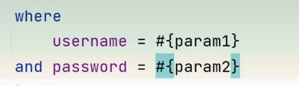

# 参数传递

-   单个参数
    1.  POJO类型(实体类)

        -   直接使用
        -   属性名和参数占位符一致即可

    2.  Map

        -   直接使用
        -   键名和参数占位符一致即可

    3.  Collection

        -   map.put("arg0",collection);
        -   map.put("collection",collection);

    4.  List

        -   map.put("arg0",list);
        -   map.put("collection",list);
        -   map.put("list",list);

    5.  Array

        -   map.put("arg0",数组);
        -   map.put("array",数组);

    6.  其他

        int id这种

        where id = #{id}这种

        写#{xxx}也行

        只有一个没有任何问题
-   多个参数
  
    -   @Param()注解

## ParamNameResolver类

-   封装传入参数

### 原理

-   底层会把参数封装成Map集合
    -   键-值
    -   map.put("arg0",值1);
    -   map.put("param1",值1);
    -   map.put("arg1",值2);
    -   map.put("param2",值2);
-   也就是说,不给他命名键,它也有键给你装好了可以用(arg0,arg1,param1,param2都可以用)



```java
 class ParamNameResolver
```

-   这个类是用来帮我封装map的

## 使用@Param

-   会用@Param的参数替换arg系列
-   总而言之加@Param(), 除了单个其他类型

