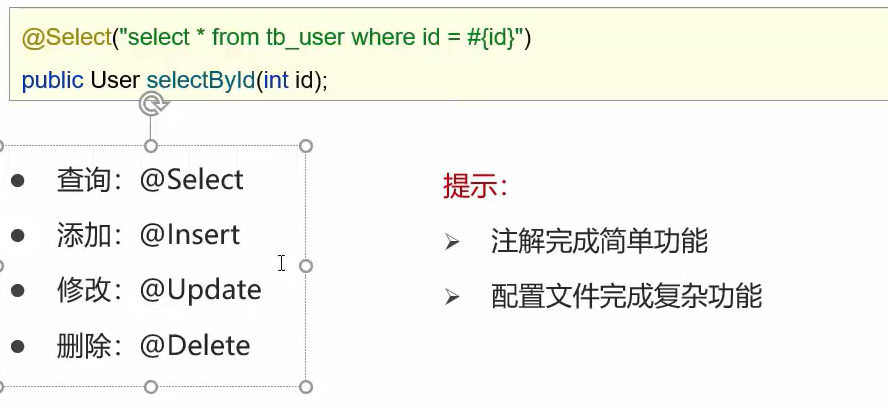

>   ​		使用注解来映射简单语句会使代码显得更加简洁，但对于稍微复杂一点的语句，Java 注解不仅力不从心，还会让本就复杂的 SQL 语句更加混乱不堪。 因此，如果你需要做一些很复杂的操作，最好用 XML 来映射语句。																																		   
>
>   ​																																					----------MyBatis官网

```java
@Select("select * from user where id = #{id}")
List<User> selectById(int id);
```

-   测试是一摸一样的
