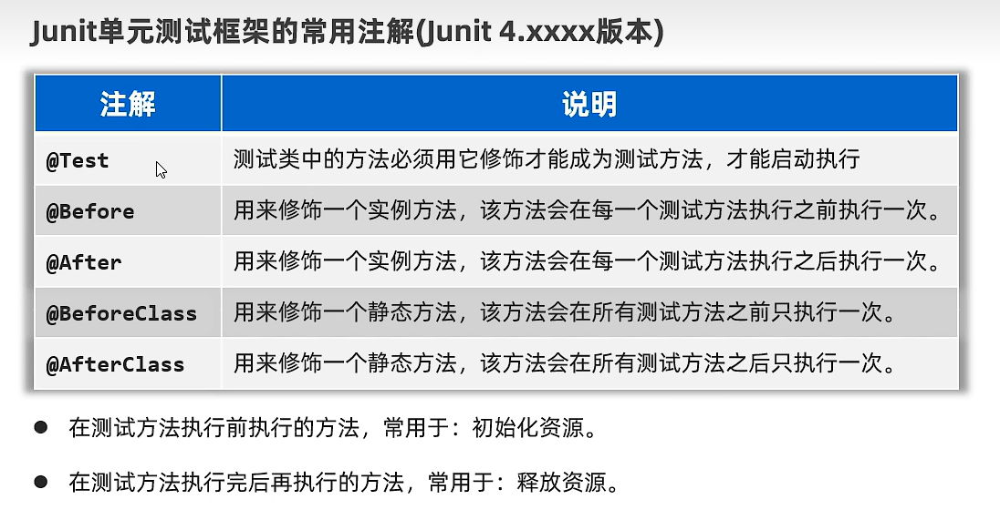
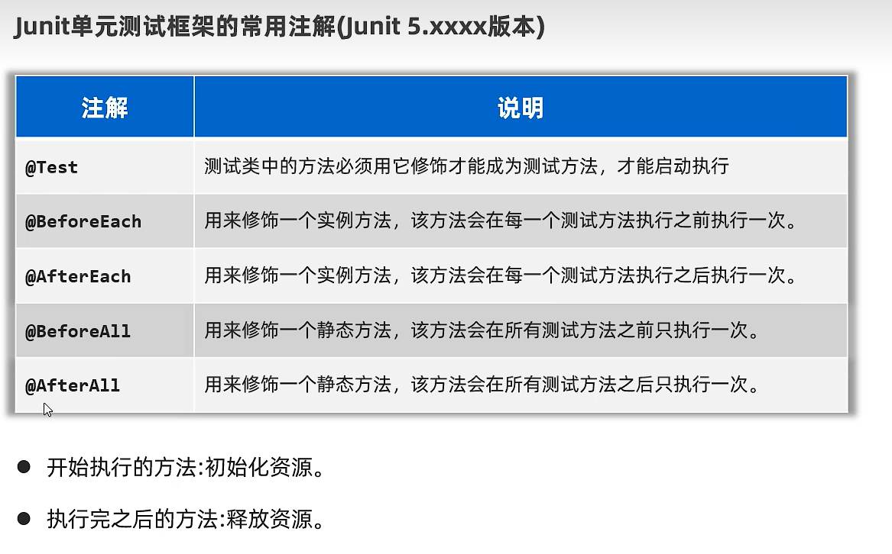

# Junit

-   用psvm测试之坏处

    

IDEA已经集成了Junit

## 优点


## 使用


对AaaaAaAaa类的测试类->AaaaAaAaaTest

对aaaAaaAaa方法的测试方法->testAaaAaaAaa


对有参数的方法,测试的时候传个null


## 断言机制

断言->预测

```java
@Test
public void tT(){
    Assert.assertEquals("方法内部有Bug",12,AppTest.t(12));
}
public static int t(int a) {
    System.out.println(a);
    return a;
}
```

-   ok↑

-   不ok↓

```test
junit.framework.AssertionFailedError: 方法内部有Bug expected:<1> but was:<12>
预期:1
实际:12
```

## 常用注解




```
@BeforeClass
	@Before
	@Test
	@After

	@Before
	@Test
	@After

	@Before
	@Test
	@After

	...
@AfterClass
```



玩弄我感情是吧

