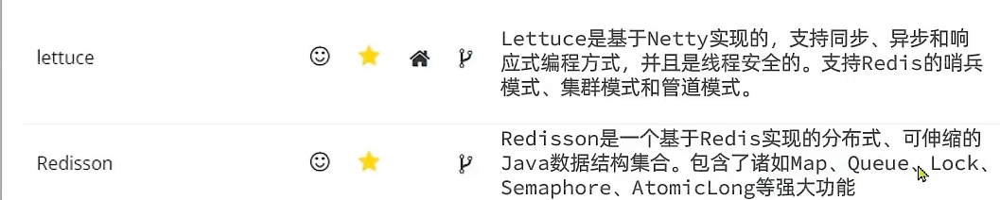

# Jedis

-   Radis命令作为方法名称
-   学习成本低
-   简单实用
-   **线程不安全**
    -   多线程短句下需要基于连接池使用



```xml
<!-- https://mvnrepository.com/artifact/redis.clients/jedis -->
<dependency>
  <groupId>redis.clients</groupId>
  <artifactId>jedis</artifactId>
  <version>4.2.3</version>
</dependency>
```

1.  建立依赖

2.  操作Redis
3.  关闭连接

```java
package com.harvey;

import junit.framework.TestCase;
import org.junit.*;

import org.slf4j.Logger;
import org.slf4j.LoggerFactory;

import redis.clients.jedis.Jedis;

/**
 * Unit test for simple App.
 */
public class AppTest extends TestCase {
    private static final Logger LOGGER = LoggerFactory.getLogger("JedisLog");
    private Jedis jedis;

    /**
     * Jedis快速入门
     */
    @Before
    public void setUp() {
        //建立连接
        jedis = new Jedis("0.0.0.0", 6379);

        //设置密码?设置?不是输入?
        //jedis.auth("123456");

        //选择库
        jedis.select(0);//默认0号库
        LOGGER.info("Connect Succeed.");
    }

    @Test
    public void test() {
        LOGGER.info("-----------String----------");
        LOGGER.info("String set=" + jedis.set("name", "Harvey"));
        LOGGER.info("String get=" + jedis.get("name"));
        LOGGER.info("------------Hash----------");
        LOGGER.info("long hSet=" + jedis.hset("User:1", "name", "Jack"));
        LOGGER.info("long hSet=" + jedis.hset("User:1", "age", "12"));
        LOGGER.info("long hSet=" + jedis.hset("User:1", "gender", "男"));
        LOGGER.info("Map User:1="+jedis.hgetAll("User:1"));
        LOGGER.info("--------------------------");
    }

    @After
    public void tearDown() {
        if (jedis != null) {
            jedis.close();
        }
        LOGGER.info("Close Succeed");
    }

}
```

