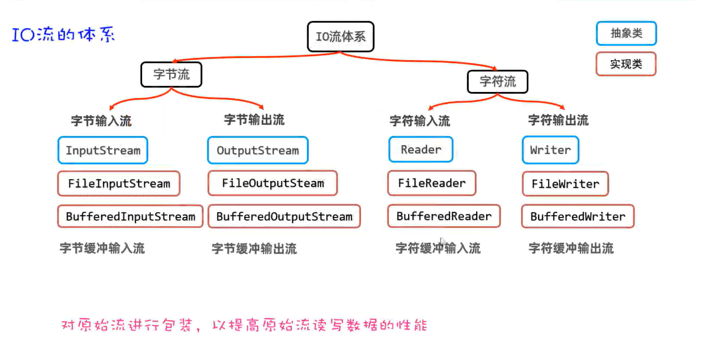
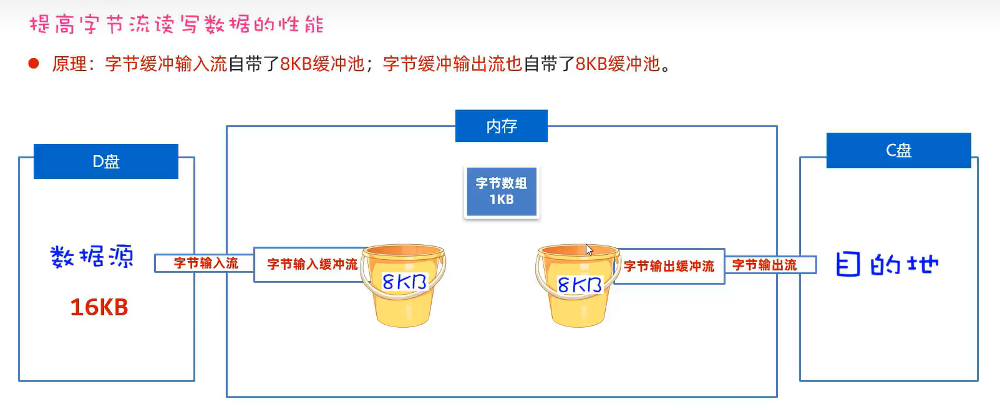
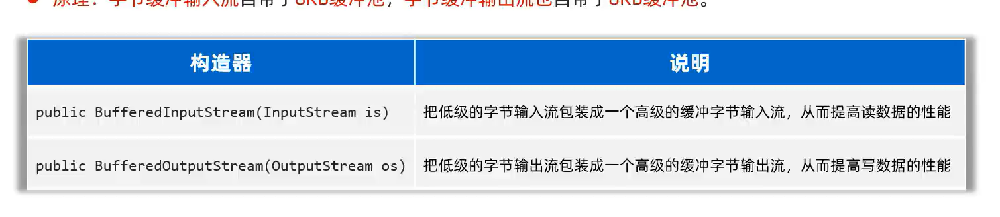
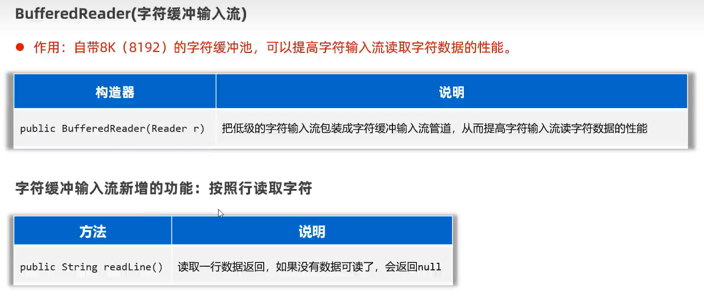
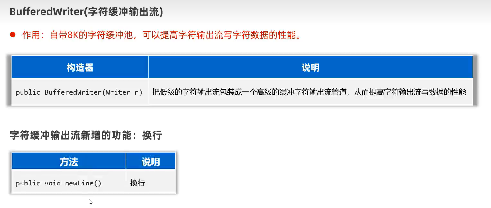

# 缓冲流



-   包装流的构造里套原始流

## 字节缓冲输入输出流



### API



```java
InputStream bufferedInputStream = 
        new BufferedInputStream(
                new FileInputStream(
                        "./src/TCP_NET/Client.java"
                ),
                1024*16//可以自己调
        )
```

## 字符缓存输入输出流

### API(功能新增!!!!!!!!!!!!!!!!!!!!!!!!!!!!!!!!!!!!!!)





-   用readLine()读csa之类的啊

```java
@Test
public void writeText() {
    try (
            Reader reader = new FileReader("./src/TCP_NET/Client.java");
            BufferedReader bReader = new BufferedReader(reader,1024*16);
            //文件若不存在,就会自己创建
    ) {
        String line;
        while ((line = bReader.readLine()) != null) {
            System.out.println(line);
        }
    } catch (IOException e) {
        e.printStackTrace();
    }
}
```

