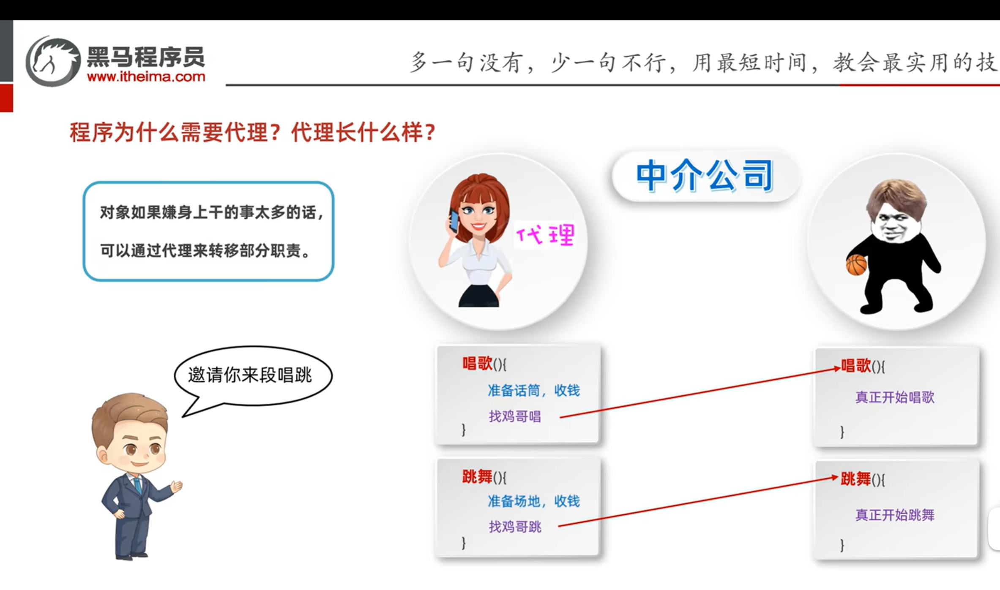

# 动态代理

还记得静态代理吗?这是多线程的知识点

## 概念

### 侵入式修改

- 直接在程序里修改

- 很危险,多米诺效应,千里之堤毁于蚁穴,不知道会发生啥

### 动态代理

- 特点:**无侵入式地给代码增加额外的功能**

### 什么是代理

中介公司即是代理,**做一些准备工作**



中介如何知道要有唱歌跳舞的方法的呢?万一还有打篮球呢?

答 : **代理和坤坤都去实现接口**

## 如何创建动态代理

### Proxy类

java.lang.reflect.Proxy类提供了为对象产生代理对象的方法:

```java
public static Object newProxyInstance(ClassLoader loader,Class<?>[] interfaces,InvocationHandler h)
```

- 参数loader:用于指定用哪个类加载器
- 参数interface:这些接口用于指定生成的代理有那些方法
- 参数h:用来指定生成的代理对象要干什么事情


### 实操

```java
//返回值:创建的代理
User user =(User) Proxy.newProxyInstance(
        App.class.getClassLoader(),//指定哪个类的类加载器,去加载生成代理对象,就写当前类没毛病
        new Class[]{User.class},//指定接口,接口用于指定生成的代理长什么样
        //指定生成的代理对象要干什么事情,可Lambda
        new InvocationHandler() {
            /**
             * 这个invoke(Object proxy,...)等价于他自动帮你做了proxy.method(args),三个元素
             * @param proxy 代理的对象user
             * @param method 要运行的方法
             * @param args 传给method的实参列表
             *
             * @return 返回方法的返回值
             * */
            @Override
            public Object invoke(Object proxy, Method method, Object[] args) throws Throwable {
                return method.invoke(
                        new UserServiceImpl(),//需要被代理的对象
                        args//实参列列表
                );
            }
        }

);
```

