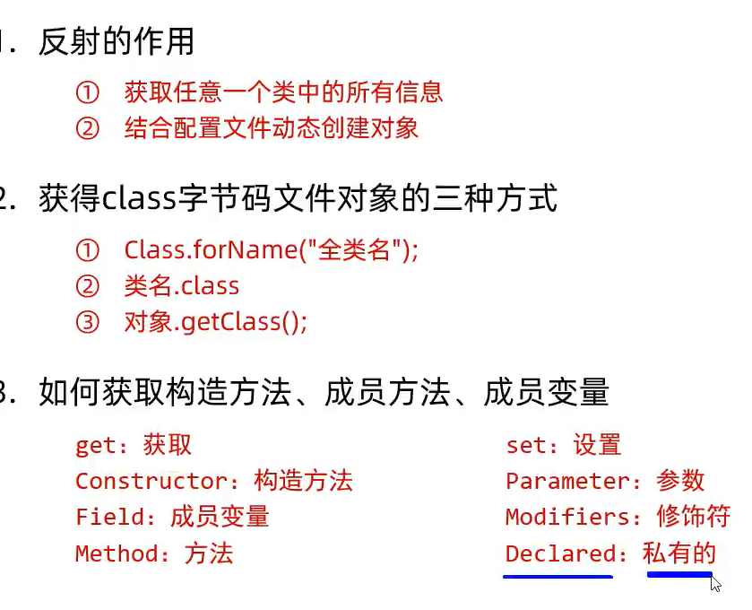

# 反射Reflection

## 概念

- 反射允许成员变量,成员方法,构造方法的信息进行编程访问

## 实例

- IDEA的代码预测功能

- ........

## 功能

能拿:

成员变量	修饰符		值			标识符 		类型

构造方法	修饰符		形参		标识符		创建对象		

成员方法	修饰符		形参		标识符		返回值		注解		异常		运行方法

## 用法

1. 先获取class对象
2. 在获取:
   - 成员变量(字段)
   - 构造方法
   - 成员方法

## 作用

- 获取对象的信息

- 将其信息保存到本地文件当中(IO流)

