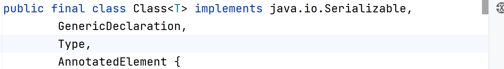
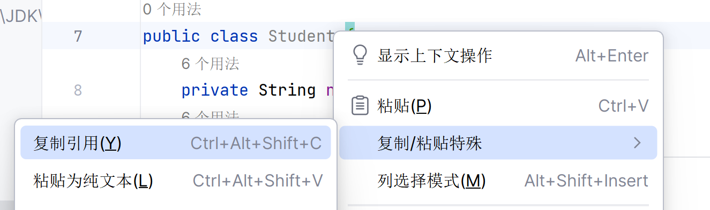

# Class类

名为Class的一个类



## 获取Class对象

1. 在源代码阶段

   - 先编写Java文件,

   - 再把它编译成字节码.class文件

   - 此时没有将代码加载到内存当中

   - 只停留在硬盘阶段

     ​	应用:

```java
Class.forName("全.包.名.类名")
```

2. 在加载阶段(.class自解码文件加载到了内存当中)应用:

```java
类名.class
```

3. 创建了对象之后应用:

```java
对象.getClass();
```

### 在源代码阶段获取Class对象(最常用)

全类名的复制:




全类名的粘贴:

<video src="../../typora-user-images/Day28/LearnLambda – Demo.java 2023-09-08 23-45-14.mp4"></video>

```java
/*LearnReflection.Student*/
Class studentClass1 =  Class.forName("LearnReflection.Student");//抛出异常
//就这样获取了Class的自解码对象
System.out.println(studentClass1);
```

### 在加载阶段获取Class对象(当作参数进行传递)

```java
System.out.println(Student.class);
```

### 在创建对象之后获取Class对象(已经有了对象)

```java
System.out.println(new Student().getClass());
//System.out.println((new Student()).getClass());
```

### 这三种方法结果是一样的

```j'a'v
Class studentClass1 = Class.forName("LearnReflection.Student");
Class studentClass2 = Student.class;
Class studentClass3 =new  Student().getClass();
System.out.println(studentClass1 == studentClass2);//true
System.out.println(studentClass2 == studentClass3);//true
System.out.println(studentClass1 == studentClass3);//true
```