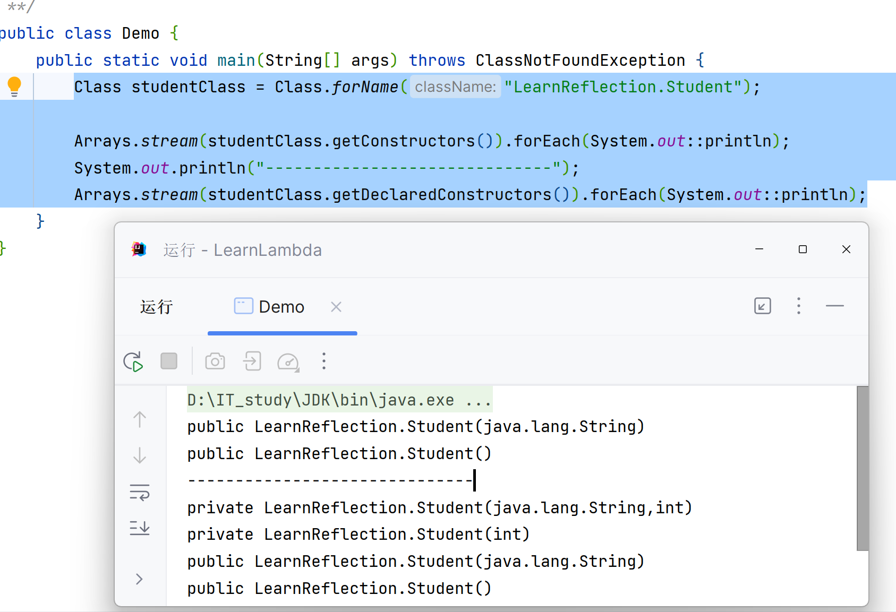
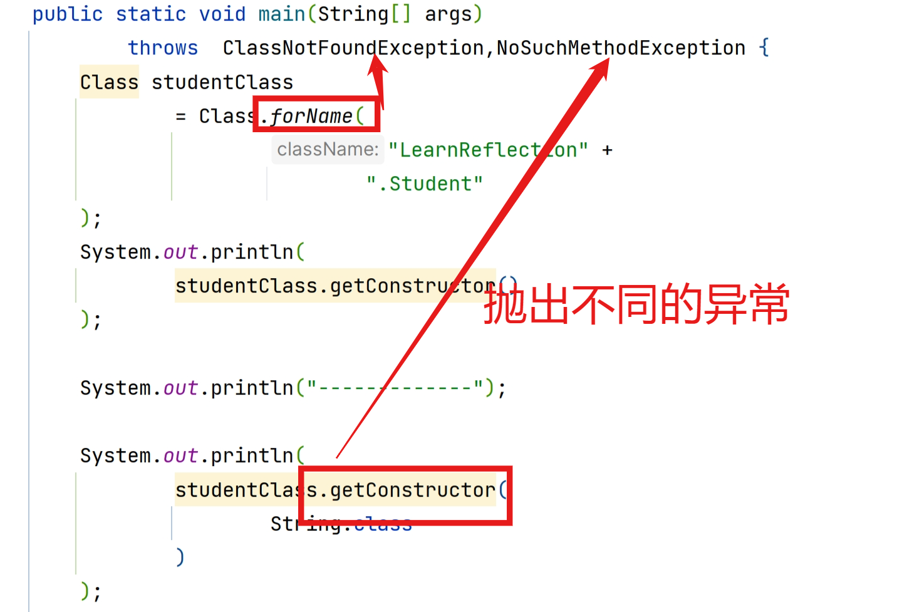
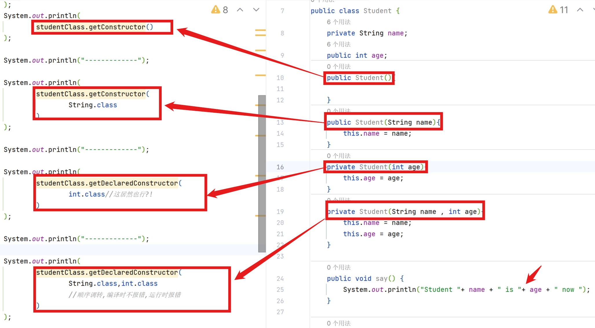

# Class中反射构造方法

Class Student ,着重看作用域,形参:

```java
public class Student {
    private String name;
    public int age;
    public Student(){...}
    public Student(String name){this.name = name;}
    private Student(int age){this.age = age;}
    private Student(String name , int age){
        this.name = name;
        this.age = age;
    }
```


## 获取构造方法

Class类里的方法:


| 方法返回值类型 | 方法名及形参 | 描述 |
| -------------- | ------------ | ---- |
| Constructor<T>| getConstructor(Class<?>... parameterTypes) | 依据给定的形参数据类型,返回单个public构造方法对象 |
| Constructor<?>[] |  getConstructor**s**()| 返回所有public构造方法对象的数组 |
|Constructor<T>  |getDeclaredConstructor(Class<?>... parameterTypes)| 依据给定的形参数据类型,返回单个构造方法对象 |
|Constructor<?>[]|getDeclaredConstructor**s**()| 返回所有构造方法对象的数组 |


### 返回构造方法的数组

```java
Class studentClass = Class.forName("LearnReflection.Student");

Arrays.stream(studentClass.getConstructors()).forEach(System.out::println);
//返回所有public构造方法对象的数组
System.out.println("------------------------------");
Arrays.stream(studentClass.getDeclaredConstructors()).forEach(System.out::println);
//返回所有构造方法对象的数组
```

输出结果:



### 返回指定构造方法



```java
studentClass.getConstructor()

studentClass.getConstructor(String.class)

studentClass.getDeclaredConstructor(int.class)//这居然也行?!

studentClass.getDeclaredConstructor(String.class,int.class)
    								//顺序调转,编译时不报错,运行时报错
```





### 获取构造方法的信息

Constructor类的方法

```java
public int getModifiers() {...}//获取权限修饰符,返回整形
public Parameter[] getParameters(){...} //返回构造方法形参的数组
```

#### 获取修饰符

```java
System.out.println(
        studentClass.getDeclaredConstructor(
                String.class,int.class
        )
                .getModifiers()//获取权限修饰符,返回整形
        *2/2//说明了它返回的是int
);
```


| Modifier and Type         | Constant Field | Value  |
| ------------------------- | -------------- | ------ |
|public static final int | PUBLIC       | 1    |
| public static final int | PRIVATE  | 2 |
| public static final int | PROTECTED    | 4|
| public static final int |STATIC       | 8    |
| public static final int | FINAL | 16  |
| public static final int | SYNCHRONIZED | 32   |
| public static final int | VOLATILE     |64   |
| public static final int | TRANSIENT    | 128  |
| public static final int | NATIVE       | 256 |
| public static final int | INTERFACE    | 512  |
| public static final int | ABSTRACT   | 1024 |
| public static final int| STRICT      | 2048|


IDEA底层用到了反射,就不会提醒你去调用peivate的构造方法


#### 获取形参的类型

```java
Arrays.stream(
        studentClass
                .getDeclaredConstructor(
                        String.class,int.class
                )
                .getParameters()//返回构造方法形参的数组
).forEach(System.out::println);

//输出:
/*
java.lang.String arg0
int arg1
*/
```

### 利用反射创建对象


Constructor类里的方法:

| Modifier and Type | Method                      | Description                 |
| ----------------- | --------------------------- | --------------------------- |
| T                 | newInstance()               | 创建对象                    |
| void              | setAccessible(boolean flag) | 设置为true,表示取消访问检查 |


```java
public static void main(String[] args)
        throws ClassNotFoundException, NoSuchMethodException, InvocationTargetException, InstantiationException, IllegalAccessException {
    Class studentClass = Class.forName("LearnReflection.Student");
    Constructor studentConstructor = studentClass.getDeclaredConstructor(String.class,int.class);
    Student student =(Student) studentConstructor.newInstance("Mike", 12);
    /*
    * 注意:
    * 1. 要强转
    * 2.getDeclaredConstructor()只是让你看到这个构造方法
    *           可是这个构造方法是私有的,所以会运行时异常
    * 			IllegalAccessException
    * */
}
```

可是我就是要用私有构造方法去创建!!!!!!!!!


```java
public static void main(String[] args)
        throws ClassNotFoundException, NoSuchMethodException, InvocationTargetException, InstantiationException, IllegalAccessException {
    
    Class studentClass = Class.forName("LearnReflection.Student");
    Constructor studentConstructor = studentClass.getDeclaredConstructor(String.class, int.class);
    
    studentConstructor.setAccessible(true);//临时取消权限的校验
    
    Student student = (Student) studentConstructor.newInstance("Mike", 12);
}
```

这叫**暴力反射**

