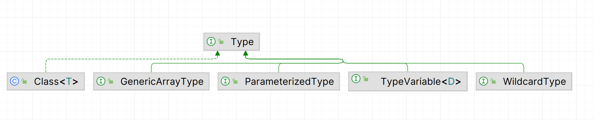

# 运行时类型

Type的子类有



-   `Class ` 字节码类

-   `GenericArrayType `  数组类

-   `ParameterizedType`  含有泛型类型参数列表的数组类

    -   `getRawType` 获取本身的类
    -   `getActualTypeArguments` 获取泛型参数列表

-   `TypeVariable<D>`  本身就是泛型的类型

    -   `getBounds`获取泛型范围限制

        ```java
        Type[] bounds = typeVar.getBounds();
        if (bounds.length > 0) {
            return bounds[0];
        }
        return Object.class;
        ```

-   `WildcardType`  泛型中出现的形如`List<?>`中的`?`就是该类型

    -    `?`本身没有意义, 但其`extends`和`super`的范围有意义
    -   `getLowerBounds` 获取其下限
    -   `getUpperBounds` 获取其上限

## 解析与使用

泛型只有在运行时才能得知它实际的类型, 当泛型出现在诸如返回值或参数的地方, 或者类型的泛型参数列表, 而又使用反射获取到了方法对象的返回值或参数列表等的时候, 得到的就不应该是一个明确的Class

那么, 在获取方法的返回值或参数的运行时类型时, 可以使用形如`getGenericParameterTypes()`的方法, 获取Type类型

然后再使用 `type instanceof  ParameterizedType` 再对不同类型的类型对象做各自的处理

