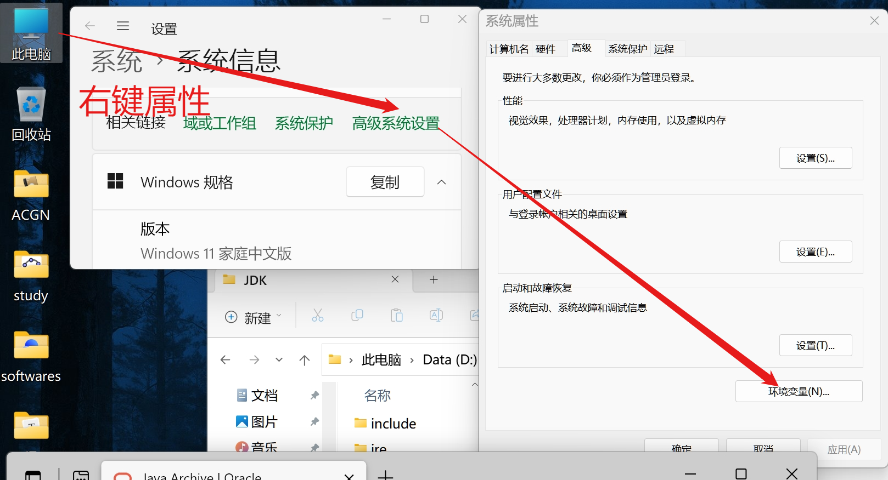
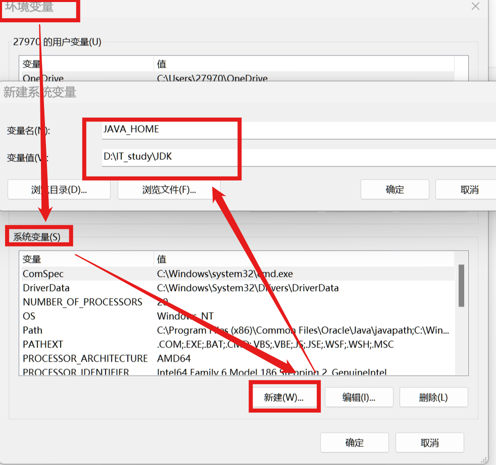
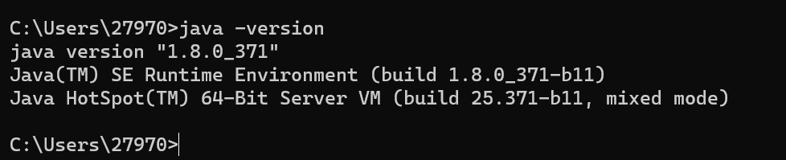

# JDK下载安装与卸载

## 卸载

1. 我的电脑->属性->高级系统设置->环境变量

2. 从**JAVE_HOME**得到文件路径，删除

3. 删除**path**下的**JAVE_HOME**相关文件

4. ```bush
   #在cmd中检查JAVA是否删除干净
   java -version
   ```

## 安装

1. 从我的电脑属性里了解自己电脑的配置
2. 登录Oracle
3. [在这个链接选择JDK版本](https://www.oracle.com/java/technologies/downloads/archive/)
4. 依据配置进一步选择
5. 安装时**更改下载目录**，一定要**记住**
6. 配置环境变量
   1. 我的电脑->属性->高级系统设置->环境变量

   2. 在系统变量中新建**JAVA_HOME**                                                

   3. 配置**path**变量（*%*表示引用）   

         
7. 检查是否安装成功                                           



