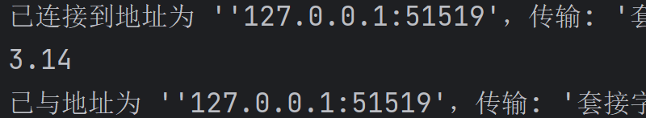

# 变量与常量与枚举类型

## 变量

声明和初始化：
[变量类型]  [变量名] = [变量值]


``` java
int a=1,b=2,c=3; //不建议在一行里定义多个变量，程序可读性差
```

### 作用域

``` java
//压根没讲清楚，以后再说

public class Main {
    static int allClock=0; //类变量，static(静态的)
    String str;//实例变量,从属于对象，不用初始化
    public static void main(String[] args) {

        int i=0;//局部变量
        System.out.println(i);

        System.out.println("----------------------------------");

        //实例变量的用法:
        //变量类型  变量名 =  会返回值new Main()
        Main       main  =  new Main();
        System.out.println(main.str);

        System.out.println("----------------------------------");

        int a=add();//？？？？？？？？？？？？？？？？？？？？？？？？？
    }

    public  void add() {

        System.out.println(allClock);

        return 0;
    }
}

```


#### 局部变量

**必须声明和初始化**

#### 类变量

写在类里面

static [type] [name] = [value]

#### 实例变量

从属于对象，**在“类”内，“方法”外**

## 常量0

### 用final修饰的常量

写在方法里,表示变量只能修改一次

### 用static final修饰的类常量

写在类里,作为属性+

``` java
//修饰符(static、final)不分前后，紫色部分也叫“变量类型”，在类下
static final double PI=3.14;		//静态(static)常(final)量
final static double PI=3.14;
```

``` java
public class Main {

    static final double PI=3.14;
    
    public static void main(String[] args) {

        System.out.println(PI);

    }
}
```




## 枚举类型

### 自定义枚举(enumerated)类型

```java
public class Main {
    //JDK8,枚举变量应写在类里
    enum Size{SMALL,MEDIUM,LARGE,EXTRA_LARGE}//表示衣服尺码
    //当有数据组,就这么几种,且不会变的,就用枚举变量

    //现在可以声明这些变量
    Size s1 = Size.MEDIUM;
    public static void main(String[] args) {
        Size s2 = Size.LARGE;
    }
}
```
