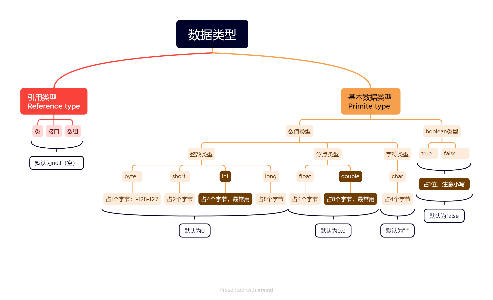
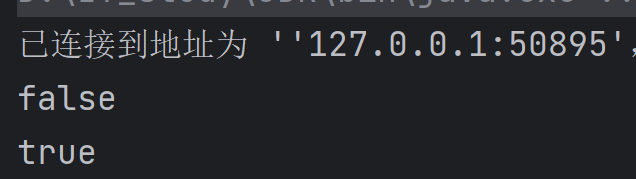
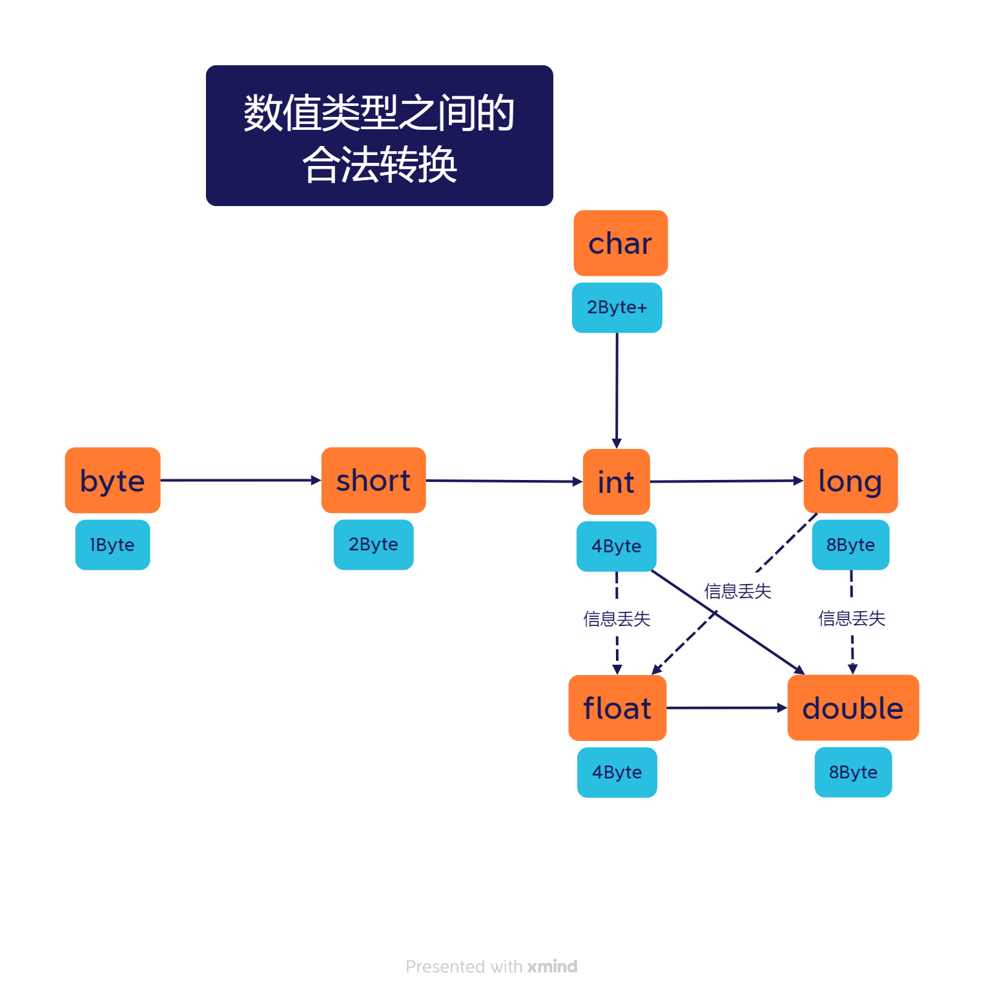
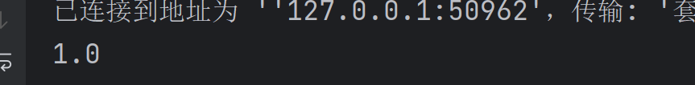
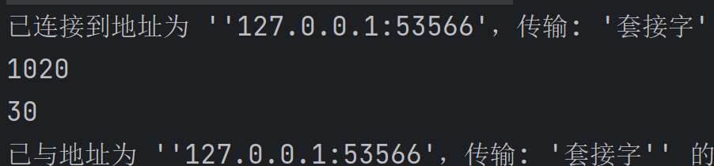
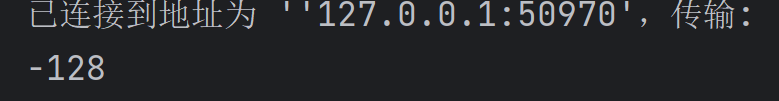
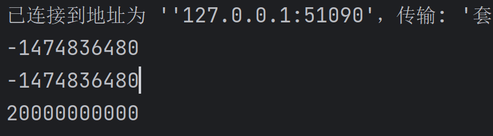

# 数据类型

## 两类语言

| 强类型语言 | Java           |
| ---------- | -------------- |
| 弱类型语言 | VB，JavaScripe |
## 数据类型的分类



## 整形相关

``` java
int num1=10 ;          	//byte,short也一样
int num2=10_0000_0000	//JDK7特性，数字内可加下划线
long num3=100L  ;      	//用L标注表示long型（l太像1了）

float numf=1.2F；		//理由同上
double numd=3.141592653589793238462643;
    
boolean falg=true;

char characer="中"；		//字符类型，注意区分字符串
    
String name="中国"		//String不是数据类型，而是一个**类**!!!!!!!!!!!!!!!!
```


- 进制转化

```java
int a=0x11     ;    			//十六进制
int b=010      ;   				//八进制
int c=0b1011_1010_0011_1001;	//二进制
```


- 转义字符            \n,\0,\r之类，都通用的


### Unsigned

当遇到例如:

- 一个byte不想表示-128~127,想表示0~255需要:

``` java
int unsignedByte = Byte.toUnsignedInt((byte) 255);//把(byte)255转为int
{...}//作为int处理这个数,适合除法和取余 
```


## Double的出错情况

常量

```java
System.out.println(Double.POSITIVE_INFINITY);
//正无穷大,POSITIVE_INFINITY = 1.0 / 0.0
        
System.out.println(Double.NEGATIVE_INFINITY);
//负无穷大,NEGATIVE_INFINITY = -1.0 / 0.0

System.out.println(2.0/0.0 == Double.POSITIVE_INFINITY);//true

System.out.println(Double.NaN);
//NaN = 0.0d / 0.0

System.out.println(0.0/0.0 == Double.NaN);//always false
//应当认为每次0.0/0.0的结果都不一样
System.out.println(Double.isNaN(0.0/0.0));//true
//这才对嘛
```


## float的舍入误差

``` java
float f=0.1f;
double d=0.1;

System.out.println(f == d); //false

float f1=9292999292.1f;
float f2=f1+1;

System.out.println(f1 == f2);//true
```

输出结果如下：




***结论：最好完全避免使用浮点数进行比较***

## char与String

```java
System.out.println("\"+\"");//"+"
//\u0022意味双引号,\u是Unicode转义符,可被程序应用
System.out.println("\u0022+\u0022"+".");//,
```

**注意!**Unicode转义符会在解析代码之前处理:

```java
//\u000A is a newLine<-会报错
//looke c:\users
```

## 默认值

默认值是针对字段的,与局部变量无关

## 类型转化

### 信息丢失




``` java
int n = 123456789;
float f = n ;//f = 1.23456792E8
```

当用一个二元运算符链接两个值是,应遵循**如下规则**

1. 若两数中有一数是double,另一数转为double
2. 否则,若其中有一数是float,另一数转为float
3. 否则,若其中有一数是long,另一数转为long
4. 否则,两数皆转为int

### 低转级

> 自动转换

``` java
int i=1;
double d=i;

System.out.println(d);
```




``` java
public class Demon01 {
    public static void main(String[] args) {

        System.out.println(""+10+20);

        System.out.println(10+20+"");
        
    }
}
```



### 高转低

> 强制转换 

``` java
//[type] [name1]=([type])[name2]
int i = 8 ;
byte b=(byte) i;
```
#### 内存溢出
``` java
int i = 128 ;
byte b=(byte) i;

System.out.println(b);
```



``` java 
int money=10_0000_0000;
int year=20;
int tatal=money*year;

System.out.println(tatal);//溢出
//----------------------------------------

long tatal1=money*year;

System.out.println(tatal1);//溢出

//----------------------------------------

long tatal2=money*(long)year;//(long)加前加后一个样

System.out.println(tatal2);//不溢出
```



## 引用类型

引用类型首先要检查是否为**null**

**如果在null上调用方法,会出现错误**
