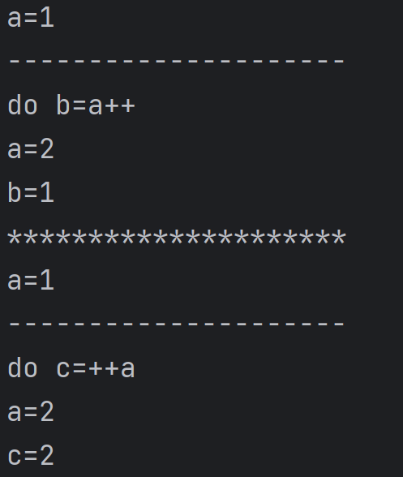

# 运算符

| **优先级** | **描述**                             | **运算符**                               | **结合性**   |
| ---------- | ------------------------------------ | ---------------------------------------- | ------------ |
| **1**      | **分隔符**                           | **[ ] ( ) . , ;**                        |              |
| **2**      | **对象归类，自增自减运算符、逻辑非** | **instanceof ++ -- !**                   | **从右到左** |
| 见下方     | **取反**                             | **~**                                    | **从右到左** |
| **3**      | **算术乘除运算符**                   | *** /**                                  | **从左到右** |
| **4**      | **算术加减运算符**                   | **+ -**                                  | **从左到右** |
| **5**      | **移位运算符**                       | **>>(符号位填充高位),<<,>>>(0填充高位)** | **从左到右** |
| **6**      | **大小关系运算符**                   | **>   >=   <   <=**                      | **从左到右** |
| **7**      | **相等关系运算符**                   | **==    !=**                             | **从左到右** |
| **8**      | **按位与**                           | **&**                                    | **从左到右** |
| **9**      | **按位异或**                         | **^**                                    | **从左到右** |
| **10**     | **按位或**                           | **\|**                                   | **从左到右** |
| **11**     | **逻辑与运算符**                     | **&&**                                   | **从左到右** |
| **12**     | **逻辑或运算符**                     | **\|\|**                                 | **从左到右** |
| **13**     | **三目运算符**                       | **? :**                                  | **从左到右** |
| **14**     | **赋值运算符**                       | **=**                                    | **从右到左** |

## 算数运算符

``` java
System.out.println("30/20="+30/20);
System.out.println("30.0/20="+30.0/20);
System.out.println("(-30)/20="+(-30)/20);
System.out.println("30/(-20)="+30/(-20));
System.out.println("30%20="+30%20);
System.out.println("(-30)%20="+(-30)%20);
System.out.println("30%(-20)="+30%(-20));
```

**((int) (a/b))*b + a%b = a**;

整型浮点都这样,别管!

## 自增自减运算符

``` java
public class Main {
    public static void main(String[] args) {

        int a=1;
        System.out.println("a="+a);

        System.out.println("---------------------");
        System.out.println("do b=a++");			//先赋值，再自增

        int b=a++;
        System.out.println("a="+a);
        System.out.println("b="+b);

        System.out.println("*********************");

        a=1;
        System.out.println("a="+a);

        System.out.println("---------------------");
        System.out.println("do c=++a");			//先自增，再赋值

        int c=++a;
        System.out.println("a="+a);
        System.out.println("c="+c);
    }
}
```



## 逻辑运算符


|  与  |  或  |  非  |
| :--: | :--: | :--: |
|  &&  | \|\| |  !   |

```java
x == 0 && 1/X > 0
```

存在短路,&&左边是false就不再运算右边

### 大小关系运算符

```java
System.out.println(2.0 == 2);//true
```


## 位运算

``` java
public class Demon01 {
    public static void main(String[] args) {

        /*
        A=0011 1100
        B=0000 1101

        A&B     每位做与运算
        A|B     每位做或运算
        A^B     每位做异或运算（相同为0，相异为1）
        ~B      取反

         */
		//------------------------------------------------------------------------
        /*
        <<   左移
        >>   右移
         */

        System.out.println(2<<3);//输出16
        System.out.println(~(-1));//0
    }
}
```

### 取反的优先级

首先,它的优先级**大于乘除**自不用说

其次,它的优先级和**取负**一样

```java
int a = -1;
System.out.println(~++a);//-1
a = -1;
System.out.println(~a++);//0
```

由此可以看出,优先级比自增自减低

## 拓展赋值运算符

+=，-=.................

### 警告!!!!!

```java
int x = 1;
x += 3.5//x仍为int,此式即为x = (int)(x+3.5)
```


## 条件运算符 (x？y：z) 炒鸡好用

``` java 
/*
if(x){
    y
}else{
    z
}
*/
int score=80;
String type = score>=60?"及格"："不及格";
System,out println(type)
```

