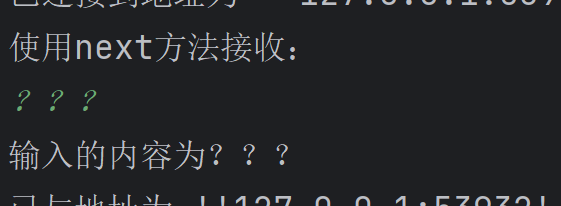
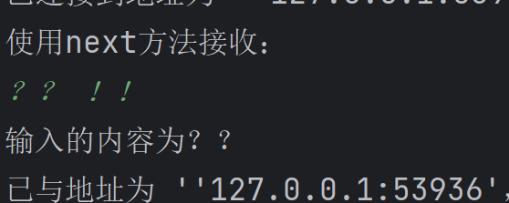
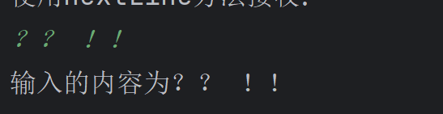
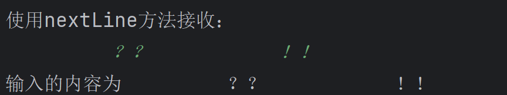

# Scanner 用户输入

``` java
import java.util.Scanner;

public class Main {


    public static void main(String[] args) {
        Scanner scanner=new Scanner(System.in);

        System.out.println("使用next方法接收：");

        //判断用户有无字符串输入
         if (scanner.hasNext()){
             String str=scanner.next();
             System.out.println("输入的内容为"+str);
        }
         //凡是属于IO流(输入输出)的类，如果不关闭会一直占用资源
         scanner.close();
        //但是scanner要保证在循环内是一直开启的
    }
}
```
***


---




***


``` java
import java.util.Scanner;

public class Main {


    public static void main(String[] args) {
        Scanner scanner=new Scanner(System.in);

        System.out.println("使用nextLine方法接收：");

        
         if (scanner.hasNextLine()){//x.hasNextLine
             String str=scanner.nextLine();//x.nextLine()
             System.out.println("输入的内容为"+str);
        }
         scanner.close();
    }
}
```



## next()

1. 一定要读到有效字符后才可以结束输入
2. 对输入有效字符之前的空白，会将其自动去除
3. 只有输入有效字符后才将其后面输入的空白作为结束符
4. **next()不能得到带空格的字符串**


## nextLine()

1. 以Enter为结束符
2. 可以获得空白




## 用法

``` java
import java.util.Scanner;

public class Main {
    public static void main(String[] args) {
        Scanner scanner=new Scanner(System.in);
		System.out.println("请输入");
        String str=scanner.nextLine();
        System.out.println("输入的内容为"+str);
       
        scanner.close();
    }
}
```

``` java
import java.util.Scanner;

public class Main {


    public static void main(String[] args) {
        Scanner scanner = new Scanner(System.in);

        System.out.println("请输入整数：");

        if (scanner.hasNextInt()) {    //
            int i = scanner.nextInt();   //
            System.out.println("输入的整数为" + i);
        }
        scanner.close();
    }

}
```

