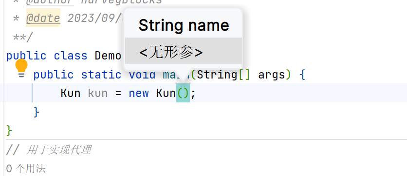

# 阳了，适用于IDEA

Ctrl + D     					复制当前行的内容到下一行

Ctrl+H							查看类关系结构

Ctrl +Shift+ Enter    	自动在句末添加分号

Ctrl + Alt + L				自动整理格式

Alt+Enter      				显示上下文操作,可以显示编译时异常类型,并帮助抛出

Ctrl + /  		 				本行注释

Ctrl +Shift+/ 				多行注释

Ctrl + R  		 				批量替换代码

Ctrl+I/O						实现/覆写

Ctrl + P  		 				提示方法参数:

Ctrl+F							文件内查找



Shift + F6						批量修改变量名，没法用，原因不明，只能用右键+R+R凑合一下

Ctrl +Shift+ -				全部收起


psvm

```
public static void main(String[] args) {
        
    }
```

sout

``` java
System.out.println();//sout
System.out.println("man");//"man".sout
```

Alt+Insert

1. 构造构造器函数
2. 构造get-set函数
3. 重写方法
4. ··········

Ctrl +Alt+T 包围代码块


Alt+鼠标拖动  多行同时操作

