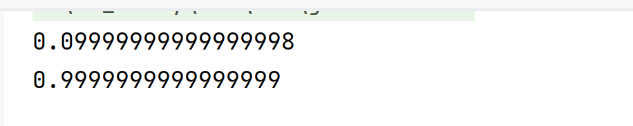

# BigDecimal

## 引入：浮点数的存储存在误差

```java
System.out.println(1.0-0.9);
System.out.println((1.4-0.5)/0.9);
```

输出结果如下：



解决此类问题的方法是使用类**BigDecimal**


## 常用方法

```java
import java.math.BigDecimal;

public class Main {
    public static void main(String[] args) {
        BigDecimal bigDecimal1 = new BigDecimal("1.0");//注意使用字符串，字符串是最准确的
        BigDecimal bigDecimal2 = new BigDecimal("0.9");

        //加
        BigDecimal result = bigDecimal1.add(bigDecimal2);
        System.out.println(result);//1.9

        //减
        result = bigDecimal1.subtract(bigDecimal2);
        System.out.println(result);//0.1

        //乘
        result = bigDecimal1.multiply(bigDecimal2);
        System.out.println(result);//0.90

        //除
        result =new BigDecimal("1.4")
                        .subtract(new BigDecimal("0.5"))
                        .divide(new BigDecimal("0.9"));
        System.out.println(result);//1
        //注意
        //这里统一都是”.“运算符的优先级所以从左到右运算

        /*
        result = bigDecimal1.divide(bigDecimal2);
        1.0/0.9,除不尽，报错：ArithmeticException
        解决方法：指定保留小数位数
        */
        
        //-----------------小数点后几位，好像无上限?↓---------------↓意为四舍五入
        result = bigDecimal1.divide(bigDecimal2,5,BigDecimal.ROUND_HALF_UP);
        System.out.println(result);//1.11111
        
        
        BigDecimal n1 = new BigDecimal("2.000");
        BigDecimal n2 = new BigDecimal("2");
        System.out.println(n1.compareTo(n2)+1);
        //n1<n2----->-1,n1>n2-------->1,n1==n2--------->0
    }
}
```


## 取舍方法：


| 取舍方法                 | 描述     | 示例                                |
| ------------------------ | -------- | ----------------------------------- |
| BigDecimal.ROUND_UP      | 向外取   | 1.0/9.0=0.11112 ; -1.0/9.0=-0.11112 |
| BigDecimal.ROUND_DOWN    | 向内取   | 8.0/9.0=0.88888 ; -8.0/9.0=-0.88888 |
| BigDecimal.ROUND_CEILING | 向上取   | 1.0/9.0=0.11112 ; -1.0/9.0=-0.11111 |
| BigDecimal.ROUND_FLOOR   | 向下取   | 8.0/9.0=0.88888 ; -8.0/9.0=-0.88889 |
| BigDecimal.ROUND_HALF_UP | 四舍五入 | 5.0/9.0=0.55556；-5.0/9.0=-0.55556  |
| 别的别管                 |          |                                     |

