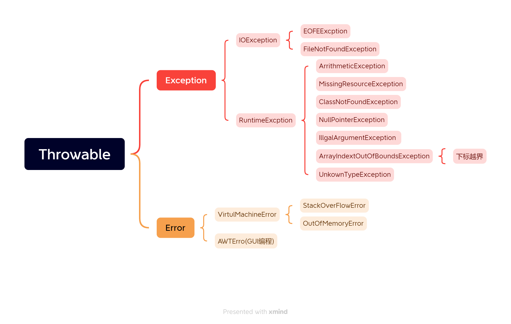
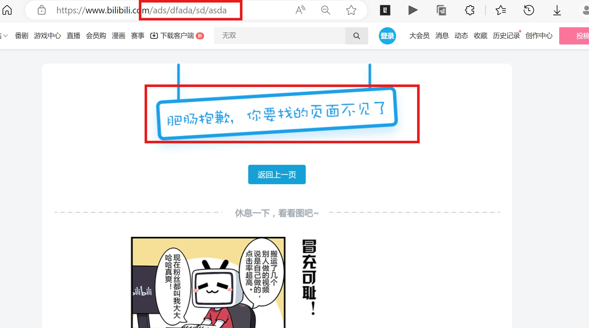
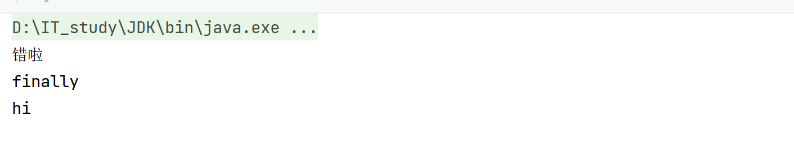
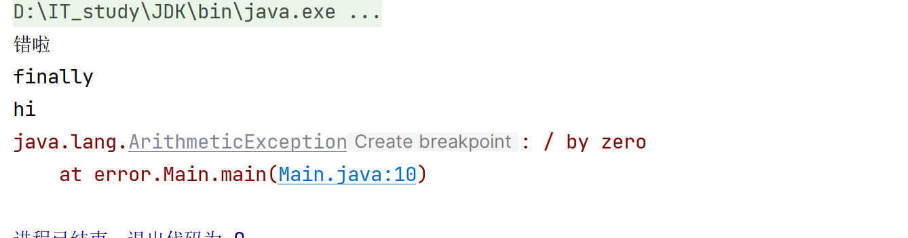
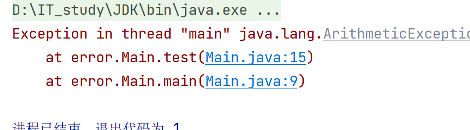
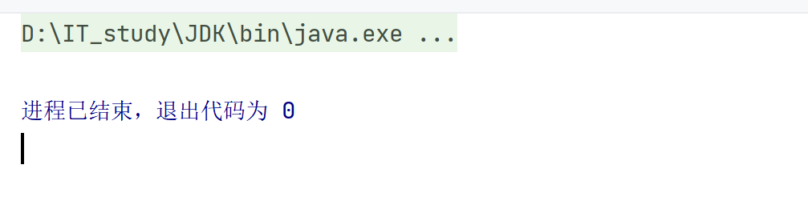

# Error和Exception

异常指程序运行中出现了不期而至的各种状况

如：文件找不到，网络链接失败，非法参数等

## 抛出异常的原理

1. 出现异常
2. 找到异常对象
3. 把异常对象抛给JVM虚拟机
4. JVM虚拟机停止程序运行 
5. JVM虚拟机打印异常

## 分类

1. 编译时异常：编译时会报错的异常
2. 运行时异常(RuntimeExcption及其子类)：可以被程序员避免的异常，运行时异常可以在编译时不报错
3. 错误（Error）：错误不是异常（Exception），二十脱离程序员控制的问题。错误在代码中通常被忽略。如：栈溢出。它们在编译时也检查不到.这是开发java时要考虑的,与程序员无关.



## 异常处理框架

Java把异常作为对象来处理，并定义了一个基类java.lang,Throwable作恶日所有异常的超类

## 异常例举

```java
package error;

/**
 * @author HarveyBlocks
 * @date 2023/08/14 16:59
 **/
public class Main {
    public static void main(String[] args) {
        new Main().a();
    }
    public void a(){
        System.out.println("a");
        b();
    }
    public void b(){
        System.out.println("b");
        a();
    }
    //循环依赖,但不会报错
}
```


```java
public class Main {
    public static void main(String[] args) {
        System.out.println(1/0);
    }
    
    //除零,但不会报错
}
```

## 抛出异常

- 现有 方法A( ) 调用 方法B( ) ,  方法B( ) 调用 方法C( )  

1. C( ) 可能出现异常,需要向外抛,抛给方法B()

2. B( )可能同时带有异常,需要把B()的异常连带着C()的异常往外抛,抛给方法A()

   - 可以抛多个异常`throws XXXExcption <,  XXXExcption...> `
   - 但是不建议细分到如此,直接用`throws Exception`把所有异常抛出

3. A() 理论上还可以往外抛,但不建议,建议在A()处try-catch A(),B(),C()的异常 

   - 可以try-catch多个异常:

   ```java
   try{
       B();
   }catch (XXXExcption e){
       System.out.println("你的程序有XXX异常")//对用户的友好回复
       e.printStackTrace();//对异常进行记录
   }catch (XXXExcption e){
       e.printStackTrace();
   }
   ```

   

4. 在 A() 处捕获到异常之后,可以记录异常并响应合适的信息给用户


这就很友好:




### 抛出异常有关关键字

- try
- catch捕获
- finally无论有没有异常都会走的
    - 就算前面return了也tm会走!!
    - finally里面不要返回值,否则会不准确
- throw抛出异常
- throws抛出异常

### 抛出异常示例

无shit.printStackTrace();打印错误的栈信息

```java
package error;

/**
 * @author HarveyBlocks
 * @date 2023/08/14 16:59
 **/
public class Main {
	public static void main(String[] args) {
        try {
            System.out.println(1/0);
            System.out.println("hello");//不运行
        }catch (ArithmeticException exceptionName){//如果出现了{ArithmeticException}异常，则执行以下代码块：
            System.out.println("错啦");
            //exceptionName.printStackTrace();//打印错误的栈信息
        }catch (Throwable exceptionName){//大的写下面，原理同if-else，直接跳出
            System.out.println("错啦");
            exceptionName.printStackTrace();        
        } finally{//最后处理善后
            System.out.println("finally");
        }
        System.out.println("hi");

    }

    //除零,但不会报错
}
```

**注意代码块执行的顺序**



有shit.printStackTrace();打印错误的栈信息

```java
package error;

/**
 * @author HarveyBlocks
 * @date 2023/08/14 16:59
 **/
public class Main {
    public static void main(String[] args) {
        try {
            System.out.println(1/0);
        }catch (ArithmeticException shit){//如果出现了{ArithmeticException}异常，则执行以下代码块：
            System.out.println("错啦");
            shit.printStackTrace();//打印错误的栈信息
        }catch (Throwable shit){//大的写下面，原理同if-else，直接跳出
            System.out.println("错啦");
            shit.printStackTrace();
        } finally{//最后处理善后
            System.out.println("finally");
        }
        System.out.println("hi");

    }

    //除零,但不会报错
}
```

**注意代码块执行的顺序**



### finally,主动修复异常

```java
finally{//最后处理善后
        System.exit(123);//参数是int即可，即退出程序    
    	System.out.println("finally");
        }
```


### 主动抛出异常，throw

此法常用于方法

```java
public class Main {
    public static void main(String[] args) {
        test(1,0);
    }
    public static void test(int a,int b){
        if(a==0){
            throw new ArithmeticException();
        }
        System.out.println(a/b);
    }
    //除零,但不会报错
}
```



```java
public class Main {
    public static void main(String[] args) {
        test(1,0);
    }
    public static void test(int a,int b){
        if(a==0){
            throw new ArithmeticException();
        }
		//System.out.println(a/b);
    }
    //除零,但不会报错
}
```



### throws

假设这个方法处理不了这个异常，那么就在这个方法上抛出异常**（使用throws）**抛给上一层程序(JVM虚拟机是最上层程序)

```java
public class Main {
    public static void main(String[] args) {
        test(1,0);
    }
    public static void test(int a,int b) throws ArithmeticException{//抛给JVM虚拟机
        if(a==0){
            throw new ArithmeticException();
        }

    }
    //除零,但不会报错
}
```


### 主动抛出的好处

被动地，系统自动停止；主动的，系统继续执行


### 抛出异常,不断循环直至解决

- 特别注意:
  - 因为scanner要保证在循环内是一直开启的
    可以在main方法里面声明scanner，然后传入judgeage方法里，最后在main的结尾关闭scanner就没问题了
  - 每次检验出异常Scanner都会关闭,所以要在每次循环都new Scanner一次

```java
package LearnException;
import java.util.Scanner;
public class Test {
    //循环调用judgeAge(),并抓取可能的异常,直到输入正确
    public static void main(String[] args) {

        while (true) {
            Scanner scanner = new Scanner(System.in);
            try {
                judgeAge(scanner);
                break;
            } catch (Exception e) {
                System.out.println("输入有误");
                e.printStackTrace();
            }//每次报错scanner都会关闭,所以要在每次循环都new Scanner一次

            try {//延时,为了寻找错误
                Thread.sleep(1000);
            } catch (InterruptedException e) {}

        }
    }

    //输入age,并判断age是否合法
    //age的合法标准:1.整形  2.(0,130)
    //当不满足2时,抛出自定义异常
    public static void judgeAge(Scanner scanner){

        //输入age
        System.out.print("请输入年龄:");
        int age = scanner.nextInt();
        System.out.println("输入的内容为" + age);

        //判断age是否符合(0,130)
        if (age > 0 && age < 130) {
            System.out.println("success");
        } else {//抛出自定义异常
            System.out.println(
            "年龄范围不合理,您输入的年龄是:" + age
            );
            try {//延时,为了寻找错误
                Thread.sleep(1000);
            } catch (InterruptedException e) {}
            throw new AgeIllegalException("your age is impossible");
        }
    }
}
```

## 自定义异常


### 自定义运行时异常

1. 定义一个异常类继承RuntimeException
2. 重写构造器
3. 用一个异常对象分装这个问题
4. throw抛给main()里的judgeAge()


```java
package LearnException;

//1.定义一个异常类继承RuntimeException
public class AgeIllegalException extends RuntimeException{
    //2.重写构造器
    public AgeIllegalException(String message){
        super(message);
    }

}
```


``` java
package LearnException;

public class Test {

    public static void main(String[] args) {
        try {
            judgeAge(215);//在这里接收异常,并将其抓住
        } catch (Exception e) {
            e.printStackTrace();
        }
    }

    public static void judgeAge(int age) {
        if (age > 0 && age < 130){
            System.out.println(age);
        }else {
            //3.用一个异常对象分装这个问题
            //4.throw抛给main()里的judgeAge()
            throw new AgeIllegalException(
                    "your age is illegal,your age is " + age
            );
        }
    }
}

```


### 用户自定义编译时异常

1. 定义一个异常类继承Exception
2. 重写构造器
3. 用一个异常对象分装这个问题
4. throw抛给main()里的judgeAge()


```java
public static void judgeAge(int age) throws Exception{//throw抛给main()里的judgeAge()
    ...
}
```

```java
public class AgeIllegalException extends Exception{//继承Exception
	...
}
```


## 实际应用中的经验

- 处理运行异常时，采用逻辑去合理规避同时辅助try-catch处理
- 在于多重catch块后面，可以加一个catch(Exception)【大点好】,处理潜在的异常
- 对于不缺定的代码，也可以加上try-catch，处理潜在的异常
- 尽量去处理异常，切忌只是简单的调用printStackTrace（）去打印输出错误的栈信息
- 具体如何处理异常，要根据不同的业务需求和异常类型去决定
- 尽量添加finally语句块去释放占用的资源

