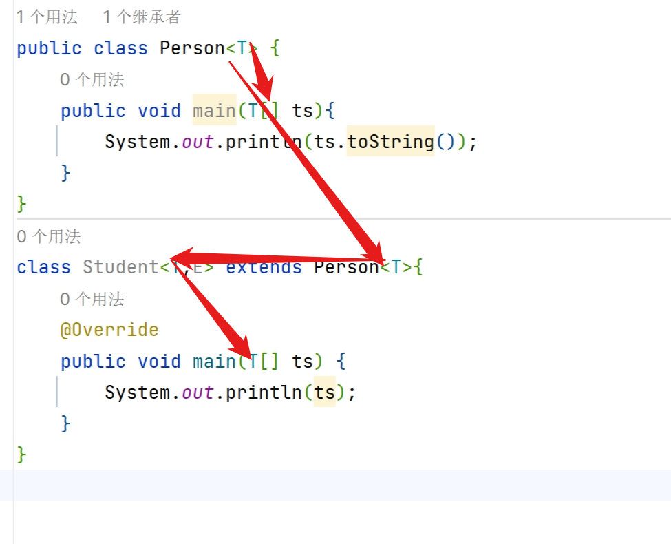

# 泛型类的实现

```java
class 类名<类型占位符[,....]>{
     修饰符 类型展占位符 变量名;
}
```

## 泛型类的创建

* 泛型类
 * 语法       `类名<类型占位符[,....]></>`
 * T 表示一种引用类型

```java
package GenericLearning;

/**
 * @author HarveyBlocks
 * @date 2023/08/28 15:46
 **/
public class MyGeneric<T> {
    //创建变量
     T t;
    
    //创建方法

    //作为方法的参数
    public void say(T t) {
        /*
        T t1 = new T();汇报错
        因为不知道T是什么类型,
        不知道他的构造方法是不是private,
        不知道他的构造方法是有参还是无参
        */
        System.out.println(t);
    }
    
    //作为方法的返回值
    public T getT(){
        return t;
    }

}
```

## 泛型类的使用

- 不对泛型类指示类型,默认是Object

### 用泛型类创建对象(以String为例)

```java
package GenericLearning;

/**
 * @author HarveyBlocks
 * @date 2023/08/28 16:24
 **/
public class TestGeneric {
    public static void main(String[] args) {
        //用泛型类创建对象
        MyGeneric<String> myGeneric1 = new MyGeneric();
        MyGeneric<String> myGeneric2 = new MyGeneric<>();//后面的在1.7之后可以不写
        MyGeneric<String> myGeneric3 = new MyGeneric<String>();//1.7之前要写成这样
    }
}
```

### 对泛型类内的属性赋值(以String为例)

```java
myGeneric1.t = "Hello";
myGeneric1.say("什么?");//什么
System.out.println(myGeneric1.t);//Hello

myGeneric2.say("什么?");//什么
System.out.println(myGeneric2.t);//null

myGeneric3.t = "What?";
String str3_0 = myGeneric3.getT();
System.out.println(str3_0);//"What?"
String str3_1 = myGeneric3.t;
System.out.println(str3_1);//"What?"
```

### 用泛型类创建对象及对其内的属性赋值(以Integer为例)

```java
MyGeneric<Integer> integerMyGeneric = new MyGeneric();
//MyGeneric<Integer> integerMyGeneric = 1;报错
// 废话,一个类怎么可能是一个整形呢?
integerMyGeneric.t = 1;//自动装箱
System.out.println(integerMyGeneric.t);//1
integerMyGeneric.t = new Integer(100);
System.out.println(integerMyGeneric.t);//100
```

### 不同的泛型类型不能相互赋值

```java
//myGeneric1 = integerMyGeneric; 不可以
myGeneric3 = myGeneric1;//可以
```


### 同一泛型类之间的关系

```java
MyGeneric<String> StringMyGeneric = new MyGeneric<>();
MyGeneric<Integer> integerMyGeneric = new MyGeneric<>();
```

StringMyGeneric和integerMyGeneric本质上还是MyGeneric类

### 泛型类的继承

#### 子类也是泛型类

- 子类和父类的泛型类型要一致

```java
class Student<T> extends Person<T>
```
##### 子类是泛型类,且子类的泛型比父类多




#### 子类不是泛型类

- 父类明确泛型的数据类型

```java
class Student extends Person<String>
```

```java
class Student extends Person<T>//编译时错误
```

``` java
class Student extends Person//这里Person默认成了Object
```

