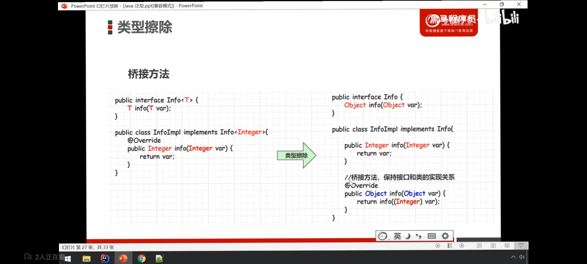
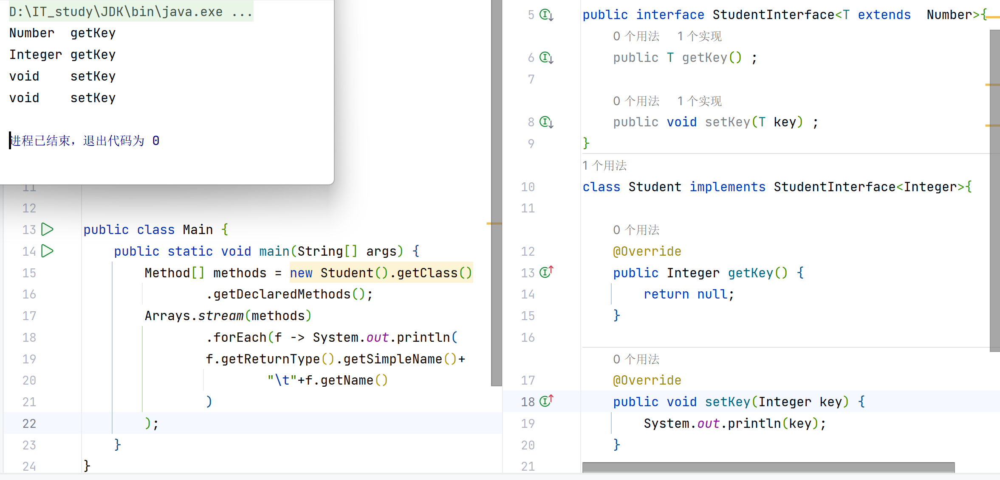

# 类型擦除

## 概念

- 泛型是 Java1.5 才有的概念,在这之前是没有泛型的

- 但是,泛型代码能很好地和之前版本的代码兼容.

- 那是因为**泛型信息只存在于编码的编译阶段**

- 在进入JVM之前,于泛型的相关信息会被**擦除**掉

- 我们将之称为**类型擦除**


```java
public class Demo {
    public static void main(String[] args) {
        ArrayList<Integer> intList = new ArrayList<>();
        ArrayList<String> strList = new ArrayList<>();

        System.out.println(intList.getClass().getSimpleName());//ArrayList
        //Integer被擦除了
        System.out.println(strList.getClass().getSimpleName());//ArrayList
        //String被擦除了

        System.out.println(intList.getClass() == strList.getClass());//true
        //比较内存地址

    }
}
```


## 无限制类型的擦除

在生成字节码文件的过程中,T都用Object来代替的

- 利用反射,获取了Erasure类字节码文件的Class类对象看看是不是Object


```java
public class Student<T> {
    public T key;

    public T getKey() {
        return key;
    }

    public void setKey(T key) {
        this.key = key;
    }
}
```


```java
public static void main(String[] args) {
    Field[] fields = new Student<Integer>().getClass().getDeclaredFields();
    Arrays.stream(fields).forEach(f -> System.out.println(
            f.getType().getSimpleName()+"\t"+f.getName()
            )
    );//Object
}
```


## 有限制的类型擦除


现在酱紫改下:

```java
public class Student<T extends  Number> {}
```

依就运行main(String[] args)

结果:


## 对方法(接口)的有限制,无限制擦除同理

你依旧可以用反射去验证


## 桥接方法




**注意**,有两个info()方法,类型还不一样




桥接方法是为了程序的规范和约束

```java
public static void main(String[] args) {
    ArrayList<ArrayList<String>> listArrayList = new ArrayList<>();
    ArrayList arrayList1= new ArrayList<>();
    arrayList1.add(12);
    listArrayList.add(arrayList1);
    listArrayList.forEach(a->a.forEach(System.out::println));
    
    //.ClassCastException呦,你还挺谨慎
}
```

## 泛型类型转换

```java
T t1 = (T) new Object();
T t2 = (T) new String();
T t3 = (T) new Integer();
T t4 = (T) new Student();
```

都不会报`ClassCastException`错😂
