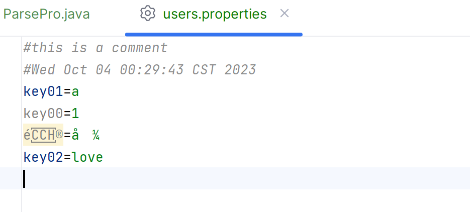
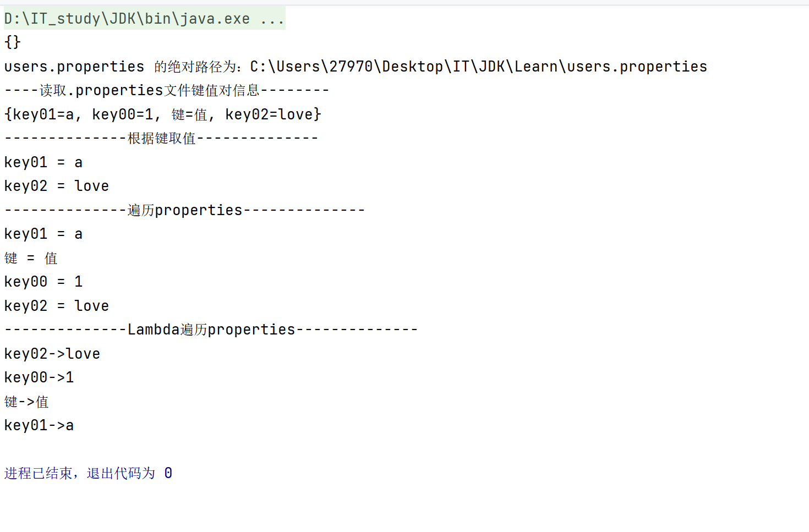

# 属性文件.properties

- 常用于存储文件信息属性啥的

```.properties
# 用#打头的是注释
# 写注释
# 属性文件.properties的内容是键值对,见是唯一的
key00=1
key01=a
key02=love
```

## 用IO流代码写

## 用Properties(Map集合)读取

```java
package learnSpecialDoc;

import java.io.File;
import java.io.FileReader;
import java.io.FileWriter;
import java.util.Properties;
import java.util.Set;

/**
 * @author HarveyBlocks
 * @date 2023/10/03 23:25
 **/
public class ParsePro {
    public static void main(String[] args) throws Exception {
        Properties properties = new Properties();
        System.out.println(properties);

        String fileName = "users.properties";
        File file = new File(fileName);
        System.out.println(fileName+" 的绝对路径为：" + file.getAbsolutePath());

        System.out.println("----读取.properties文件键值对信息--------");
        properties.load(//load,加载
                //抛出了FireReader产生的异常还不够,这个也会编译时异常,也抛出
                new FileReader(//FireReader,文件字符输入流,记得抛出编译时异常
                        "C:\\Users\\27970\\Desktop\\IT\\JDK\\Learn\\src\\learnSpecialDoc\\users.properties"
                )
        );
        System.out.println(properties);
        //{key01=a, key00=1, key02=love}

        System.out.println("--------------根据键取值--------------");
        System.out.println("key01 = " + properties.get("key01"));
        System.out.println("key02 = " + properties.get("key02"));

        System.out.println("--------------遍历properties--------------");
        Set<String> keys = properties.stringPropertyNames();
        for (String key:
             keys) {
            System.out.println(key + " = " + properties.get(key));
        }

        //把键值对数据写入属性文件
        properties.setProperty("键", "值");//键=值
        properties.store(
                new FileWriter(
                        "src/learnSpecialDoc/users.properties"
                ),//文件字符输出流
                "this is a comment"
        );//保存

        properties.load(//load,加载
                new FileReader(
                        "src\\learnSpecialDoc\\users.properties"
                    //正反斜杠皆可
                )//猜测是从.idea开始记的
        );

        System.out.println("--------------Lambda遍历properties--------------");
        properties.forEach((k,v)->System.out.println(k + "->" + v));
        //键->值
    }

}

```



