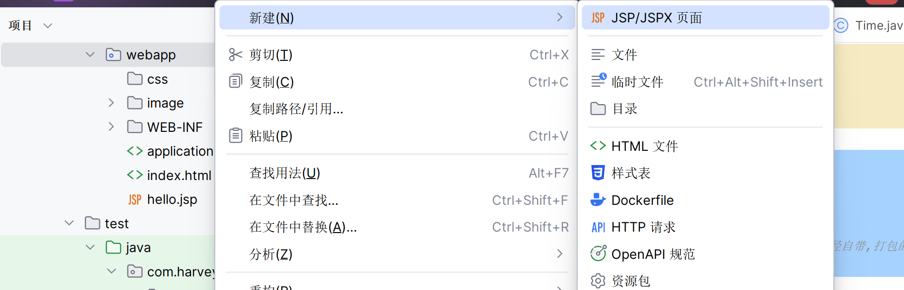

# JSP

>   Java Server Pages	Java服务端页面

## 概述

-   一种动态的网页技术
-   其中可以定义HTML,JS,CSS等**静态**内容
-   还可以定义Java代码的动态内容
-   JSP = HTML + Java


## 快速入门

### 导入坐标

```xml
<dependency>
    <groupId>javax.servlet.jsp</groupId>
    <artifactId>jsp-api</artifactId>
    <version>2.2</version>
    <!--依赖范围,编译和测试,在运行环境无效,不会被打包(Tomcat已经自带,打包的时候会重复,报错)-->
    <scope>provided</scope>
</dependency>
```

###创建JSP文件




### 改字符集

-   写在jsp文件的头

```html
<%@ page pageEncoding="UTF-8" %>
```

### 写代码

```jsp
<html>
<head>
    <title>JSP</title>
</head>
<body>
<h2>Hello World!</h2>
<%
    //百分号里的被称为"Java代码的脚本"
	System.out.println("Hello");
%>
</body>
</html>
```

## 原理

JSP本质上就是一个Servlet

Tomcat自动转换成Servlet

hello.jsp->hello_jsp.java->hello_jsp.class

底层还是writer.write()原始方法