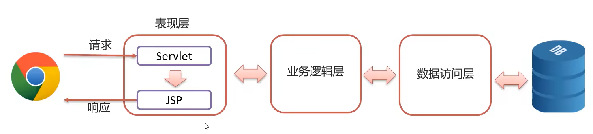
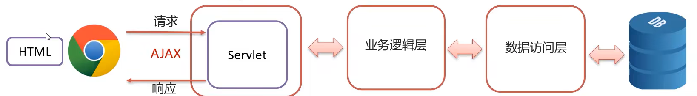
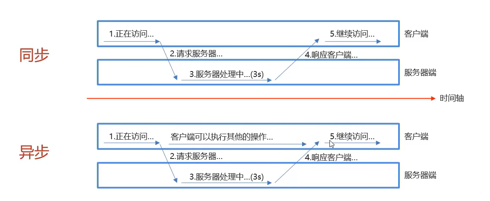

# AJAX

>   **A**synchronous **J**avaScripe **A**nd **X**ML	异步的JavaScripe和XML

## 作用

-   与服务器进行数据交换

    -   通过AJAX可以给服务器发送请求,并**获得服务器响应的数据**

    

-   异步交互
    -   可以在**不重新加载整个页面**的情况下,与服务器交换数据并**更新部分**网页的技术
    -   如：搜索联想、用户名是否可用校验(光标关注已离开)等

## Axios异步框架

-   简化AJAX

