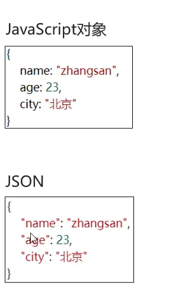
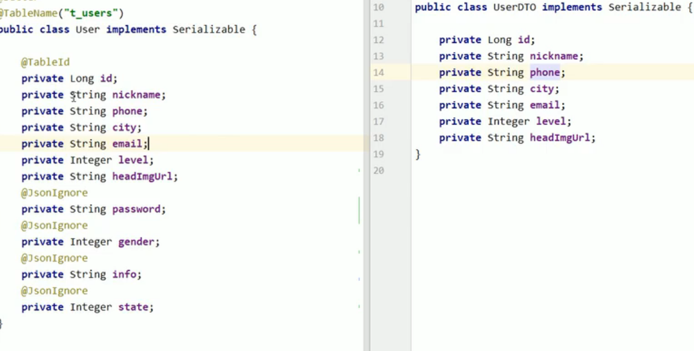

# JSON

>   **J**ava**S**cript **O**bject **N**otation   -JAvaScript对象表示法



## 用处

-   语法简单,层次结构鲜明,多用于作为**数据载体**,在网络中进行数据传输

## 基础语法

### 定义

```JSON
var 变量名={
	"key1":value1,
    "key2":value2,
    "key3":value3,
    ...
}
```

-   示例

    ```json
    var user = {
        "name": "张三",
        "age": 32,
        "addr": [
            "北京",
            "上海",
            "西安"
        ],
        "birthday": {
            "year": 1900,
            "month": 12,
            "day": 20
        }
    }
    ```

### value的数据类型

-   数字(整数或浮点数)
-   字符串(双引号中)
-   逻辑值(true or false)
-   数组(方括号中)
-   对象(花括号中)
-   null

### 获取数据:

```json 
变量名.key
```

```json
user.name
```

## JSON对象和Java对象的相互转换

-   很适合使用递归啊

### Fastjson

>   阿里巴巴的,目前Java语言中最快的JSON库,其之下的工具类**JSON**

#### 导入坐标

```xml
<dependency>
    <groupId>com.alibaba</groupId>
    <artifactId>fastjson</artifactId>
    <version>1.2.62</version>
</dependency>
```

#### Java对象转JSON字符串

```java
String com.alibaba.Json.toJSONString(Object object){...};
```

```json
{	
    "brand":{
    	"id":0,
		"on":false,
		"order":0
     },
	"companyName":"三只松鼠食品有限公司",
	"id":1,
	"introduce":"三只松鼠--好吃不上火",
	"on":true,
	"order":100,
	"productName":"三只松鼠"
}
```

#### JSON字符串转Java对象

```java
T com.alibaba.Json.parseObject(String text, Class<T> clazz){...}
```

### Jackson

SpringBoot默认自带的Json工具

#### 导入坐标

```xml
<dependency>
  <groupId>com.fasterxml.jackson.core</groupId>
  <artifactId>jackson-databind</artifactId>
  <version>2.9.6</version>
</dependency>
<!--
这些被jackson-databind依赖, 可以不写
<dependency>
  <groupId>com.fasterxml.jackson.core</groupId>
  <artifactId>jackson-core</artifactId>
  <version>2.9.6</version>
</dependency>

<dependency>
  <groupId>com.fasterxml.jackson.core</groupId>
  <artifactId>jackson-annotations</artifactId>
  <version>2.9.6</version>
</dependency>
-->
```

springboot有集成的Jackson, 其依赖简单, 故此处略

#### Java对象转JSON字符串

```java
ObjectMapper objectMapper = new ObjectMapper();
String beanJson = objectMapper.writeValueAsString(bean);
```

map转json

```java
//map<String,String>转json
HashMap<String, String> map = new HashMap<String,String>();
// ... 填充数据
ObjectMapper objectMapper = new ObjectMapper();
String mjson = objectMapper.writeValueAsString(map);
System.out.println(mjson);

```

#### JSON字符串转Java对象

```java
try {
    ObjectMapper objectMapper = new ObjectMapper();
    Bean bean = objectMapper.readValue(beanJsonStr, Bean.class);
    System.out.println("bean = " + bean);
} catch (IOException e) {
    e.printStackTrace();
}
```

对于数组

```java
ObjectMapper objectMapper = new ObjectMapper();
Bean[] beans = objectMapper.readValue(jsonArrayStr, Bean[].class);
```

对于List

```java
ObjectMapper objectMapper = new ObjectMapper();
List<Bean> beans = objectMapper.readValue(jsonArrayStr, new TypeReference<List<Bean>>(){});
```

转Map

```java
ObjectMapper objectMapper = new ObjectMapper();
Map<String, Object> jsonMap = objectMapper.readValue(jsonStr,
    new TypeReference<Map<String,Object>>(){});

```

如果JSON字符串中有值为null的字段, Java中为 **int, long, float, double**等的，Jackson 会报错

#### 对象和Map的转换

```java
ObjectMapper objectMapper = new ObjectMapper();

// 对象转Map
Map<String, Object> beanMap = objectMapper.convertValue(bean, Map.class);

// Map转对象
Bean newBean = objectMapper.convertValue(beanMap, Bean.class);
```

### Jackson和Fastjson的区别

和FastJson的区别在于, 如果有字段无法映射, 

FastJson采用的策略是尽可能转换, 有字段但Json里没有的情况, 就不给字段填值, 有Json但没有字段的情况, 就忽略Json里的值

Jackson一般情况下会报错, 但也可以配置不报错:

```java
objectMapper.configure(
    DeserializationFeature.FAIL_ON_UNKNOWN_PROPERTIES, false); // 对于Json中的未知字段选择忽略
```

但配置了不报错, 就会有无法检查出隐藏错误的危险, 所以: 



当然, FastJson也有

```java
@JSONField(name="ID")
```

配置在实体类的字段上, 使其不会被序列化

## JSON与枚举

FastJson认为,枚举的值就是**标识符的名字**

## 基于Jackson的json工具类

可直接拷贝

```java
import com.fasterxml.jackson.core.JsonProcessingException;
import com.fasterxml.jackson.core.type.TypeReference;
import com.fasterxml.jackson.databind.DeserializationFeature;
import com.fasterxml.jackson.databind.ObjectMapper;

import java.util.HashMap;
import java.util.List;
import java.util.Map;

/**
 * TODO
 *
 * @author <a href="mailto:harvey.blocks@outlook.com">Harvey Blocks</a>
 * @version 1.0
 * @date 2024-04-26 15:40
 */
public class JsonUtils {
    public static final ObjectMapper MAPPER = new ObjectMapper();
    /**
     * 对所有调用次方法之后的转化都生效, 不会报错了
     */
    public static void ignoreUnknownFieldInJson() {
        // 对于Json中的未知字段选择忽略
        MAPPER.configure(DeserializationFeature.FAIL_ON_UNKNOWN_PROPERTIES, false);
    }
    /**
     * 对所有调用次方法之后的转化都生效, 继续报错
     */
    public static void emphasisUnknownFieldInJson() {
        // 对于Json中的未知字段选择重视
        MAPPER.configure(DeserializationFeature.FAIL_ON_UNKNOWN_PROPERTIES, true);
    }
    public static String toJsonStr(Object bean) {
        try {
            return MAPPER.writeValueAsString(bean);
        } catch (JsonProcessingException e) {
            throw new RuntimeException(e);
        }
    }

    public static String toJsonStr(HashMap<String, Object> map) {
        //map<String,String>转json
        try {
            return MAPPER.writeValueAsString(map);
        } catch (JsonProcessingException e) {
            throw new RuntimeException(e);
        }
    }

    public static <T> T toBean(String json, Class<T> type) {
        try {
            return MAPPER.readValue(json, type);
        } catch (JsonProcessingException e) {
            throw new RuntimeException(e);
        }
    }

    public static <T> T[] toBeanArray(String arrayJson, Class<T[]> type) {
        try {
            return MAPPER.readValue(arrayJson, type);
        } catch (JsonProcessingException e) {
            throw new RuntimeException(e);
        }
    }

    public static <T> List<T> toBeanList(String listJson, Class<T> type) {
        try {
            return MAPPER.readValue(listJson, new TypeReference<List<T>>() {
            });
        } catch (JsonProcessingException e) {
            throw new RuntimeException(e);
        }
    }

    public static Map<String, Object> toMap(String json) {
        try {
            return MAPPER.readValue(json, new TypeReference<>() {
            });
        } catch (JsonProcessingException e) {
            throw new RuntimeException(e);
        }
    }

    public static <T> Map<?,?> toMap(Object bean) {
        return MAPPER.convertValue(bean, Map.class);
    }

    public static <T> T toBean(Map<String, Object> map, Class<T> type) {
        return MAPPER.convertValue(map, type);
    }
}

```

## 自己写的Map-Bean转换

```java
private static final String SETTER_PREFIX = "set";
private static final String NORMAL_GETTER_PREFIX = "get";
private static final String BOOLEAN_GETTER_PREFIX = "is";

@Deprecated
public static Map<String, Object> toMap(Object bean) {
    Assert.notNull(bean, "bean shouldn't be null");
    Class<?> type = bean.getClass();
    Field[] fields = type.getFields();
    Map<String, Object> map = new HashMap<>();
    for (Field field : fields) {
        try {
            Method getter = type.getMethod(getGetterName(field), (Class<?>) null);
            map.put(field.getName(), getter.invoke(bean));
        } catch (NoSuchMethodException | InvocationTargetException | IllegalAccessException e) {
            throw new RuntimeException(e);
        }
    }
    return map;
}

private static String getGetterName(Field field) {
    String fieldName = field.getName();
    return fieldName.startsWith("is") || fieldName.startsWith("has") ?
            fieldName : getterPrefix(field.getType()) + upperFirst(fieldName);
}

private static String getterPrefix(Class<?> fieldType) {
    return fieldType.isInstance(Boolean.TYPE) ? BOOLEAN_GETTER_PREFIX : NORMAL_GETTER_PREFIX;
}

@Deprecated
public static <T> T toBean(Map<String, Object> map, Class<T> type) {
    Assert.notNull(map, "map shouldn't be null");
    Assert.notNull(type, "type shouldn't be null");
    Field[] fields = type.getFields();
    T bean;
    try {
        bean = type.getDeclaredConstructor().newInstance();
    } catch (InstantiationException | IllegalAccessException | InvocationTargetException |
             NoSuchMethodException e) {
        throw new RuntimeException(e);
    }
    for (Field field : fields) {
        String setterName = getSetterName(field);
        try {
            Method setter = type.getMethod(setterName, field.getType());
            setter.invoke(bean, map.get(field.getName()));
        } catch (NoSuchMethodException | InvocationTargetException | IllegalAccessException e) {
            throw new RuntimeException(e);
        }
    }
    return bean;
}

private static String getSetterName(Field field) {
    String fieldName = field.getName();
    return fieldName.startsWith("is") || fieldName.startsWith("has") ?
            fieldName : SETTER_PREFIX + upperFirst(fieldName);
}

private static String upperFirst(String field) {
    char[] chars = field.toCharArray();
    chars[0] = toUpperCase(chars[0]);
    return String.valueOf(chars);
}

private static char toUpperCase(char c) {
    return 97 <= c && c <= 122 ? (char) (c ^ 32) : c;
}
```

## JSONObject

Java 

