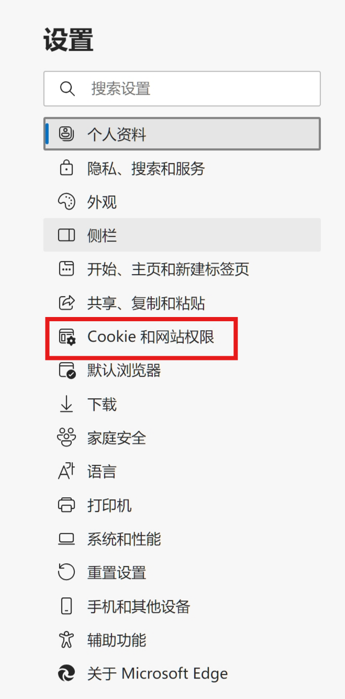
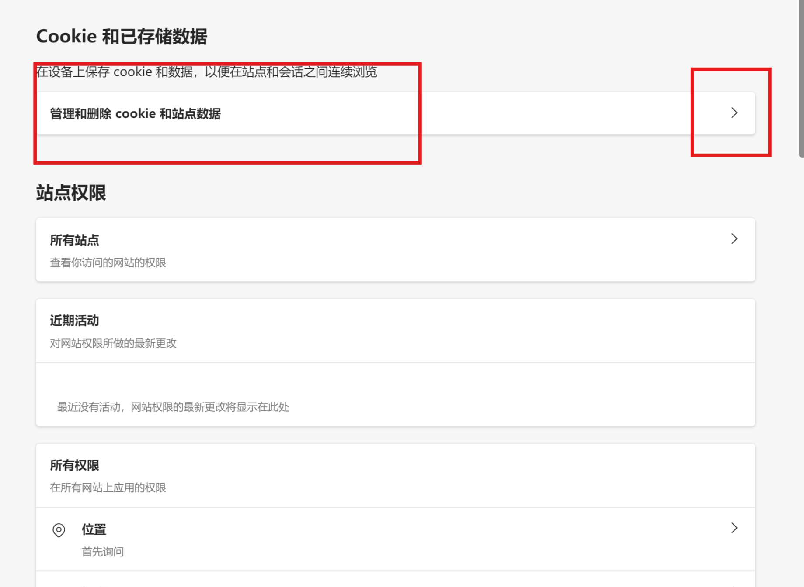
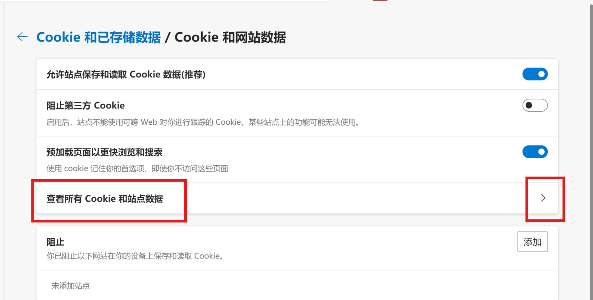
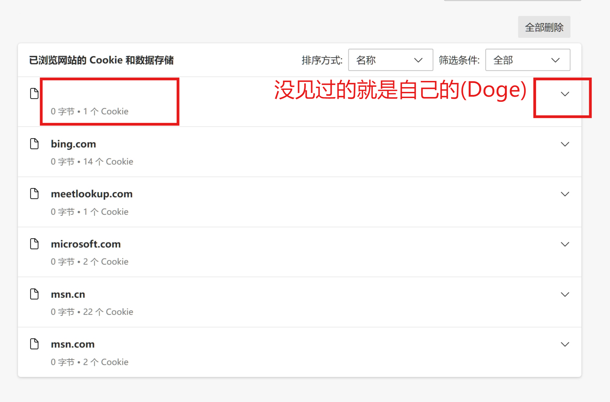
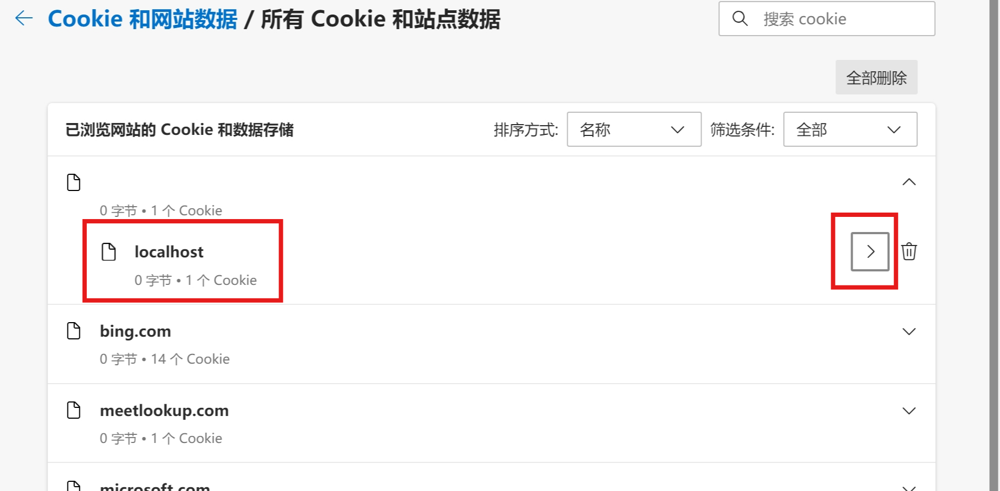
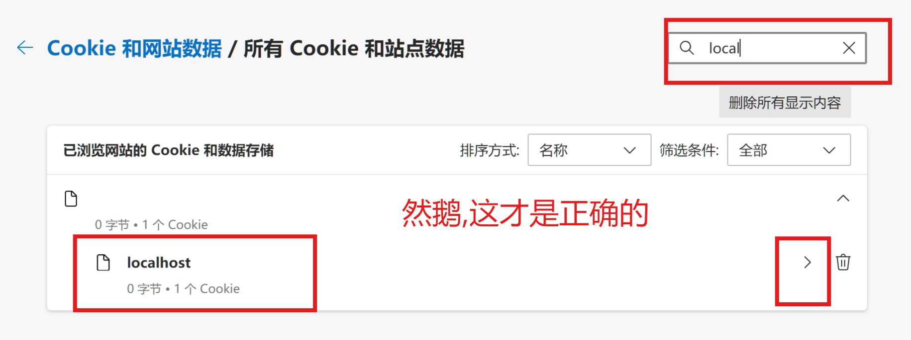
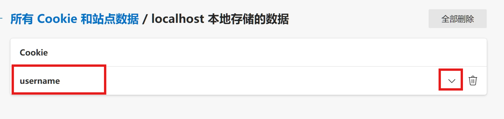
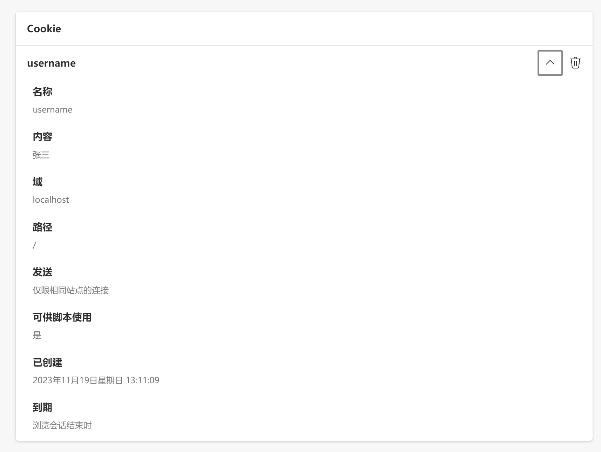
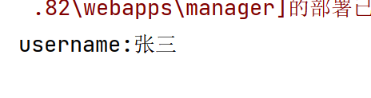
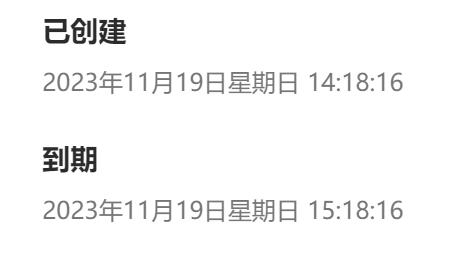

# Cookie

>   客户端会话跟踪技术
>
>   数据保存在客户端快捷,减少服务端的记忆的消耗,服务端只需要知道怎么解析Cookie,每个Cookie是啥意思即可,不用记住每一个浏览器(没有Cookie它也没办法记住就是了)

-   将数据保存在客户端,以后每次请求都携带Cookie数据进行访问

## 基础使用

>   我们不关心浏览器怎么做的，我们只关心浏览器做了啥，以及服务器应该是如何应对

-   服务器发送Cookie
-   服务器获取Cookie

### 发送Cookie

1.  创建Cookie对象，设置数据

    ```java
    Cookie cookie = new Cookie("key","value");
    ```

2.  发送Cookie到客户端:使用response对象

    ```java
    response.addCookie(cookie)
    ```

3.  Tomcat把Cookie的数据拿出来,再响应到浏览器中去

#### 试验

```java
@WebServlet(value = "/Servlet1")
public class Servlet1 extends HttpServlet {
    @Override
    protected void doGet(...){...}

    @Override
    protected void doPost(...){...}

    protected void parseWebString(HttpServletRequest request,
                                  HttpServletResponse response)
            throws ServletException, IOException {
        // 1. 创建Cookie对象
        Cookie cookie = new Cookie("username","张三");

        // 2. 发送Cookie数据
        response.addCookie(cookie);
    }
}
```

### 在浏览器查看Cookie

















### 获取Cookie

1.  获取客户端携带的所有Cookie对象

    ```java
    Ciookie[] cookies = request.getCookie();
    ```

2.  使用Cookie对象方法获取数据

    ```java
    Cookie.getName();
    Cookie.getValue();
    ```

#### 实践

```java
@WebServlet(value = "/Servlet2")
public class Servlet2 extends HttpServlet {
    @Override
    protected void doGet(...){...}
    @Override
    protected void doPost(...){...}

    protected void parseWebString(HttpServletRequest request,
                                  HttpServletResponse response)
            throws ServletException, IOException {
        Cookie[] cookies = request.getCookies();
        Arrays.stream(cookies).forEach(
                c -> System.out.println(c.getName()+":"+c.getValue())
        );
    }
}
```



## 原理

-   Cookie的实现是基于HTTP协议的

    -   响应头:set-cookie

        ```http
        set-cookie:username=张三
        ```

        服务器响应Cookie时

    -   请求头cookie

        ```http
        cookie:username=张三
        ```

        浏览器请求Cookie时

## 使用细节

### Cookie存活时间

>   默认情况下,Cookie存储在浏览器的内存中,浏览器关闭,内存释放,则Cookie被销毁

#### 实现Cookie持久化

-   持久化->存入磁盘

-   设置Cookie存活时间

    ```java
    cookie.setMaxAge(int seconds);
    ```

    -   正数
        -   将Cookie写入浏览器所在电脑的磁盘,持久化存储,到时间自动销毁(浏览器做)
    -   负数
        -   默认值,Cookie在当前浏览器内存中,当浏览器关闭,则Cookie被销毁
    -   0
        -   删除对应Cookie(妙哉,曲线救国了属于是)



-   设置了1小时
-   但实际上我设置了每次关闭时删除所有Cookie记录,所以没法实验

### Cookie存储中文

-   Cookie不能直接存储中文(尊嘟假嘟?0.o)
-   使用URL编码

### 实践

```java
// 1. 创建Cookie对象
String value = "张三";
//对数据URL编码
value = URLEncoder.encode(value, StandardCharsets.UTF_8);
System.out.println(value);
Cookie cookie = new Cookie("username",value);
cookie.setMaxAge(60*60);
// 2. 发送Cookie数据
response.addCookie(cookie);
```

然后获取Cookie的地方记得解码就行

```java
String value = URLDecoder.decode( cookie.getValue(), StandardCharsets.UTF_8);
```

