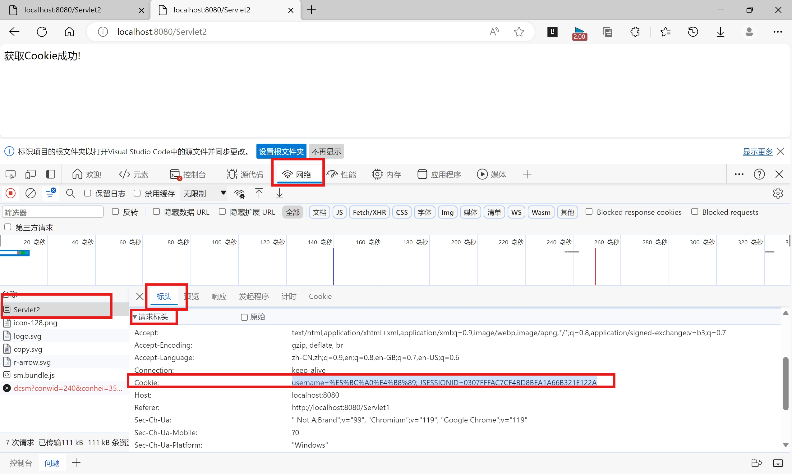
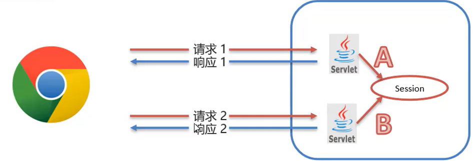
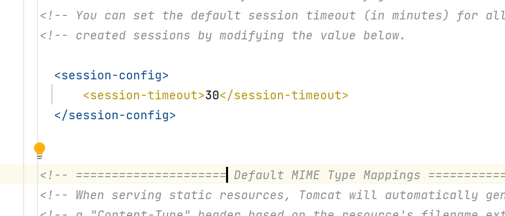

# Session

>   服务端会话跟踪技术：将会话保存到服务端
>
>   数据保存在服务端**安全,**不用像Cookie一样在互联网中传来传去的

-   资源A和B能获取同一个Session对象

## 基本使用

-   JavaEE提供HttpSession接口,来实现一次对话的多次请求间数据共享功能

-   使用

    1.  获取Session

        ```java
        HttpSession session = request.getSession;
        ```

    2.  Session对象功能

        ```java
        public void setAttribute(String name, Object value);
        public Object getAttribute(String name);
        public void removeAttribute(String name);
        ```

        ```java
        session.setAttribute("username" ,"张三");
        Object value = session.getAttribute("张三");
        System.out.println(value);
        session.removeAttribute("username");
        ```


## 原理

-   Session实现基于Cookie

-   你自己要实现Session的话,
    -   可以搞个成员变量吗存储数据吗?
        -   不行啊!不然这样,不同浏览器会访问到同一个Session啊!
    -   搞一个Map集合?
        -   不行啊!你不知道来访问你的是哪个浏览器,用什么作为键啊!

### Tomcat的Session实现方法

1.  Tomcat发现服务器使用了Session!
2.  Tomcat创建了一个Cookie`id=11451419191810`
3.  Tomcat将Cookie发送给了当前会话的浏览器`set-cookie:id=11451419191810`
4.  浏览器再次向Tomcat发起请求
5.  Tomcat一看浏览器发过来的众多Cookie中有一个`cookie:id=11451419191810`
6.  呦呦呦!这不是野兽先辈吗?几天不见,怎么这么臭了?
7.  然后依据`id=11451419191810`在服务端找到了对应的Session

-   当然,`id`不一定叫做`id`,`id`的值也不会这么臭


### 看看id真实的样子



```
JSESSIONID:0307FFFAC7CF4BD8BEA1A66B321E122A
```

## 细节

###Session钝化,活化

-   服务器重启之后,Session数据是否还存在?
    -   如果不在了?合理吗?

#### 钝化

>   在服务器正常关闭后.Tomcat会自动将Session数据写入硬盘的文件中

#### 活化

>   再次启动服务器后,从文件中加载数据到Session中
>
>   文件删除

####文件的位置

`${project}/target/tomcat/work/Tomcat/localhost/${project}/SESSIONS.ser`

-   我没找到


### 小问题



1.  浏览器请求A资源
2.  浏览器关闭
3.  浏览器开启
4.  浏览器请求B资源

-   问:获取的Session是同一个吗?
-   两次会话获得的Session怎么会是同一个呢?


-   Session钝化,活化包装服务端的数据安全,不会有数据丢失
-   至于浏览器关闭,导致了数据丢失,就不关服务器的事啦

###Seesion销毁

-   默认情况下Session30分钟内销毁

-   用于用户登出

####更改销毁时间

#####配置web.xml

-   webapp/WEB-INF/web.xml

```xml
<?xml version="1.0" encoding="UTF-8" ?>

<!DOCTYPE web-app PUBLIC
        "-//Sun Microsystems, Inc.//DTD Web Application 2.3//EN"
        "http://java.sun.com/dtd/web-app_2_3.dtd" >

<web-app xmlns="http://xmlns.jcp.org/xml/ns/javaee"
         xmlns:xsi="http://www.w3.org/2001/XMLSchema-instance"
         xsi:schemaLocation="http://xmlns.jcp.org/xml/ns/javaee
         http://xmlns.jcp.org/xml/ns/javaee/web-app_4_0.xsd"
        version="4.0">

    <session-config>
        <session-timeout>30</session-timeout>
    </session-config>
</web-app>
```

-   写在Tomcat文件下的web.xml(只能看,不要乱动哦)

    `${tomcat}/conf/web.xml"`



##### 用方法invalidate()

```java
session.invalidate();
```

