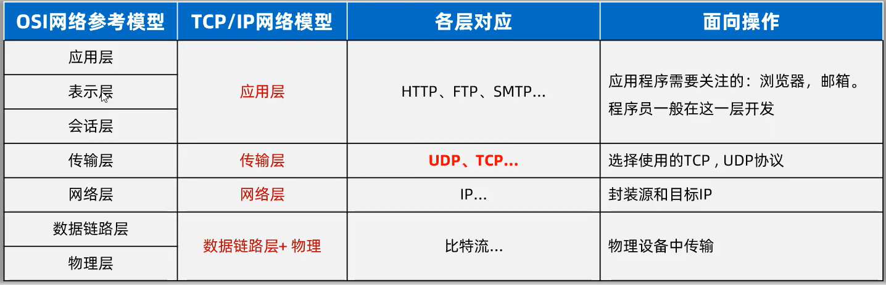

# 协议

-   真正应用的是TCP/IP网络模型

## T(ransmission)C(ontrol)P(rotocol)通信协议

-   传输控制协议

### 特点

-   通信效率不高(因为要一来二去,其实还好)
-   面向连接
-   可靠通信

### 最终目的

保证在**不可靠的信道上实现可靠传输**

-   可靠连接:
    -   确定通信双方,收发问题都是正常无问题的

### 实现可靠传输的方法

1.  三次握手建立连接(为了确认**双方** **收** **发** 信息没问题)
    1.  客户端向服务器**发出连接请求**(第一次握手)
    2.  服务器向客户端**返回一个响应**(第二次握手)
    3.  客户端向服务器**再次发出确认信息,连接建立**(第三次握手)
2.  传输数据进行确认
3.  四次挥手断开连接(为了确认**双方** **收** **发** 数据已完成)
    1.  客户端向服务器**发出断开请求**(第一次挥手)
    2.  服务器向客户端**返回一个响应 : 稍等**(第二次挥手)
        -   此时服务器可能还没有将最后的数据处理完
    3.  服务器向客户端**返回一个响应 : 确认断开**(第三次挥手)
        -   此时服务器已经将最后的数据处理完
    4.  客户端向服务器**发出最后确认断开连接**(第二次挥手)

### 应用场景

-   网页
-   金额

## U(ser)D(atagrame)P(rotocol)通信协议

-   用户数据报协议

### 特点

-   速度快,效率高
-   无连接
-   不可靠
-   程序端口和数据限制再64KB之内
    -   超出的,分成一包一包发
-   对方在不在线都会发送
-   对方收不收得到不会返回

### 应用场景

-   语音通话
-   视频直播

