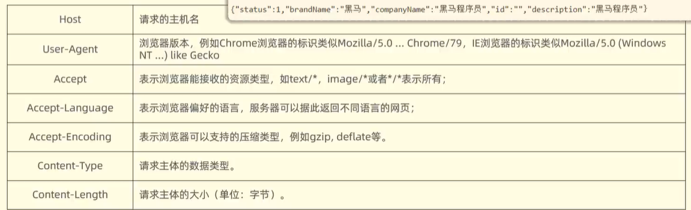
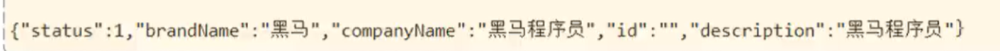
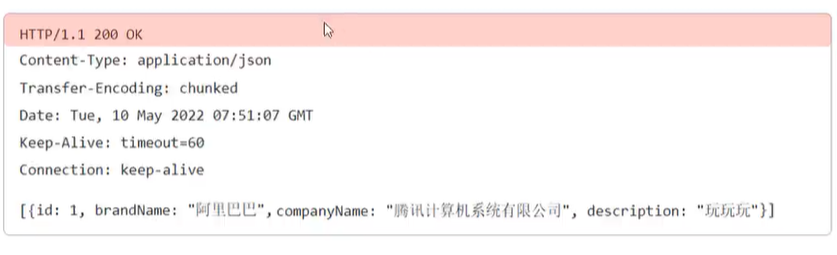
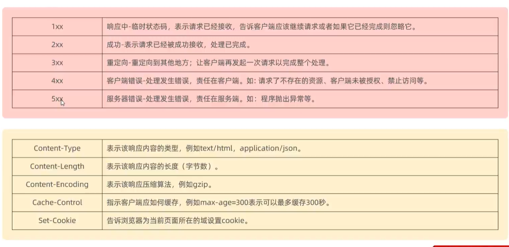

# HTTP

超文本传输协议

-   基于TCP协议
-   基于请求-响应模型:一次请求对应一次模型
-   HTTP协议时**无状态**的协议:对于事务处理没有记忆能力,每一次请求-响应都是独立的
    -   缺点:多次请求键间共享数据
    -   优点:速度快

## 请求协议


### 请求行

-   请求的第一行

```http
GET|POST /brand/find... HTTP/1.1
```

-   请求方式
-   资源路径
-   协议/协议版本

## 请求头

第二行开始到请求体之前

key:value形式的键值对

### 常见的请求头



-   HOST指请求服务器的

test/* 表示文本,  \*/*表示所有

## 请求体




## 响应协议



### 响应行

协议 状态码 描述

```http
HTTP/1.1 200 OK
```

[响应状态码](https://www.runoob.com/http/http-status-codes.html):



-   响应头↑

-   重定向
    -   请求了一个服务器,该服务器没有资源,但它会返回另一个有资源的服务器的地址

### 响应头

key:value

### 响应体

-   响应数据

## 协议解析

-   浏览器会自动解析(原理:拆字符串)

\\(@\^0^@)/

