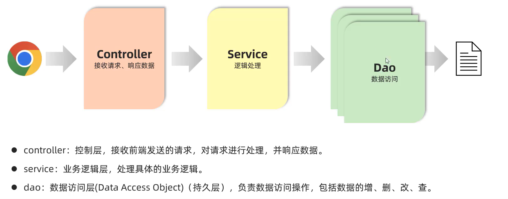

# PostMan

网页调试与发送网页HTTO请求的Chrome插件

常用故意接口测试

```java
package com.harvey.controller;

import com.harvey.pojo.User;
import org.springframework.web.bind.annotation.RequestMapping;
import org.springframework.web.bind.annotation.RestController;

import javax.servlet.http.HttpServletRequest;
import java.util.Calendar;

/**
 * @ClassName: Request
 * @Author: Harvey Blocks
 * @Description: 以原始的方式从网页请求信息
 * @Date: 2023/11/13 00:59
 * @Version: 1.0
 */
@RestController
public class Request {


    /**
     * @return 输出的字符串
     * */
    @RequestMapping("/simpleParam")
    public String simpleParam(HttpServletRequest request){
        String username = request.getParameter("username");
        String password = request.getParameter("password");
        Integer age =Integer.parseInt(request.getParameter("age")) ;

        int nowYear = Calendar.getInstance().get(Calendar.YEAR);
        User user = new User(username,password,age);
        System.out.println(user);
        return "你好!"+username+",你的出生年份是:"+(nowYear-age);
    }
}
```

-   原始逻辑



-   学Spring需要先学JavaWeb
-   学JavaWeb会教SpringBoot(不会教你Spring和SpringMVC)
-   学习SpringBoot前要先学Spring和SpringMVC
-   学习SpringMVC要先学JavaWeb
