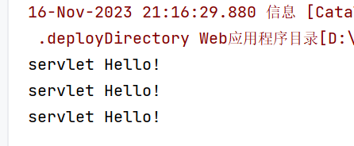
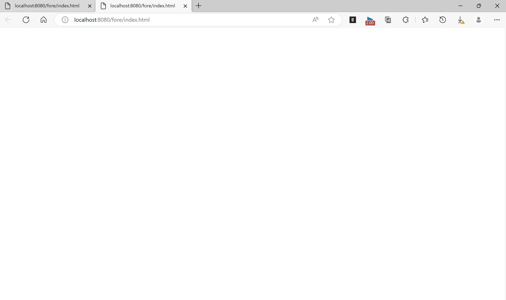
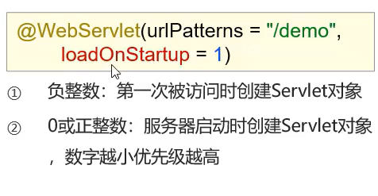
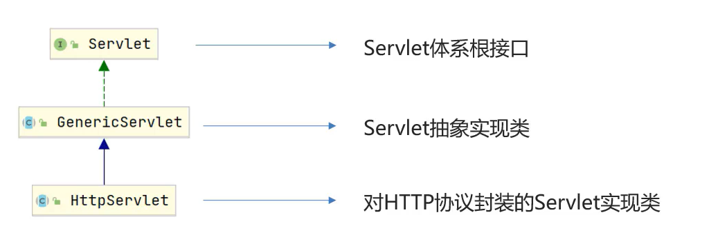
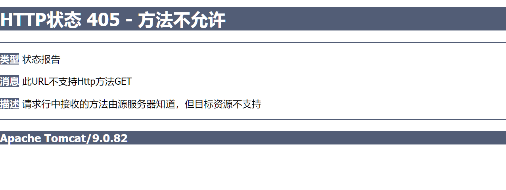
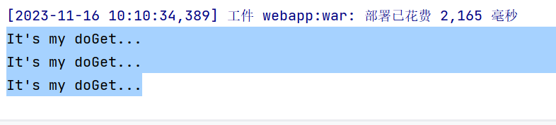

# Servlet接口

## Servlet

>   Java提供的一门**动态**web资源开发**技术**
>
>   是接口规范


有些网站对没注册的用户爱答不理,对注册了的顾客百般纠缠就(动态),就是它来实现的

## 导入配置

```xml
<dependency>
    <groupId>javax.servlet</groupId>
    <artifactId>javax.servlet-api</artifactId>
    <version>3.1.0</version>
    <!--依赖范围,编译和测试,在运行环境无效,不会被打包(Tomcat已经自带,打包的时候会重复,报错)-->
    <scope>provided</scope>
</dependency>
```

## 基本使用

```java
package com.harvey;

import javax.servlet.*;
import javax.servlet.annotation.WebServlet;
import java.io.IOException;

/**
 * @author Harvey Blocks
 * @version 1.0
 * @className App
 * @description TODO
 * @date 2023-11-16 19:23
 */
@WebServlet("/fore/index.html")//写上访问路径
public class App implements Servlet {
    /**
     * @description web项目被执行后自动被执行
     * */
    @Override
    public void service(ServletRequest request, ServletResponse response) throws ServletException, IOException {
        System.out.println("servlet Hello!");
    }

	...
}
```



-   每一次访问(刷新一次也算哦),就会执行一次servlet



-   网页一片空白,怎么了?
-   service()方法还没有指定这个网页要干嘛呢,连Html的加载也没说,Tomcat就好心地没有为我们多此一举啦


## 执行流程

先看了Spring之后真是一点压力都没有

## 生命周期

### 加载和实例化

-   当Servlet第一次被访问时**(默认)**
-   由容器**创建Servlet对象**



-   通过配置可以改变创建对象的时机

### 初始化init()

-   在Servlet**初始化之后**
-   容器调用Servlet的**init()**方法**初始化这个对象**
-   加载配置文件,创建连接等**初始化工作**
-   **该方法只执行一次**


### 请求处理service()

-   **每次**请求Servlet
-   容器调用**service()**方法对请求进行处理


### 服务终止

-   需要释放内存或容器关闭时
-   容器调用**destroy()**方法完成**资源释放**
-   容器释放Servlet资源,随后会被JVM垃圾回收器回收
-   **该方法只执行一次**

### 实践生命周期

```java
package com.harvey;

import javax.servlet.*;
import javax.servlet.annotation.WebServlet;
import java.io.IOException;

/**
 * @author Harvey Blocks
 * @version 1.0
 * @className App
 * @description TODO
 * @date 2023-11-16 19:23
 */
@WebServlet(urlPatterns = "/login",loadOnStartup = 1)//创建时机
public class App implements Servlet {
    /**
     * @description  初始化方法
     * @param servletConfig
     * @throws ServletException
     */
    @Override
    public void init(ServletConfig servletConfig) throws ServletException {
        System.out.println("init...");
    }


    /**
     * @description web项目被执行后自动被执行
     *
     * @param request
     * @param response
     * @throws ServletException
     * @throws IOException
     */
    @Override
    public void service(ServletRequest request, ServletResponse response) throws ServletException, IOException {
        System.out.println("servlet Hello!");
    }

    /**
     * @description 不要按IDEA的红按钮,强制停止啦(拔电源)!
     * 在控制台输入命令:mvn tomcat7:run
     * 然后Ctrl+C终止(我失败啦qwq)<-把<from>写成<from>的屑
     */
    @Override
    public void destroy() {
        System.out.println("destroy...");
    }
	...
}
```

## Servlet方法介绍

### init()

>   初始化方法


### service()

>   服务提供方法


### destroy()

>   销毁方法


### getServletConfig()

>获取ServletConfig对象
>
>不常用

```java
private ServletConfig servletConfig;
@Override
public void init(ServletConfig servletConfig) throws ServletException {
    this.servletConfig = servletConfig;
    System.out.println("init...");
}
@Override
public ServletConfig getServletConfig() {
    return servletConfig;
}
```

### getServletInfo()

>获取Servlet对象(含作者,版权等信息)
>
>不常用

## Servlet体系结构



### 使用HttpServlet

```java
package com.harvey;

import javax.servlet.ServletException;
import javax.servlet.annotation.WebServlet;
import javax.servlet.http.HttpServlet;
import javax.servlet.http.HttpServletRequest;
import javax.servlet.http.HttpServletResponse;
import java.io.IOException;

/**
 * @author Harvey Blocks
 * @version 1.0
 * @className Application
 * @description TODO
 * @date 2023-11-16 19:24
 */
@WebServlet("/application")
public class Application extends HttpServlet {
    @Override
    protected void doGet(HttpServletRequest req, HttpServletResponse resp) throws ServletException, IOException {
        System.out.println("It's my doGet...");
    }

    @Override
    protected void doPost(HttpServletRequest req, HttpServletResponse resp) throws ServletException, IOException {
        System.out.println("It's my doPost...");
    }
}
```






# urlPattern

```java
@WebServlet(urlPattern={"/app","App"})
```

### 配置规则

-   精确匹配

    -   要求完全一致

-   目录匹配

    -   *做通配符

        ```java
        @WebServlet(urlPattern={"/web/*"})
        ```

    -   有两个Sercvlet,同时满足精确匹配和目录匹配,将匹配范围小的精确匹配

-   拓展名匹配

    -   注意**不能以斜杠开头**

        ```java
        @WebServlet(urlPattern={"*.do"})
        ```

-   任意匹配

    -   只要资源不被其他的Sercvlet接受,都会走到这个Sercvlet

    -   写法有两种

        ```java
        @WebServlet(urlPattern={"/"})
        @WebServlet(urlPattern={"/*"})
        ```

    -   **"/*"**的优先级高于**"/"**

    -   当项目中的Sercvet配置了**"/"**,会**覆盖Tomcat的DefaultServlet**( **"/*"** 不会覆盖)

        -   不要配置**"/"**和**"/*"**,**Tomcat的DefaultServlet**是用来配置静态文件的(index.html啥的)

### 优先级

精确路径>目录路径>拓展名路径>/*>/

## XML配置Servlet

>src/main/webapp/WEB-INF/web.xml

```xml
<?xml version="1.0" encoding="UTF-8" ?>

<!DOCTYPE web-app PUBLIC
        "-//Sun Microsystems, Inc.//DTD Web Application 2.3//EN"
        "http://java.sun.com/dtd/web-app_2_3.dtd" >

<web-app xmlns="http://xmlns.jcp.org/xml/ns/javaee"
         xmlns:xsi="http://www.w3.org/2001/XMLSchema-instance"
         xsi:schemaLocation="http://xmlns.jcp.org/xml/ns/javaee
         http://xmlns.jcp.org/xml/ns/javaee/web-app_4_0.xsd"
        version="4.0">

<!--Servlet全类名-->
    <servlet>
        <servlet-name>aaa</servlet-name>
        <servlet-class>com.harvey.App</servlet-class>
    </servlet>
    <servlet-mapping>
        <servlet-name>aaa</servlet-name>
        <url-pattern>/AAA</url-pattern>
    </servlet-mapping>
    <display-name>Archetype Created Web Application</display-name>
</web-app>
```

411(这个41啥意思啊?我也不好乱删啊😓)
