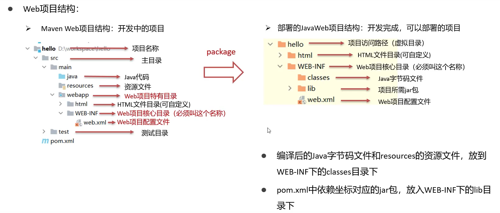
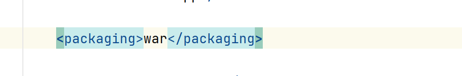
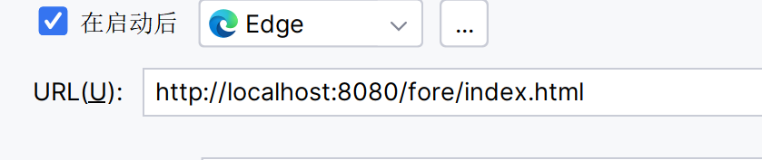
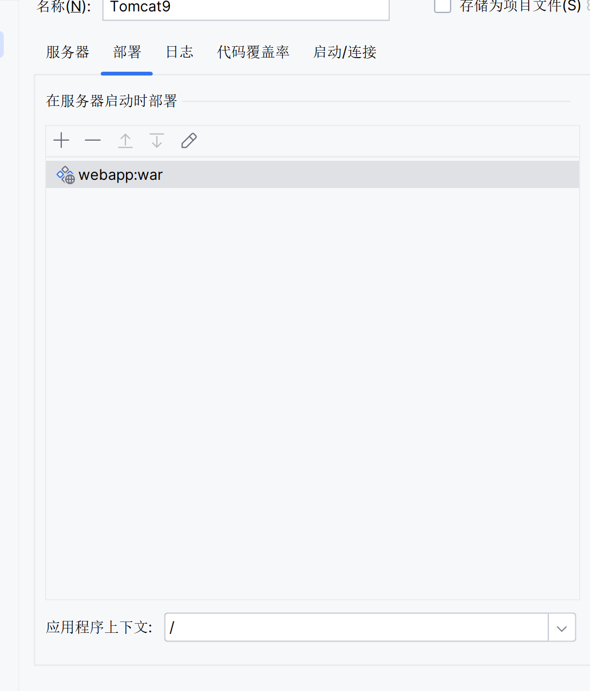
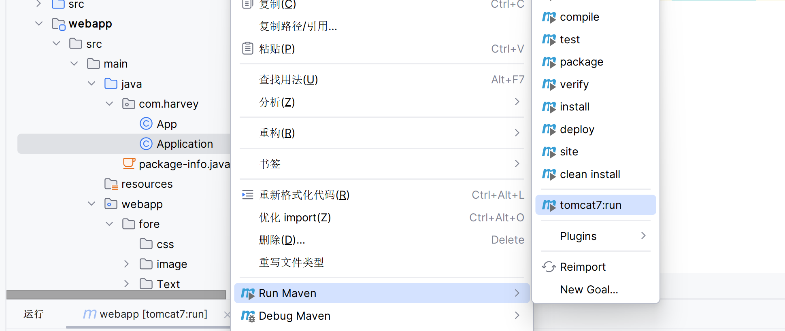

#  阿帕奇旗下的开源项目

-   默认端口8080
-   遵循Sevelet协议
-   HttpServletRequest
-   HttpServletResponse
-   Browser(浏览器)/Server(服务器)

# Web项目结构

-   

Web项目的War包

-   POM.xml



Idea集成Tomcat






-   这么配,就可以直接打开index.html了

# 插件配置

-   POM.xml

```xml
<build>
    <plugins>
        <!--Tomcat插件-->

        <plugin>
            <groupId>org.apache.tomcat.maven</groupId>
            <artifactId>tomcat7-maven-plugin</artifactId>
            <version>2.2</version>
        </plugin>
    </plugins>
    
    ...
</build>
```

```xml
<plugin>
    <groupId>org.apache.tomcat.maven</groupId>
    <artifactId>tomcat7-maven-plugin</artifactId>
    <version>2.2</version>
    <configuration>
        <port>80</port>
        <!--路径默认是项目文件名-->
        <path>/</path>
    </configuration>
</plugin>
```

## 装上MavenHelper的插件

-   随便找个文件左键



