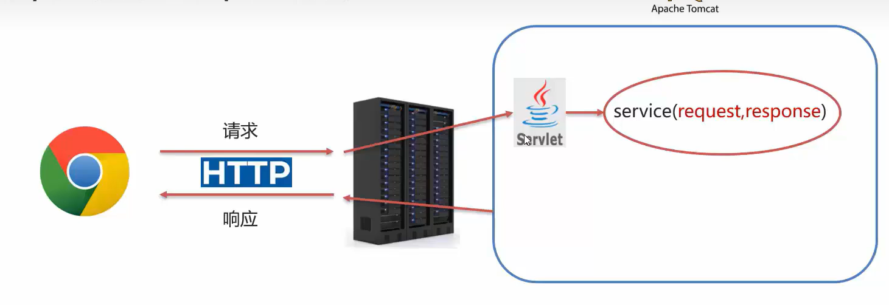
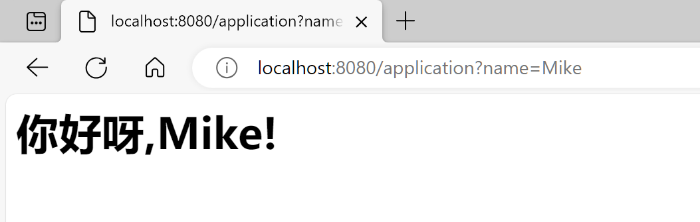
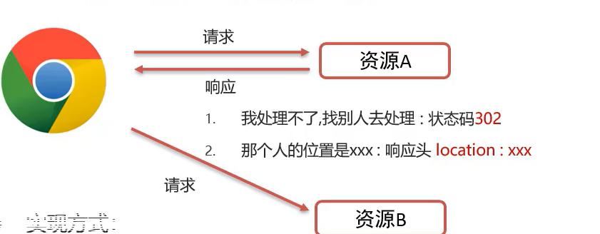
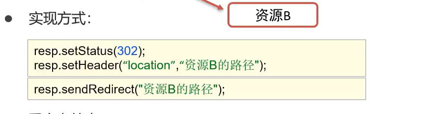
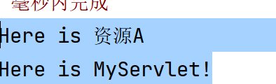
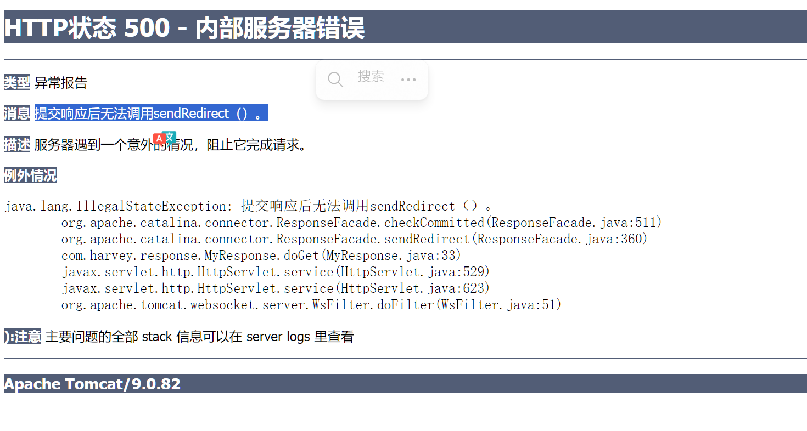
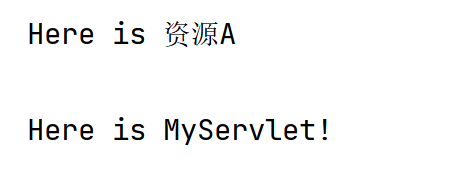
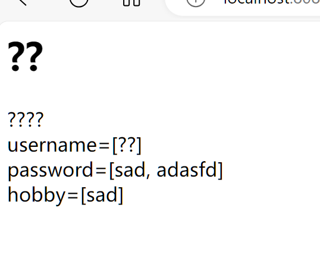
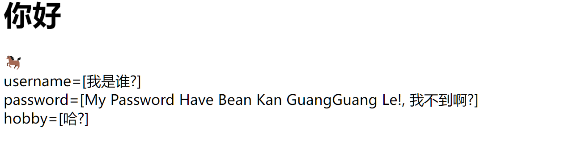

# Response



-   请求数据就是一个字符串嘛
-   都是字符串嘛

```java
@WebServlet(urlPatterns = {"/application","/Application"})//精准匹配
public class Application extends HttpServlet {
    @Override
    protected void doGet(HttpServletRequest request, HttpServletResponse response) throws ServletException, IOException {
        System.out.println("It's my doGet...");
        String name = request.getParameter("name");//url?name=Mike

        response.setHeader("content-type","text/html;charset=utf-8");
        response.getWriter().write("<h1>"+"你好呀,"+name+"!"+"</h1>");
    }

    @Override
    protected void doPost(HttpServletRequest req, HttpServletResponse resp) throws ServletException, IOException {
        System.out.println("It's my doPost...");
    }
}
```



## 继承体系

-   ServletResponse
    -   Java提供的请求对象根接口
-   HttpServletResponse
    -   Java提供的对Http协议分装的请求对象接口
-   ResponseFacade
    -   Tomecat定义的实现类

[你好](www.baidu.com)

## 设置响应数据

### 响应行

```http
HTTP/1.1 200 OK
```

-   我们只关心响应状态码

```java
void setStatus(int sc);
```

-   设置响应状态码


### 响应头

```http
Content-Type:text/html
```

-   键值对

```java
void setHeader(String name,String value);
```

-   设置响应头键值对


### 响应体

```html
<html><head><body></body></head></html>
```


```java
PrintWriter getWriter();//获取字符输出流
ServletOutputStream getOutputStream();//获取字符输出流
```


## 重定向

>   一种资源跳转的方式 

1.  **浏览器**拿着数据去**请求资源A**
2.  资源A说:我不做不了,你要去(响应状态码:**302**表示要进行重定向)找**资源B**
3.  资源A告诉了**资源B的位置**
4.  **浏览器**自动地去**请求资源B**


-   **请求转发的区别**:请求转发会对数据进行一部分更改,重定向是一点事情都不去做的

-   响应状态码:**302**表示要进行重定向







```java
//设置响应状态码302
response.setStatus(302);
//设置响应头Location
response.setHeader("Location","/MyServlet");
```

```java
response.sendRedirect("/MyServlet");
```




#### 再试试

```java
System.out.println("Here is 资源A");
//重定向
response.sendRedirect("/MyServlet");
this.parseWebString(request, response);//这一步居然会会执行!
//方法全部执行完之后会去"/MyServlet".
//response.sendRedirect("/application");不能写两个重定向对象呢
```




### 特点

-   浏览器地址栏路径发生变化
-   可以重定向到任意位置的资源(**服务器内部外部均可**)
-   两次请求,不能在多个资源使用request共享数据


## 资源路径问题

-   因为我设置虚拟目录为**"/"**导致上面的案例看不出区别
-   其实有时候路径要跳转到`webapp/MyServlet`
-   有时候路径又要跳转到`MyServlet`

**那么,什么时候要写虚拟路径呢?**

### 明确路径谁使用

-   浏览器使用?需要加虚拟路径(项目访问路径)
-   服务端使用?不需要加虚拟路径

### 练习

-   `<a href="路径">`
    -   加虚拟目录
-   `<form action = "路径">`
    -   加虚拟目录
-   `request.getRequestDispatcher("路径")`
    -   不加虚拟目录
-   `response.sendRedirect("路径")`
    -   加虚拟目录

### 虚拟目录的耦合性

由上,我们已经知道了`response.sendRedirect("路径")`要加虚拟目录qwq

**但是虚拟目录说不定会改呀!**

到时候千千万万的`response.sendRedirect("路径")`,还要你手动去改?

-   动态获取虚拟目录(**以前讲过**)

    

    还记得这个空缺吗?就是我设置的**/**

## 响应字符数据

```java
PrintWriter getWriter();
```

-   获取字符输出流


-   doGet()

    ```java
    PrintWriter writer = response.getWriter();
    response.setHeader("content-type","text/html");//响应的字符串是html格式的
    writer.write("<h1>"+"你好"+"</h1>");
    writer.write("🐎<br>");
    Map<String, String[]> parameterMap = request.getParameterMap();
    parameterMap.forEach((k, v) -> writer.write(k + "=" + Arrays.toString(v)+"<br>"));
    ```



-   不支持中文
-   **不需要对流关闭**,response销毁的时候**会自动对流关闭**,提早关闭了反而之后的工作不好做了


### 解决中文问题

```java
//response.setHeader("content-type","text/html");
response.setContentType("text/html"+";"
        +"charset="+ StandardCharsets.UTF_8);
PrintWriter writer = response.getWriter();//注意更改了字符集之后再获取字符输出流
```



## 响应字节数据

```java
ServletOutputStream getOutputStream();
```

-   获取字符输出流


-   这里用了放在项目目录里的图片作为例子,其实Tomcat已经为这种静态文件创建了网址,只需在这里进行跳转网址的操作就能达到一样的效果.但是,这里还是用字节数据的输入输出流,用以作为示范

```java
// 读取文件src/main/webapp/image/warma.jpg
FileInputStream fileIn = new FileInputStream(
      "C:/Users/27970/Desktop/IT/JDK/javaweb/webapp/src/main/webapp/image/warma.jpg"
);
/*
    只有绝对路径管用
    也不知道为啥
    在别处新建了一个类
    测试了这个路径"webapp/src/main/webapp/image/warma.jpg"
    好好的没问题啊?\
    不明白
*/
// 获取response字节输出流
ServletOutputStream output = response.getOutputStream();

//文件对拷
byte[] buff = new byte[1024];//1KB
int len;
while ((len = fileIn.read(buff)) != -1) {
    output.write(buff, 0, len);
}
System.out.println("传输完成");
```

-   用工具类简便文件对拷

    -   导入依赖:

        ```xml
        <dependency>
            <groupId>commons-io</groupId>
            <artifactId>commons-io</artifactId>
            <version>2.6</version>
        </dependency>
        ```

    -   代码优化

        ```java
        FileInputStream fileIn = new FileInputStream( "C:/Users/27970/Desktop/IT/JDK/javaweb/webapp/src/main/webapp/image/warma.jpg");
        ServletOutputStream output = response.getOutputStream();
        
        org.apache.commons.io.IOUtils.copy(fileIn, output);
        ```


### 解决相对路径问题

-   获取当前项目目录(决定了相对路径的**相对的对象**)

```java
File directory = new File("");//参数为空
String courseFile = directory.getCanonicalPath() ;
System.out.println(courseFile);//D:\IT_study\tomcat\9.0.82\bin
```

**豁然开朗**

然鹅,idea会把tomcat的项目文件部署到:

```
${user.home}/.IntelliJIdea/system/tomcat
```

-   so,放弃吧

