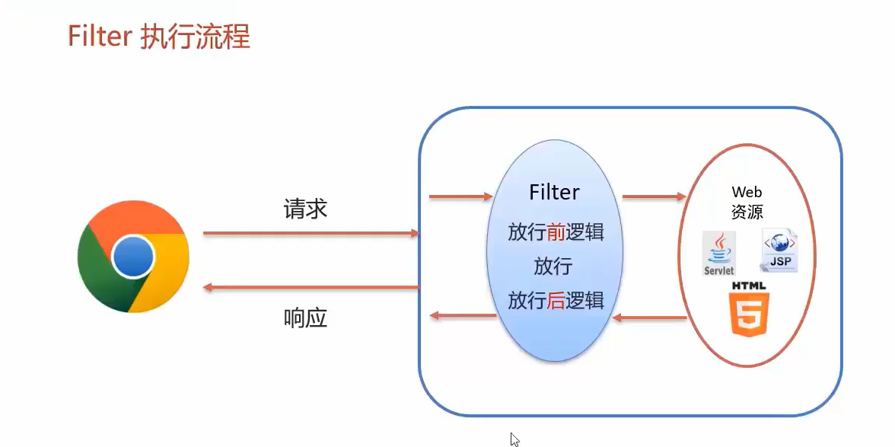
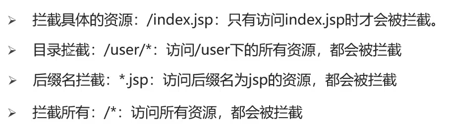
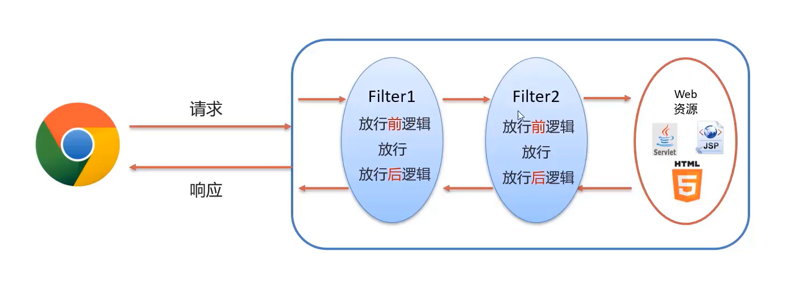

# Filter

>   过滤器

JavaWeb三大组件(Servlet,Filter,Listener)之一



-   过滤器可以把对资源的请求拦截下来,从而实现一些特殊的功能
-   过滤器一般用于完成一些通用的操作,比如:**权限控制**,**统一编码处理**,**敏感字符处理**等等
    -   判断用户是否登录了,不登录,全部跳转到登录界面

## 快速入门

1.  定义类,**实现Filter接口**,并重写其所有方法
2.  配置Filter**拦截资源的路径**:在类上定义@WebFilter
3.  在doFilter方法中执行程序

```java
package com.harvey.filters;

import com.harvey.utils.Log;

import javax.servlet.*;
import javax.servlet.annotation.WebFilter;
import javax.servlet.http.HttpServletRequest;
import java.io.IOException;

/**
 * @author Harvey Blocks
 * @version 1.0
 * @className Filter
 * @description 过滤器
 * @date 2023-11-19 19:22
 */
@WebFilter("/*")//全部拦截
public class MyFilter implements Filter {
    @Override
    public void init(FilterConfig filterConfig) throws ServletException {}

    @Override
    public void doFilter(
            ServletRequest request,
            ServletResponse response,
            FilterChain chain) throws IOException, ServletException {
        Log.info("放行前!"+((HttpServletRequest) request).getRequestURI()+" Yes~~~");
        chain.doFilter(request, response);
        Log.info("放行后!"+((HttpServletRequest) request).getRequestURI()+" Yes~~~");
    }


    @Override
    public void destroy() {}
}
```


```verilog
23-11-19 19:53 [http-nio-8080-exec-5] INFO  main - 放行前!/Servlet1 Yes~~~
%E5%BC%A0%E4%B8%89
23-11-19 19:53 [http-nio-8080-exec-5] INFO  main - 放行后!/Servlet1 Yes~~~
23-11-19 19:53 [http-nio-8080-exec-6] INFO  main - 放行前!/Servlet2 Yes~~~
23-11-19 19:53 [http-nio-8080-exec-6] INFO  main - username:张三
23-11-19 19:53 [http-nio-8080-exec-6] INFO  main - 张三
23-11-19 19:53 [http-nio-8080-exec-6] INFO  main - 放行后!/Servlet2 Yes~~~
```


## 执行流程

放行前逻辑->访问放行的资源->放行后逻辑


## 使用细节

### 拦截路径配置



-   精确匹配

    -   要求完全一致

-   目录匹配

    -   *做通配符

        ```java
        @WebFilter(urlPattern={"/web/*"})
        ```

    -   有两个Sercvlet,同时满足精确匹配和目录匹配,将匹配范围小的精确匹配

-   拓展名匹配

    -   注意**不能以斜杠开头**

        ```java
        @WebFilter(urlPattern={"*.do"})
        ```

-   任意匹配

    -   只要资源不被其他的Sercvlet接受,都会走到这个Sercvlet

        ```java
        @WebFilter(urlPattern={"/*"})
        ```

        


### 过滤器链

-   一个Web应用,可以配置多个过滤器,这多个过滤器被称为过滤器链




#### 自然排序的优先级

-   如果是用注解配置的Filter,优先级按照过滤器的**类名(字符串)**的自然排序,小的先执行

#### 注解配置优先级

```java
@WebFilter(urlPatterns = "/*",filterName = "1")
```

-   主打的就是一个投机取巧

#### XML配置决定优先级

```xml
xmlCopy code<filter>
    <filter-name>FilterA</filter-name>
    <filter-class>com.example.FilterA</filter-class>
    <!-- 配置FilterA的其他参数 -->
</filter>

<filter>
    <filter-name>FilterB</filter-name>
    <filter-class>com.example.FilterB</filter-class>
    <!-- 配置FilterB的其他参数 -->
</filter>

<filter-mapping>
    <filter-name>FilterA</filter-name>
    <url-pattern>/*</url-pattern>
</filter-mapping>

<filter-mapping>
    <filter-name>FilterB</filter-name>
    <url-pattern>/*</url-pattern>
</filter-mapping>
```

-   按照**`<filter-mapping>`**的配置顺序


```java
package com.harvey.filters;

import com.harvey.utils.Log;

import javax.servlet.*;
import javax.servlet.annotation.WebFilter;
import javax.servlet.http.HttpServletRequest;
import javax.servlet.http.HttpServletResponse;
import javax.servlet.http.HttpSession;
import java.io.IOException;
import java.util.Arrays;

/**
 * @author Harvey Blocks
 * @version 1.0
 * @className Filter
 * @description TODO
 * @date 2023-11-19 19:22
 */
@WebFilter(urlPatterns = "/*")//全部拦截
public class MyFilter2 implements Filter {
    @Override
    public void init(FilterConfig filterConfig) throws ServletException {
    }

    @Override
    public void destroy() {
    }
    // 需要放行注册,登录相关的CSS等资源
    // 下面的这些资源路径,实际上不会同时有html和jsp的,自己做取舍
    private static final String[] UNFILTERED_URLS = {
            "/image/",
            "/css/",
            "/login.html",
            "/login.jsp",
            "/loginServlet",
            "register.html",
            "register.jsp",
            "register.html",
            "registerServlet",
            "/checkCodeServlet",
    };

    @Override
    public void doFilter(
            ServletRequest request,
            ServletResponse response,
            FilterChain chain) throws IOException, ServletException {
        HttpServletRequest req = (HttpServletRequest) request;
        String url =  req.getRequestURL().toString();
        for(String unfilteredUrl :UNFILTERED_URLS){
            if (unfilteredUrl.equals(url)){
                chain.doFilter(request,response);
                return;
            }
        }

        HttpSession session = req.getSession();
        boolean isLogin = session.getAttribute("username") != null;
        if (isLogin) {
            Log.info("Yes~~~");
            chain.doFilter(request, response);//放行
        } else {
            //爬去登录!
            request.setAttribute("warning","您尚未登录");//信息放到jsp警告的位置去
            request.getRequestDispatcher("/login").forward(request,response);
        }
    }


}
```

