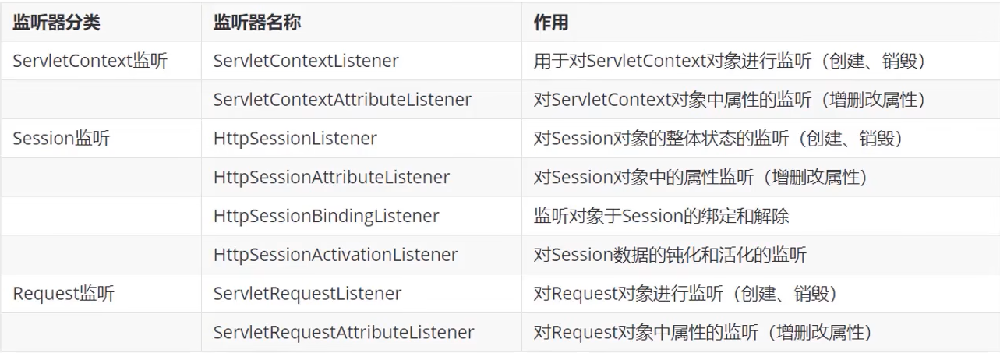

# Listener监听器

>   监听application(ServletContext),session.request三个对象的创建销毁或者往其中添加修改删除属性时自动执行代码的功能组件


## Listener分类



-    ServletContextListener是后面会用到的Listener,其他的不怎么用
-    ServletContextListener就是对整个Web对象进行监听

## Listener基本使用

1.  创建一个类,实现上述接口八选一
2.  添加注解@WebListener
3.  不用路径,自动执行-实现了什么接口就指明了它将来的监听范围

```java
@WebListener
public class MyListener implements ServletContextListener {
    @Override
    public void contextInitialized(ServletContextEvent sce) {
        //加载资源
        Log.info("资源加载!");
    }

    @Override
    public void contextDestroyed(ServletContextEvent sce) {
        //释放资源
        Log.info("资源释放!");
    }
}
```

```
23-11-19 22:09 [RMI TCP Connection(2)-127.0.0.1] INFO  main - 资源加载!


19-Nov-2023 22:09:59.896 警告 [RMI TCP Connection(2)-127.0.0.1] org.apache.catalina.util.SessionIdGeneratorBase.createSecureRandom 使用[SHA1PRNG]创建会话ID生成的SecureRandom实例花费了[431]毫秒。


23-11-19 22:09 [RMI TCP Connection(2)-127.0.0.1] INFO  main - init...


[2023-11-19 10:09:59,944] 工件 webapp:war: 工件已成功部署
[2023-11-19 10:09:59,944] 工件 webapp:war: 部署已花费 3,172 毫秒


23-11-19 22:10 [http-nio-8080-exec-1] INFO  main - Filter
23-11-19 22:10 [http-nio-8080-exec-1] INFO  main - Filter
23-11-19 22:10 [http-nio-8080-exec-2] INFO  main - Filter
23-11-19 22:10 [http-nio-8080-exec-2] INFO  main - Filter


19-Nov-2023 22:10:06.282 信息 [Catalina-utility-2] 
...
```

