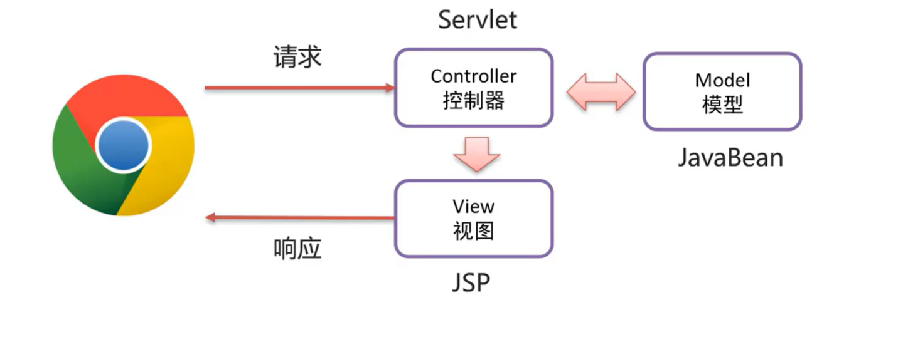
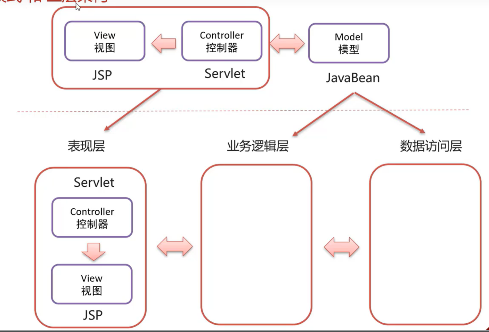

# MVC

>   Model View Controller

-   M
    -   业务模型,处理业务
    -   JavaBean
-   V
    -   视图,界面展示
    -   最终像浏览器反应
    -   JSP
-   C
    -   控制器,处理请求,调用模型和视图
    -   浏览器请求的对象
    -   Servlet

## 优点

-   指责单一
-   有利于分工合作
-   有利于组件重用
    -   指JSP换了Html(之类的)之后,不用动Java代码

### 三层架构

-   表现层(controller)
    -   接收请求,封装数据,调用与无逻辑层,响应数据
-   业务逻辑层
    -   服务层(service包)
    -   对业务逻辑进行封装,组合数据访问层中基本功能,形成复杂的业务逻辑功能
-   数据访问层
    -   持久层(dao包.mapper)
    -   对数据的CRUD操作

### MVC模式和三层架构的区别

-   M
    -   Dao层(持久层)

        数据访问层是数据增加层,对数据库中的数据进行原子化的增删改查

    -   Service层(业务逻辑层)

        调用Dao层,得到原生的数据

        或对Dao层里的数据进行操作

        实现对数据的加工处理,

        返回用户想要的数据

        事务操作就在Service层

-   表现层

    -   C

        Servket比较底端

        获取用户对视图的操作指令和数据,

        调用Service层

        返回用户需要的数据和视图应该做出的表现

    -   V

        视图,用户直接接触到的部分

