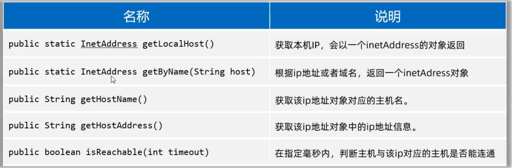

# InetAddress类

-   IP地址类



## 获取本机IP地址对象

```java
InetAddress ip1 = InetAddress.getLocalHost();
System.out.println("ip1.getAddress()="+ip1.getAddress());
System.out.println("ip1.toString()="+ip1.toString());
System.out.println("ip1.getHostAddress()="+ip1.getHostAddress());
System.out.println("ip1.getHostName()="+ip1.getHostName());
System.out.println("ip1.getCanonicalHostName()="+ip1.getCanonicalHostName());
```

-   输出结果:

```properties
ip1.Address=[B@4b67cf4d
ip1.Address=PC-Lucifer-Shan/169.254.128.11
ip1.HostAddress=169.254.128.11
ip1.getHostName=PC-Lucifer-Shan
ip1.CanonicalHostName=PC-Lucifer-Shan
```

## 获取获取指定IP或域名的的IP地址对象

```java
InetAddress ip2 = InetAddress.getByName("www.baidu.com");
System.out.println("ip2.getAddress()="+ip2.getAddress());
System.out.println("ip2.toString()="+ip2.toString());
System.out.println("ip2.getHostAddress()="+ip2.getHostAddress());
System.out.println("ip2.getHostName()="+ip2.getHostName());
System.out.println("ip2.getCanonicalHostName()="+ip2.getCanonicalHostName());

//参数表示认定超时的时限
//返回bool值
//6秒内无法连接"www.baidu.com",则认定为超时
System.out.println("isReachable="ip2.isReachable(6000));//true
//可用于判断本机或对方服务器是否宕机
```

-   输出结果

```properties
ip2.getAddress()=[B@4b67cf4d
ip2.toString()=www.baidu.com/182.61.200.6
ip2.getHostAddress()=182.61.200.6
ip2.getHostName()=www.baidu.com
ip2.getCanonicalHostName()=182.61.200.6
isReachable=true
```

