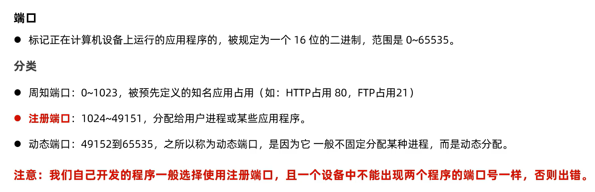

# 端口号

-   IP确定主机
-   端口号确定主机上的哪个应用程序
-   **被规定为16位的二进制,范围是[0,65535]**




在防火墙上开放端口号


```Dos
netsh advfirewall firewall add rule name="Open Port 1883" dir=in action=allow protocol=TCP localport=1883
```

