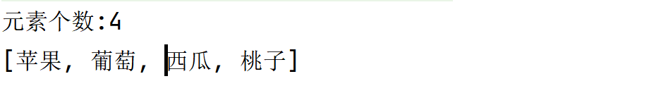

# Collection 父接口

- 有序
- 无下标
- 元素可重复


E -  此集合中元素的类型 (?)

## 实例化

```java
package CollectionLearning;

import java.util.ArrayList;
import java.util.Collection;

public class Demo01 {
    public static void main(String[] args) {
        //创建集合
        Collection collection=new ArrayList();
    }
}
```


## 方法

没有用于"替换"的方法

### 获取Collection信息

| Modifier and Type | Method    | Description                  | Example     |
| ----------------- | --------- | ---------------------------- | ----------- |
| int               | size()    | 返回a中的元素数。            | a.size()    |
| boolean           | isEmpty() | 若此集合为空，则返回 true 。 | a.isEmpty() |


### 增加元素

| Modifier and Type | Method                            | Description                  | Example            |
| ----------------- | --------------------------------- | ---------------------------- | ------------------ |
| boolean           | add(E e)                          | 添加e对象。                  | a.add(e)/=a.add(e) |
| boolean           | addAll(Collection<? extends E> c) | 将b中的所有元素添加到a集合。 | a.addAll(c)        |


```java
collection.add("苹果");
collection.add("葡萄");
collection.add("西瓜");
collection.add("桃子");
System.out.println("元素个数:"+collection.size());
System.out.println(collection);
//等价于System.out.println(collection.toString());
```

居然不带引号?!



### 删除与清空元素

| Modifier and Type | Method                     | Description                                             | Example        |
| ----------------- | -------------------------- | ------------------------------------------------------- | -------------- |
| void              | clear()                    | 从此集合中删除所有元素。                                | a.clear()      |
| boolean           | removeAll(Collection<?> c) | 在a中移除ac同时存在的元素                               | a.removeAll(c) |
| boolean           | remove(Object o)           | **从前往后**从该集合中删除o的**单个**实例（如果存在）。 | a.remove(o)    |


```java
collection.remove("西瓜");
System.out.println(collection);//[苹果, 葡萄, 桃子]

collection.clear();
System.out.println(collection);//[]
```

### 重点!遍历

法一:增强for(不能用for,因为没下标)

```java
for (Object objrct:
     collection) {
    String str = (String) object//强制转换
    System.out.print(objrct+",");
}
```

法二:使用迭代器

迭代器:接口,专门用来遍历集合

Collection里的iterator()方法:

| Modifier and Type | Method     | Description      | Example      |
| ----------------- | ---------- | ---------------- | ------------ |
| Interator         | iterator() | 实现对集合的遍历 | a.iterator() |

```java
Iterator it = collection.iterator();
```

#### Interator

| Modifier and Type | Method    | Description                                                  |
| ----------------- | --------- | ------------------------------------------------------------ |
| boolean           | hasNext() | 如果存在下一个元素,就返回true                                |
| E                 | next()    | 返回迭代的下一个元素                                         |
| void              | remove()  | 从迭代器指向collection中移除迭代器返回的**最近一个**元素.只能用迭代器的remove(),不能用collection的remove(),否则ConcurrentModificationException并发修改异常(正在使用中) |

```java
while(it.hasNext()){
    String object = (String) it.next();//等价于it.next().toString(),等价于it.next()
    System.out.print(object+",");
    collection.remove(object);//报错ConcurrentModificationException
}
```

```java
Iterator it = collection.iterator();//注意大小写
//返回值是一个类,类名首字母大写|方法是colletcion里的方法,而不是Interator类里的一个构造器,首字母小写
while(it.hasNext()){
    String object = (String) it.next();//等价于it.next().toString(),等价于it.next()
    System.out.print(object+",");
    it.remove();
}
System.out.println();
System.out.println(collection.size());//0
```

```java
//重置it指针
it = collection.iterator();
```


### 判断

| Modifier and Type | Method             | Description                                | Example       |
| ----------------- | ------------------ | ------------------------------------------ | ------------- |
| boolean           | contains(Object o) | 如果此集合包含指定的o元素，则返回 true 。  | a.contains(o) |
| boolean           | equals(Object o)   | 将指定的对象与此集合进行比较以获得相等性。 | a.equals(o)   |


```java
System.out.println(collection.contains("西瓜"));//true
```

### 转化为Array

| Modifier and Type | Method    | Description                          | Example     |
| ----------------- | --------- | ------------------------------------ | ----------- |
| Object[]          | toArray() | 返回一个包含此集合中所有元素的数组。 | a.toArray() |


## 以自建类为元素

### 添加

```java
public class Demo02 {
    public static void main(String[] args) {
        //新建Collection对象
        Collection collection = new ArrayList();
        Student s1 = new Student("张三",18);
        Student s2 = new Student("李四",19);
        Student s3 = new Student("王五",18);
        //添加元素
        collection.add(s1);
        collection.add(s2);
        collection.add(s3);
        System.out.println(collection.size());
        System.out.println(collection.toString());
        for (Object object:
             collection) {
            System.out.println(object);
        }
    }
```

其他的没什么技术含量

特别的,clear()把集合里的元素删除了,那这三个对象删除了吗?没有!因为把三个元素加入集合是加入了地址.

