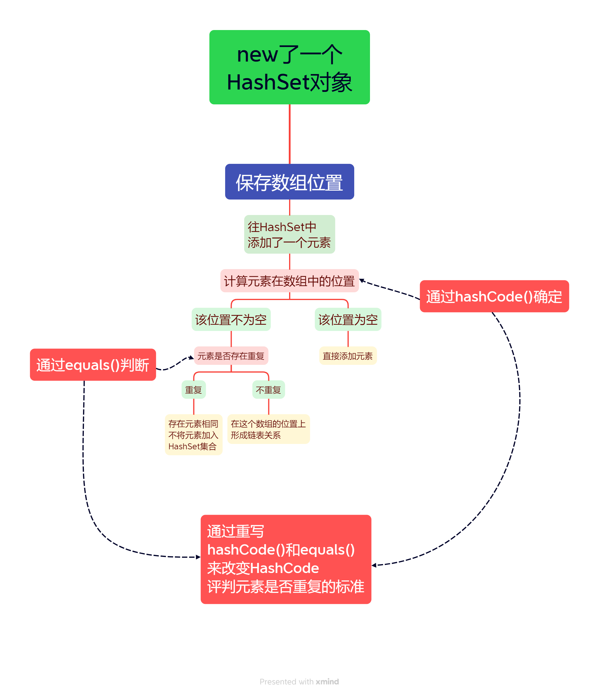

# HashSet类

- 基于HashCode计算元素存放位置
- 当存入元素的HashCode相同时,会调用equals进行曲儿,如结果为true则据拒绝后者存入

- 存储结构:哈希表=数组+链表+红黑树(数组的元素是链表这样?)


## Hash的使用

```java
package CollectionLearning;

import java.util.HashSet;
import java.util.Iterator;

/**
 * HashCode集合的使用
 * 存储结构:哈希表=数组+链表+红黑树
 * @author HarveyBlocks
 * @date 2023/08/29 10:44
 **/
public class Demo04 {
    public static void main(String[] args) {
        //创建集合
        HashSet<String> hashSet = new HashSet();

        //添加元素
        hashSet.add("A");
        hashSet.add("E");
        hashSet.add("F");
        hashSet.add("D");
        hashSet.add("C");
        hashSet.add("B");

        System.out.println(hashSet);//[A, B, C, D, E, F]
        // 无序,和添加顺序不一致,真的无序吗?

        //删除
        hashSet.remove("F");
        System.out.println(hashSet.size());//5

        //遍历
        //for1 foreach
        Iterator it = hashSet.iterator();
        while (it.hasNext()) {
            System.out.print(it.next() + ",");
        }

        //判断
        System.out.println(hashSet.contains("C"));//true
        System.out.println(hashSet.isEmpty());//false
    }
}
```


## HashSet的存储原理

Student类:

```java
package CollectionLearning;

/**
 * @author HarveyBlocks
 * @date 2023/08/15 14:43
 **/
public class Student {
    private String name;
    private int age;
    private int score;

    public Student() {}

    public Student(String name, int age, int score) {
        this.name = name;
        this.age = age;
        this.score = score;
    }

    public String getName() {return name;}
    public void setName(String name) {this.name = name;}
    
    public int getAge() {return age;}
    public void setAge(int age) {this.age = age;}
    
    public int getScore() {return score;}
    public void setScore(int score) {this.score = score;}

    @Override
    public String toString() {
        return "Student{" +
                "name='" + name + '\'' +
                ", age=" + age +
                ", score=" + score +
                '}';
    }
}
```

Demo:

```java
package CollectionLearning;

import java.util.HashSet;
import java.util.Iterator;

/**
 * HashCode集合的使用
 * 存储结构:哈希表=数组+链表+红黑树
 * @author HarveyBlocks
 * @date  2023/08/29 10:44
 **/
public class Demo04 {
    public static void main(String[] args) {
        //创建集合
        HashSet<Student> hashSet = new HashSet();

        //添加元素
        Student s1 = new Student("A",11,90);
        Student s2 = new Student("B",12,95);
        Student s3 = new Student("C",11,93);
        Student s4 = new Student("D",10,94);
        Student s5 = new Student("E",13,97);
        Student s6 = new Student("F",14,91);
        Student s7 = new Student("G",11,91);
        hashSet.add(s1);
        hashSet.add(s3);
        hashSet.add(s2);
        hashSet.add(s5);
        hashSet.add(s6);
        hashSet.add(s4);
        hashSet.add(s7);

        //遍历输出
        Iterator it = hashSet.iterator();
        while (it.hasNext()) {
            System.out.println(it.next());
        }

    }
}
```

输出:

```java
Student{name='B', age=12, score=95}
Student{name='F', age=14, score=91}
Student{name='C', age=11, score=93}
Student{name='A', age=11, score=90}
Student{name='G', age=11, score=91}
Student{name='E', age=13, score=97}
Student{name='D', age=10, score=94}
```

现在,如果想要通过new一个对象,删除这个对象

```java
boolean isRemoved = hashSet.remove(
        new Student("F",14,91)
);
System.out.println(isRemoved);
```

能够实现吗?

用屁眼想:

``` java
false
```

那么我就是想要通过new一个对象,删除这个对象

我就是认定了,如果他们name,age,score都一样,他们就是同一个元素!

怎么做呢?

先要明白HashSet如何判断两个元素是否一致:

我们知道,HushSet是用哈希表实现的

哈希表=数组 + 字符串



老规矩 Alt + Insert  偷懒大法

能用,可读性低,所以就换了一下:

### 重写equals():

```java
@Override
public boolean equals(Object o) {
    if (this == o) return true;
    if (o == null || getClass() != o.getClass()) return false;		//为什么这么写
    Student student = (Student) o;									//不知道?
    return age == student.age && score == student.score && Objects.equals(name, student.name);
}
```

### 重写hushCode():


```java
@Override
public int hashCode() {
    Object[] a ={name, age, score};
    if (a == null)
        return 0;

    int result = 1;

    for (Object element : a)
        result = 31 * result + (element == null ? 0 : element.hashCode());
		//为什么是31?
    return result;
}
```

**为什么上面有一个31?**

1. **31**是质数,减少散列冲突

2. 提高执行的效率

   ​	31 * i == ( i << 5) - i
   ​						  ↑ 左移