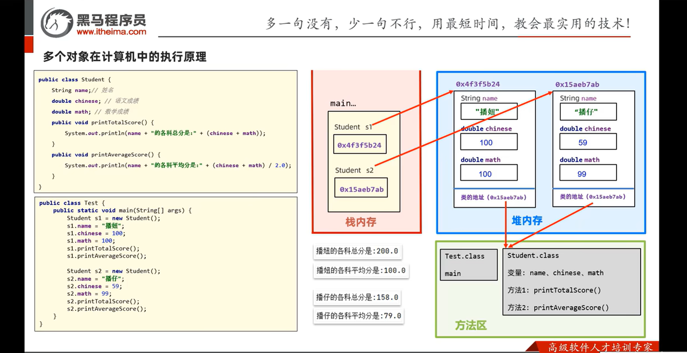
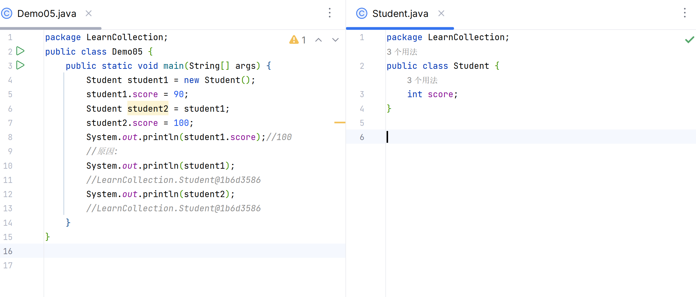

# 	创建和初始化一个对象

只能有一个public class

一个项目应该只存在一个main()方法

``` java
package com.pac;
public class Main {
    public static void main(String[] args){
            //类是抽象的，需要实例化
        new Student();//实例化
            //类实例化之后会返回一个自己的对象
        Student student1=new Student();
            //student1对象就是一个Student类的具体实例
        Student student2=new Student();
            //student1和student2都是Student类的具体实例，他们或许有不同，但他们都有name，age，grade
        student1.name="Mike";
        System.out.println(student1.name);
    }
}
```


``` java
package com.pac;

public class Student {//会进行默认的初始化
    //属性：字段
    String name;    //null
    int age;        //0

    char grade;     //''


    // 方法
    public void study(){
        System.out.println(this.name +" are studying");
    }


}

```

## 只知道存在这种现象,却没搞懂其原理

```java
class Z {
    static int peek() { return j; }
    static int i = peek();
    static int j = 1;
}
class Test {
    public static void main(String[] args) {
        System.out.println(Z.i);//0
        // 就....挺奇妙的,没搞懂
        // 在类加载(类加载的阶段, 不是对象加载的阶段), 静态字段先被创建了引用, 分配了内存, 但没有被赋值, 都是默认值, 例如double的是0.0, Object的是null
        // 所以j在peek里面被引用, 但是写在j的声明的上面没有报错, 就是在给peek这个方法创建的时候已经有j了,但是j没有被赋值, 是默认的0
        // 然后赋值阶段, i被赋值, 此时的j是默认值的0,如果j的下面有一个k, k = peek(), 那么k=1
    }
}
```


## this关键字


this关键字是指向当前**对象**的

是**对象**!!!!!!!!!!!!!!!!

所以static方法不能用this关键字(包括this和this.属性)

## 内存分析




### 对象之间的属性一般不会相互影响除非:



内存分析一下就理解了


这个好没用啊
