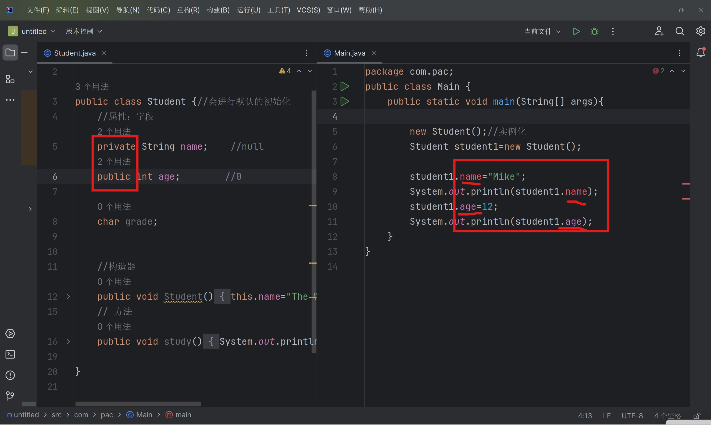
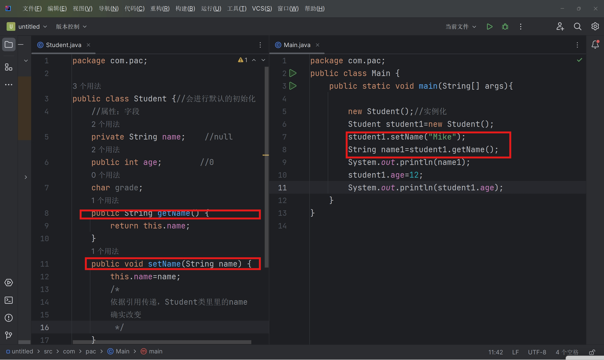
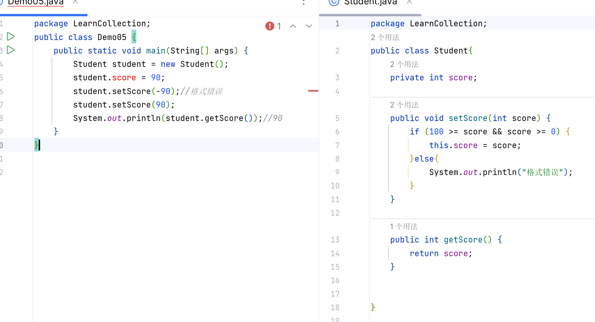

# 封装

1. 高内聚，低耦合
2. 信息隐藏
3. 属性私有private-public。提供一些可以操作这些属性的方法get-set。


| 修饰符    | 本类 | 同包 | 子类 | 其他包 |
| --------- | ---- | ---- | ---- | ------ |
| public    | √    | √    | √    | √      |
| protected | √    | √    | √    | ×      |
| default   | √    | √    | ×    | ×      |
| private   | √    | ×    | ×    | ×      |

protect子类不同包,可行



- ↑报红啦

 

- get-set的用法


为什么说这么做更安全了呢?




## 意义

1. 提高程序安全性，保护数据（在get-set函数中就做好输入检查，防止系统崩溃）
2. 隐藏代码实现细节
3.  统一接口
4. 提高系统可维护性

### 实体类JavaBean

实体类(如上Student类`)

- 所有成员变量私有对外提供get-set
- 类中必须要有一个公共的无参构造器

- 没有其他方法了,只能存储数据,不能做其他操作了

这样就把操作和存储分开来了

再写一个操作类:

```java
package LearnCollection;
public class StudentOperator {
    private Student student; 
    public StudentOperator(Student student) {
        this.student = student;
    }
    public void printStudentScore(){
        System.out.println(student.getScore());
    }
}
```
