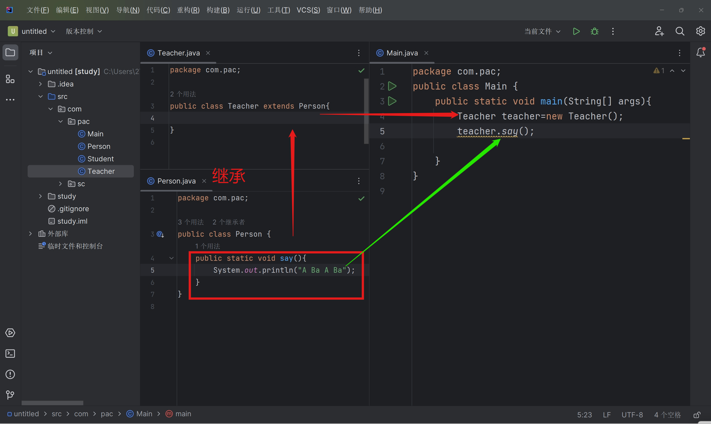
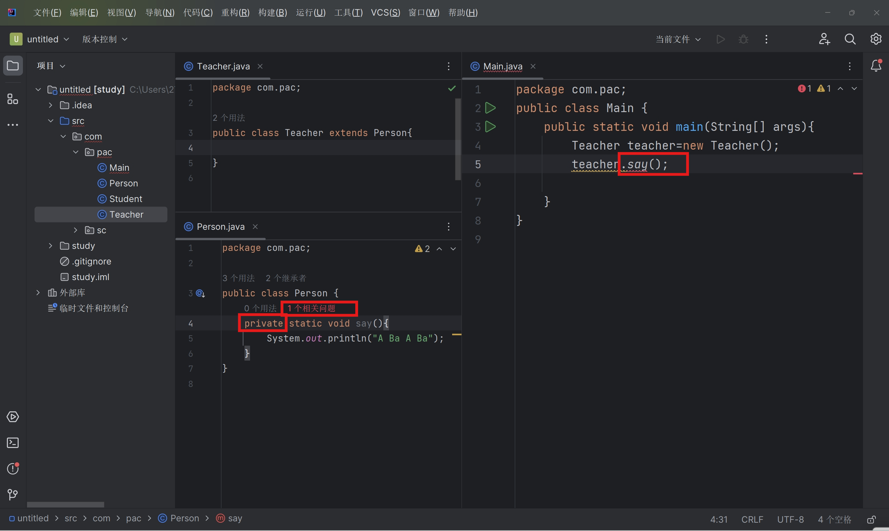
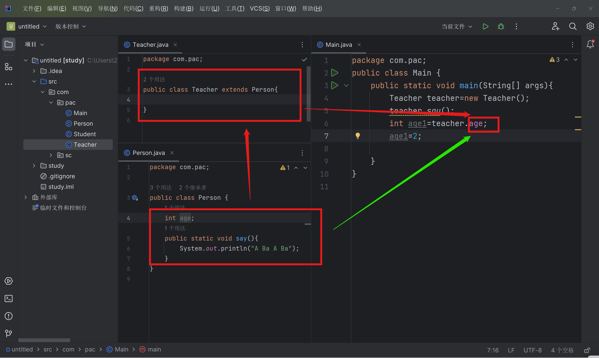
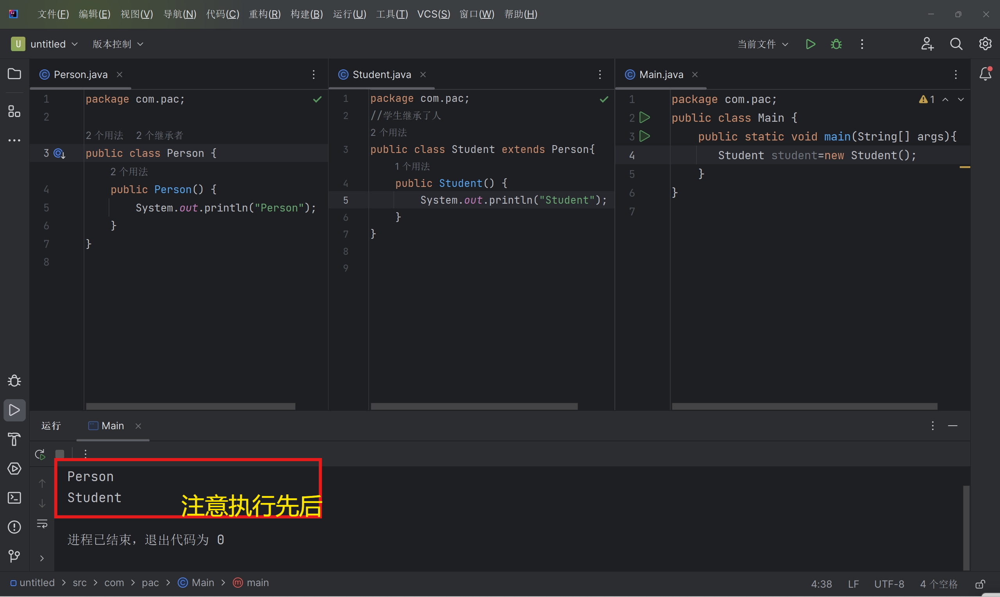
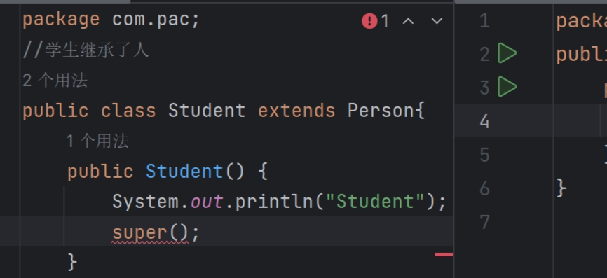
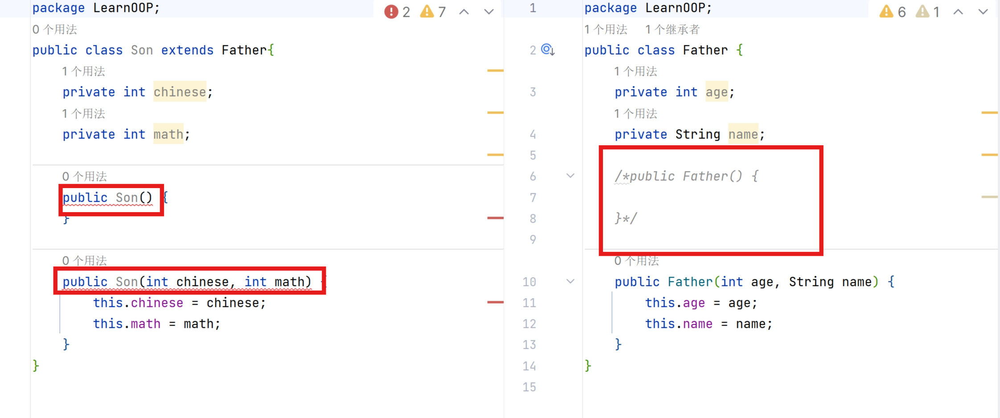
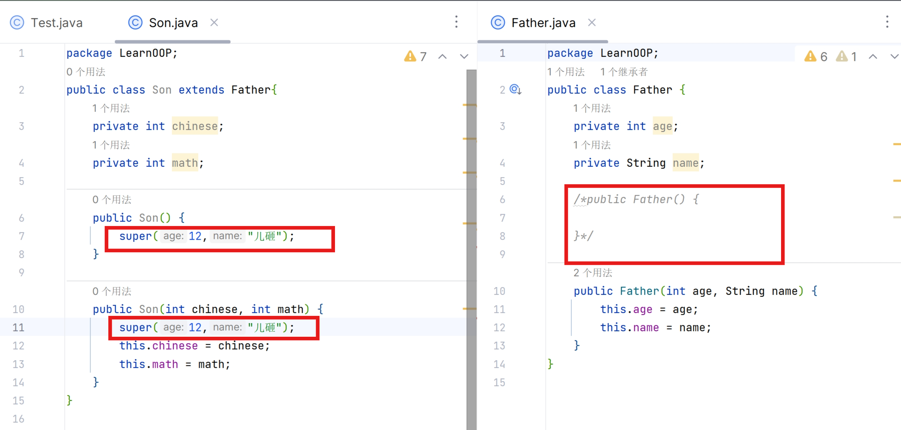

# 继承

- extends扩展，子类是父类的拓展
- java中都是单继承
- Ctrl+H查看类关系结构

子类可以继承父类的所有方法(因为子之类的构造器会先super.父类构造器(),再执行自己的)





私有的是无法继承的



当然不止是方法,属性也可以继承




## Object类

任何类默认直接或间接地继承Object类

Object类里有很多方法可用

## 核心： super，与super()

``` java
package com.pac;

public class Person {
    String name="Human";
}

```

``` java
package com.pac;
//学生继承了人
public class Student extends Person{
    String name="Mike";
    public void test(String name){
        System.out.println(name);
        System.out.println(this.name);
        System.out.println(super.name);

    }

}
```

```java
package com.pac;
public class Main {
    public static void main(String[] args){
       Student student=new Student();
       student.test("what?");
    }
}

```

输出

``` 
what?
Mike
Human
```

以上变量皆可换成方法

``` java
package com.pac;

public class Person {
    public void p(){
        System.out.println("Human");
    }
}

```

``` java
package com.pac;
//学生继承了人
public class Student extends Person{
    @Override
    public void p() {
        System.out.println("Mike");
    }

    public void test(){
        p();
        this.p();
        super.p();

    }

}
```

```java
package com.pac;
public class Main {
    public static void main(String[] args){
       Student student=new Student();
       student.test();
    }
}
```

输出

``` 
Mike
Mike
Human 
```

执行构造器




由此可以得出，Student类（子类）隐藏了super(),会调用父类的无参构造器,且一定在构造器的最前端

``` java
package com.pac;
//学生继承了人
public class Student extends Person{
    public Student() {
        super();
        System.out.println("Student");
    }
}

```

不在第一行还会报错



由此，调用父类的构造器，必须在子类构造器的第一行


如果没有父类的无参构造器呢?

那么无参是自动加的,怎么真正去掉呢?把无参注释起来吗?

**写个有参,再把无参注释起来!**

然后无参去掉了,子类构造器**通通保错**啦!





### 用super()调用父类的有参构造





**如果父类没有无参构造,就要这样在子类手搓一个super(有参)了**

### 注意

**顺带一提，也可以用this()调用本构造器，但也要求处于第一行，** ***与前一条矛盾***  **，故不能同时调用this()和super()**

**this()调用的子类方法里自动有添加一个隐藏的super(),所以this()要放最前,而又不能同时super()**
