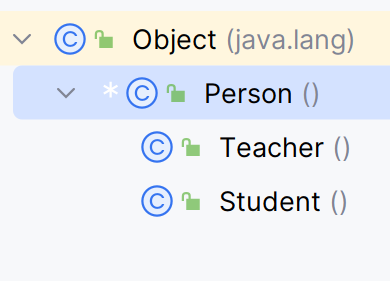

# instanceof和类型转换

## instansof

语法:

``` java
boolean isSonOrThis = 对象 instanceof 类/接口;
```

类之间的关系如下：



``` java
public class Main {
    public static void main(String[] args) {

        Object object = new Student();//多态,instanceof看右边

        /*
        Object>String
        Object>Person>**Student**
        Object>Person>Teacher
         */

        //返回true,false,看右边.
        System.out.println(object instanceof Student);//true
        System.out.println(object instanceof Teacher);//fase
        System.out.println(object instanceof String);//false
        System.out.println(object instanceof Person);//true

        //为父(/爷)false，为子(孙)true

        //会不会报错,看左边

        System.out.println("=============================================");

        Person person=new Student();

        /*
        Object>String
        Object>Person>**Student**
        Object>Person>Teacher
         */

        System.out.println(person instanceof Student);//true
        System.out.println(person instanceof Teacher);//fase

        System.out.println(person instanceof String);//报错

        System.out.println(person instanceof Person);//true

        //为父子爷孙,否则报错
    }
}
```

## 引用类型类型转化

1. 引用数据类型的转换是有条件，不能够随便转

2. 转换的条件是：只能够在有**继承关系**的类型间进行

3. 正因为只能沿着继承树进行转换，才有向上转型和向下转型的概念

```java
//Student extends Person
Student student1 = new Student();
```

- Stuednt exdents Person
- Student is Person
- so , Student can switch to Person Easily
- Meanwhile,not every Person is Student
- so, Person be a Student must add (Student)

### 向上转型

1. 把子类对象交给父类的引用---**自动类型转换**

-  当我们拥有了一个父类引用的时候，就不能再简单的认为它指向父类对象了，它还有可能指向任意一个子类对象

- 父类的引用指向子类对象是没有问题的，不过只能看到对象身上来自于父类的属性和行为

```java
Student student1 = new Student();
Person person = student1;
Person person2 = (new Student());//(new Student())看作一个整体,多态也可以看作自动转换

Person person = new Teacher();
Teacher teacher = person;//编译时会报错,Person怎么能自动转成Teacher
```

### 向下转型(一定要多态了emmmm)

1、把父类对象交给子类引用--**强制类型转换**

由于父类引用指向对象的**不确定性**，导致再把这个引用赋给某个子类引用，必须做**强制声明**

而这个强制声明只能保证编译期通过，如果声明的类型和实际指向的类型不一致还是会导致运行时报错

 ```java
Student student = (Student) person;
//注意内存溢出
 ```

可能存在问题:

```java
Person person = new Student();
Teacher teacher = (Teacher) person;
//Person类是Teacher父类啊,编译觉得没问题
//person指向了Student啊,怎么能转给Teacher呢?运行发觉了不对劲

//编译不报错,运行报错
//.ClassCastException类型转换异常
```

- **编译**时只要有继承关系的父子类可以互相转换

- **运行**时可能会引发类型转换错误

## 借助instansof,帮助实现类型转化

应用场景:**在方法里不知道传进来的参数指向了什么类**

```java
public class Test {
    public static void main(String[] args) {
        Person person = new Student();
        if (person instanceof Teacher){
            Teacher teacher = (Teacher) person;
        }else {
            Student student = (Student) person;
        }
        System.out.println("success");
    }
}
```

